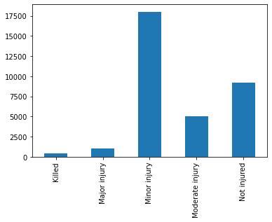

## PHILADELPHIA COLLISION INVESTIGATION (Coursera Capstone Project)
## Introduction

Vehicular accidents are a leading cause of injuries in the US. In 2018 motor-vehicle crashes accoundted for 39,404 deaths, 4.5 million medically consulted injuries and resulted in injury costs of $445.6 billion dollars. [NTSC Injury Facts](https://injuryfacts.nsc.org/motor-vehicle/overview/introduction/)

According to the ["Vision Zero"](https://www.nsc.org/Portals/0/Documents/DistractedDrivingDocuments/Driver-Tech/Road%20to%20Zero/The-Report.pdf?ver=2018-04-17-111652-263) Plan put together by the NSC, and important  aspect of reducing the severity of accidents is to design roadways in a way to prevent them.

An important aspect of the procedure to reduce the number of accidents is to identify not only the probelmatic areas, but also the additional factors that drive the severity of those accidents.

Identifying those problem areas and factors is an invaluable tool for both city planners and government officials. It also can prove to be a tool for insurance groups to push local governments into action. Nieghborhood groups can substanciate their claims for improvement in their local area. Finally Police and Emergency Response departments can better plan and hopefully reduce the amount of man hours and divert more resources to other causes when collisions are reduced.

## Business Problem
The city of Philadelphia has been implementing the __Vision Zero__ plant discussed above to improve upon the safety of its inhabitants. [They are using data to make smart decisions for city planning and enformcement.](http://visionzerophl.com/uploads/attachments/ck181ipfv1isp9pd66ww0iw0f-file-print-pages-hq-visionzero-y2-update.pdf)

So the problem to be addressed in this report is can we identify the severity of collisions based on design and situational parameters to help the city of Philadelphia better design roads and traffic to reduce the severity of the vehicular collisions.

## Data Understanding and Preparation
### Data Sources

The dataset for this analysis is a the dataset used for Philadelphia's Vision Zero project. The data is derived form PennDOT's Crash Incident Dataset filtered to 2013-2017. PennDOT's full dataset can be accessed at their [API](https://data.pa.gov/resource/dc5b-gebx.json?), it does not contain data past 2017. The actual dataset for the city of Philadelphia can be found at the [OpenDataPhilly portal](https://www.opendataphilly.org/dataset/vehicular-crash-data). This project uses both the geojson and csv versions of the data.

Additionally for visualization and some spatial investigation this project makes use of the [zipcodes boundaries](https://www.opendataphilly.org/dataset/zip-codes) obtained at OpenDataPhilly. We will also be using the metadata from the same website to idenfity some of the more useful features.

### Data Preparation
The target value for identification and classification is the `max_severity_level`. This is explained by the chart below:

| MAX_SEVERITY_LEVEL |Maximum injury severity level of the crash |
| --- | --- |
| 0 | Not injured |
| 1 | Killed  |
| 2 | Major injury |
| 3 | Moderate injury |
| 4 | Minor injury |
| 8 | Injury/ Unknown Severity |
| 9 | Unknown |

The data contains 95 features, which encompass temporal, spatial, collision results and other descriptions (intersection type, illumination, etc).

In order to determine what features/ columns to a count of the unique values per feature is performed. Features with low counts are also presented. From this approach it is clear which columns can be left out of the investigation (for example `county` and `district`).

Important features that provide varied information where identified by looking at unique counts of values. Combining the _Vision Zero_ dataset with the complete datasets metadata also allowed to remove some unexplained features.

The features identified as additional to the _Vision Zero_ are mostly descriptive of the effects of the collision. For example bicycle_death_count, vehicle_count. These were dropped from the data set investigated.

```python
array(['belted_death_count', 'belted_maj_inj_count',
       'bicycle_death_count', 'bicycle_maj_inj_count',
       'mcycle_death_count', 'mcycle_maj_inj_count', 'sch_zone_ind',
       'unb_death_count', 'unb_maj_inj_count', 'unk_inj_deg_count',
       'unk_inj_per_count', 'vehicle_count'], dtype=object)
```

Furthermore as we are only looking at the situational conditions leading up to the collision, features related to the outcome were dropped, these mostly related to `*_counts` features.

Finally the `incident` feature as it appears to have inconsistent values for 2017.

|   crash_year |    0 |    1 |
|-------------:|-----:|-----:|
|         2013 | 2657 | 3991 |
|         2014 | 2624 | 3784 |
|         2015 | 2833 | 3898 |
|         2016 | 2898 | 4286 |
|         2017 | 6470 |  nan |

The dataset contains records with Unknown max_severity_levels, these records were dropped as we are trying to investigate parameters that can lead to a reduction in severity levels.



A count of the dataset target variables leads us to identify that this is an __imbalanced__ dataset.

Additionally the [geolocated version of the data ](https://www.opendataphilly.org/dataset/vehicular-crash-data/resource/7f3e49e1-d585-4eb3-9c2a-b0e8bc65dc0c) was spatially joined to the zipcode boundaries to determine the zipcode the accidents occured within to assist with vizualization.

| Feature | Description |
| --- | --- |
| crash_month | Month for the collision |
| crash_year | Year for the collision |
|  crn | Record Identifier (used as an index) |
|  day_of_week | Weekday for the collision |
|  hour_of_day | Hour for the collision |
|  illumination | Illumination Descriptor |
|  intersect_type | Intersection Descriptor |
|  tcd_type | Traffic Control Device Descriptor |
|  road_condition | Condition of road at time of collision |
|  CODE | zipcode |
|  geometry | Coordinates for the Collision |

Additional data cleanup was done on data after the data exploration of it and will be identified at that point.

### Data Exploration
The first step was to identify the seasonal components for the data to identify if the __Vision Zero__ approach has had any effectiveness on collision reduction

 


From these plots we determine the following:
* There has not been an reduction on the total number of collisions a year, an increase occured in 2016
* Summer months seem to increase the number of collisions
* Weekends see an increase in collisions
* Most collisions seem to occur during commute times to and from work 6-9 and 15-18.

Does this information look different for fatalities?


For the fatality plot there are some differences between years
* There is an increase in the fall months, perhaps due to it being dark out.
* More of them occur on weekday 1 (Sunday)
* Late night/ early morning see most of the fatal collisions (could explain the increase on Sunday, early morning).

In order to have a assessment of the performance we also look at the percentages of each type of collisions in relation to the overall.


The overall trend over years and severity level seems to stay consistent.

We also take a look at illumination and its effects on collision.

|                               |   illumination |
|:------------------------------|---------------:|
| Daylight                      |          20501 |
| Dark -  street lights         |          11346 |
| Dusk                          |            687 |
| Dark - no street lights       |            397 |
| Dawn                          |            311 |
| Dark-unknown roadway lighting |            148 |
| Other                         |             51 |


In terms of percentages, there is a slight increase on collisions when the road, has illuination of `Othe`r and `Dark-unknown roadway lighting`. However the collision count for those is low, so those records where dropped as they provide incomplete information.

If we look at fatalities it matches what was seen previously. Most fatalities occur late at night

| Illumination           | Collisions   |
|:------------------------------|:------|
| Dark -  street lights         | 53%   |
| Daylight                      | 41%   |
| Dark - no street lights       | 3%    |
| Dusk                          | 2%    |
| Dawn                          | 2%    |
| Dark-unknown roadway lighting | 0%    |

We also look at intersection type to help identify where most collisions are occurring.

| Intersection Type             |  Collision Count |
|:------------------------------|-----------------:|
| Four way intersection         |            14983 |
| Mid-block                     |            13600 |
| T intersection                |             3342 |
| Multi-leg intersection        |              740 |
| Y intersection                |              557 |
| On ramp                       |               82 |
| Traffic circle or Round About |               47 |
| Other                         |               44 |
| Off ramp                      |               40 |
| Railroad crossing             |                5 |

As common sense most collisions happen at Four way Intersections a significant amount also happen at Mid-block.

Since intersections contain traffic devices we also look at the `tcd_type` vs the `interect_type`.

| intersect_type                |   Not applicable |   Flashing traffic signal |   Traffic signal |   Stop sign |   Yield sign |   Active RR crossing controls |   Passive RR crossing controls |   Police officer or flagman |   Other Type TCD |   Unknown |
|:------------------------------|-----------------:|--------------------------:|-----------------:|------------:|-------------:|------------------------------:|-------------------------------:|----------------------------:|-----------------:|----------:|
| Mid-block                     |            12773 |                         6 |              691 |          72 |            8 |                             0 |                              0 |                           5 |               44 |         1 |
| Four way intersection         |              752 |                        74 |            10605 |        3512 |           26 |                             0 |                              0 |                           3 |                5 |         6 |
| T intersection                |             1094 |                        11 |             1184 |        1042 |            6 |                             0 |                              0 |                           1 |                4 |         0 |
| Y intersection                |              185 |                         1 |              214 |         141 |           13 |                             0 |                              0 |                           0 |                2 |         1 |
| Traffic circle or Round About |                9 |                         0 |               32 |           2 |            4 |                             0 |                              0 |                           0 |                0 |         0 |
| Multi-leg intersection        |               13 |                         3 |              686 |          38 |            0 |                             0 |                              0 |                           0 |                0 |         0 |
| On ramp                       |               40 |                         0 |                2 |           7 |           33 |                             0 |                              0 |                           0 |                0 |         0 |
| Off ramp                      |               34 |                         0 |                2 |           2 |            1 |                             0 |                              0 |                           1 |                0 |         0 |
| Railroad crossing             |                0 |                         0 |                0 |           0 |            0 |                             3 |                              2 |                           0 |                0 |         0 |
| Other                         |               29 |                         0 |                2 |          12 |            1 |                             0 |                              0 |                           0 |                0 |         0 |

As expected Midblock collisions do not have one, however it appears that most of the additional incidents occur at fourway intersections with a traffic signal. Personal experience leads me to believe that these might be related individuals running lights.

For road conditions the results are as follows:

|      Road Condition             |   Collision Count |
|:--------------------------------|----------------:|
| Dry                             |           26821 |
| Wet                             |            5665 |
| Ice                             |             237 |
| Snow covered                    |             224 |
| Other                           |             164 |
| Ice Patches                     |             159 |
| Slush                           |             132 |
| Sand/ mud/ dirt/ oil/ or gravel |              21 |
| Water                           |              18 |

A significant number of collisions occur under wet conditions, considering we would expect roads to remain in its majority dry.


However it does appear that both Water (low count of records) and slush have an effect on if the road collision results on a major injury or a fatality.
Finally taking a look at what can be gathered from spatial data. Analyzing the number of incidents we can determine which zipcodes contain the largest amount of collisions.


It is interesting to note that the zipcodes with the highest number of collisions are not downtown as I would have expected. The top 2 contain parts of Roosevelt Highway, the 3 one is located in between college campuses and the last 2 seem to have large avenues.

The zipcodes are quite general areas, if we generate a hexbin we can clearly see that the majority of the incidents occur on Roosevelt Blvd. With an additional concentration downtown.


If  we just look at the individual locations that have the most collisions  we can identify that the top 10 locations are mostly around Roosevelt Blvd but there are also other locations with at the downtown area of Race and Vine along with Alegheny and Broad


We can concentrate on the following three areas if we want to reduce the number of collisions.


Looking at only fatalities and major injuries once again the major accidents occur along Roosevelt Ave.

## Modeling
### Dataset Preparation

Now that we have a clear understanding of the data, we the crash year feature from our data, as we determined that it did not provide significant information. We also dropped the geographical information CODE and geometry as it is believed that the information contained in them can be surmised from other information in the data set.

Our data ends up as the following:
```python
crash_month
False    31939
Name: crash_month, dtype: int64

day_of_week
False    31939
Name: day_of_week, dtype: int64

hour_of_day
False    31939
Name: hour_of_day, dtype: int64

illumination
False    31939
Name: illumination, dtype: int64

intersect_type
False    31939
Name: intersect_type, dtype: int64

max_severity_level
False    31939
Name: max_severity_level, dtype: int64

tcd_type
False    31939
Name: tcd_type, dtype: int64

road_condition
False    31939
Name: road_condition, dtype: int64
```
Since our all our data is categorical and we do not want to introduce any additional information from label encoding since there is not numerical value between `tcd_type` features. We perform one hot encoding across the data set.

This results in a dataset of 33,441 records and 78 features.

We perform a 70-30 train test split, and since we are dealing with an imbalanced dataset we perform SMOTE to generate synthetic records to balance the record. However since the first choice of classifying algorithms is a Decision Tree Classifier, the imbalance can have low impact.
```python
4    12544
3    12544
2    12544
1    12544
0    12544
Name: max_severity_level, dtype: int64
```

## Model Creation
Several models where attempted and optimized for the multi-class classification problem.

1. Decision Trees
2. Random Forest Classifier
3. KNN Classifier
4. XGBOOST

Since this is a multi-class classification problem, the measurement of the classifiers isn't as straight forward as for binary classification problems.

This required looking at both the f1-scores, precision, recall and confusion matrices for each one of the attempted results. These models used the SMOTE sampled data as there was a slight increase on performance on the training dataset.

### Decision Tree

From the training results we had the following metrics.

|           |   Not injured |   Minor injury |   Killed |   Major injury |   Moderate injury |   accuracy |   macro avg |   weighted avg |
|:----------|--------------:|---------------:|---------:|---------------:|------------------:|-----------:|------------:|---------------:|
| precision |          0.4  |           0.57 |     0.28 |           0.04 |              0.22 |        0.5 |        0.3  |           0.45 |
| recall    |          0.27 |           0.78 |     0.02 |           0.11 |              0.02 |        0.5 |        0.24 |           0.5  |
| f1-score  |          0.32 |           0.66 |     0.04 |           0.06 |              0.04 |        0.5 |        0.22 |           0.45 |
| support   |       6425    |       12544    |   261    |         709    |           3469    |        0.5 |    23408    |       23408    |

__Confusion Matrix Results__

|                 |   Not injured |   Minor injury |   Killed |   Major injury |   Moderate injury |
|:----------------|--------------:|---------------:|---------:|---------------:|------------------:|
| Not injured     |          0.27 |           0.64 |     0    |           0.07 |              0.01 |
| Minor injury    |          0.14 |           0.78 |     0    |           0.07 |              0.01 |
| Killed          |          0.36 |           0.48 |     0.02 |           0.13 |              0    |
| Major injury    |          0.24 |           0.63 |     0    |           0.11 |              0.02 |
| Moderate injury |          0.17 |           0.72 |     0    |           0.09 |              0.02 |

As we can observer from the results, a decision tree classifier doesn't perform well on this data. It is doing a good job in identifying Minor Injuries, but it is not identifying any other category properly.

### Random Forest Classifier
From the training results the following are the results

|           |   Not injured |   Minor injury |   Killed |   Major injury |   Moderate injury |   accuracy |   macro avg |   weighted avg |
|:----------|--------------:|---------------:|---------:|---------------:|------------------:|-----------:|------------:|---------------:|
| precision |          0.75 |           0.76 |     0.64 |           0.65 |              0.68 |       0.75 |        0.7  |           0.74 |
| recall    |          0.67 |           0.88 |     0.26 |           0.38 |              0.5  |       0.75 |        0.54 |           0.75 |
| f1-score  |          0.71 |           0.82 |     0.37 |           0.48 |              0.58 |       0.75 |        0.59 |           0.74 |
| support   |       6425    |       12544    |   261    |         709    |           3469    |       0.75 |    23408    |       23408    |

__Confusion Matrix Results__

|                 |   Not injured |   Minor injury |   Killed |   Major injury |   Moderate injury |
|:----------------|--------------:|---------------:|---------:|---------------:|------------------:|
| Not injured     |          0.67 |           0.28 |     0    |           0.01 |              0.04 |
| Minor injury    |          0.07 |           0.88 |     0    |           0.01 |              0.04 |
| Killed          |          0.24 |           0.41 |     0.26 |           0.01 |              0.08 |
| Major injury    |          0.13 |           0.41 |     0    |           0.38 |              0.07 |
| Moderate injury |          0.11 |           0.38 |     0    |           0.01 |              0.5  |

This classifier performs significantly better in terms of generating insight into the data. However it presents a problem as it is misclassifying injuries as not injured at , specifically 25 percent of killed result as not injured.

### KNN Classifier
From the training results we had the following metrics.

|           |   Not injured |   Minor injury |   Killed |   Major injury |   Moderate injury |   accuracy |   macro avg |   weighted avg |
|:----------|--------------:|---------------:|---------:|---------------:|------------------:|-----------:|------------:|---------------:|
| precision |          0.51 |           0.7  |     0.4  |           0.46 |              0.42 |       0.61 |        0.5  |           0.6  |
| recall    |          0.59 |           0.74 |     0.08 |           0.11 |              0.31 |       0.61 |        0.37 |           0.61 |
| f1-score  |          0.55 |           0.72 |     0.14 |           0.18 |              0.36 |       0.61 |        0.39 |           0.59 |
| support   |       6425    |       12544    |   261    |         709    |           3469    |       0.61 |    23408    |       23408    |

__Confusion Matrix Results__

|                 |   Not injured |   Minor injury |   Killed |   Major injury |   Moderate injury |
|:----------------|--------------:|---------------:|---------:|---------------:|------------------:|
| Not injured     |          0.59 |           0.34 |     0    |           0    |              0.06 |
| Minor injury    |          0.18 |           0.74 |     0    |           0    |              0.07 |
| Killed          |          0.39 |           0.4  |     0.08 |           0.01 |              0.11 |
| Major injury    |          0.31 |           0.47 |     0.01 |           0.11 |              0.11 |
| Moderate injury |          0.29 |           0.4  |     0    |           0    |              0.31 |

KNN performs substantially worse than our Random Forest Classifier on the training data.

### XGBOOST
Using XGBOOST with a one vs rest classifier did not improve performance, and the recall by individual classes was not good.

|           |   Not injured |   Minor injury |   Killed |   Major injury |   Moderate injury |   accuracy |   macro avg |   weighted avg |
|:----------|--------------:|---------------:|---------:|---------------:|------------------:|-----------:|------------:|---------------:|
| precision |          0.49 |           0.57 |        0 |           0.33 |              0.67 |       0.56 |        0.41 |           0.55 |
| recall    |          0.25 |           0.91 |        0 |           0    |              0.01 |       0.56 |        0.23 |           0.56 |
| f1-score  |          0.33 |           0.7  |        0 |           0    |              0.02 |       0.56 |        0.21 |           0.47 |
| support   |       6425    |       12544    |      261 |         709    |           3469    |       0.56 |    23408    |       23408    |

__Confusion Matrix Results__

|                 |   Not injured |   Minor injury |   Killed |   Major injury |   Moderate injury |
|:----------------|--------------:|---------------:|---------:|---------------:|------------------:|
| Not injured     |          0.25 |           0.75 |        0 |              0 |              0    |
| Minor injury    |          0.09 |           0.91 |        0 |              0 |              0    |
| Killed          |          0.23 |           0.77 |        0 |              0 |              0    |
| Major injury    |          0.15 |           0.84 |        0 |              0 |              0    |
| Moderate injury |          0.11 |           0.88 |        0 |              0 |              0.01 |

## Evaluation/Results
From the results on the training data, the selected model was the one based on Random Forest Classifier. It obtained the highest recall for each individual class which would mean it is better at identifying all results in that class. The accuracy of .75 is also not bad.

Comparing against the test data, the results do not inspire much confidence.

|           |   Not injured |   Minor injury |   Killed |   Major injury |   Moderate injury |   accuracy |   macro avg |   weighted avg |
|:----------|--------------:|---------------:|---------:|---------------:|------------------:|-----------:|------------:|---------------:|
| precision |          0.34 |           0.56 |        0 |           0.01 |              0.15 |       0.47 |        0.21 |           0.41 |
| recall    |          0.28 |           0.72 |        0 |           0    |              0.07 |       0.47 |        0.22 |           0.47 |
| f1-score  |          0.31 |           0.63 |        0 |           0    |              0.1  |       0.47 |        0.21 |           0.43 |
| support   |       2720    |        5357    |      130 |         325    |           1501    |       0.47 |    10033    |       10033    |

__Confusion Matrix Results__

|                 |   Not injured |   Minor injury |   Killed |   Major injury |   Moderate injury |
|:----------------|--------------:|---------------:|---------:|---------------:|------------------:|
| Not injured     |          0.28 |           0.63 |     0    |           0.01 |              0.07 |
| Minor injury    |          0.2  |           0.72 |     0    |           0.01 |              0.07 |
| Killed          |          0.29 |           0.59 |     0    |           0.02 |              0.1  |
| Major injury    |          0.23 |           0.69 |     0.01 |           0    |              0.07 |
| Moderate injury |          0.21 |           0.7  |     0    |           0.01 |              0.07 |

The results lead us to believe that the classifier is overfitting the test data, even using Cross Validation. This leads us to believe that the data does not have enough information to differentiate between Killed, Major, Moderate Injuries, vs Minor Injuries vs Not Injured. Additional features would need to be taken into account.

The figure below presents a geographical location of the collisions and if they succeeded or not in identifying the proper collision severity (x- represent misclassifications).


However some information can be gathered from the model feature importance

| Feature          |   Importance |
|:--------------|------:|
| hour_of_day     |  0.31 |
| crash_month    |  0.28 |
| day_of_week     |  0.2  |
| intersect_type |  0.07 |
| tcd_type       |  0.05 |
| road_condition |  0.05 |
| illumination  |  0.04 |

From the weights assigned, it is clear the model is prioritizing the identification of the classes by temporal qualities mostly time of day. Which makes sense based on the exploratory analysis which showed that fatal car crashes occur later at night while most accidents occur at peak commute hours.

## Conclusion
In this project we had two goals, identify contributing factors that can cause different severity levels in collisions and build a model that will determine the severity of the accident.

While the models performed relatively well on the training set, it did not perform well on a test dataset leading to the belief that the features selected do not provided enough information to classify into multiple classes.
The model however could be further paired down into less categories or a binary injury vs no injury problem which could lead to better performance and help plan city flow better.

The exploratory data analysis allowed us to obtain various insights.
* Slush can increase the severity of a collision and such campaigns addressing those issues could have a positive impact on fatality reductions
* Campaigns dealing with improved driver safety late at night could decrease fatalities
* Specific high frequency areas where identified and can be targeted for more in-depth analysis.

## Further Work

Further work to be done would be related to identifying better features for classification and pairing down the target variables into a binary classification project for serious/non serious collisions.

The geographic information should also be included into the data either by performing classification of the geography, using identifiable bins or other methods. This could lead to a better model and help identify locations that are dangerous.
