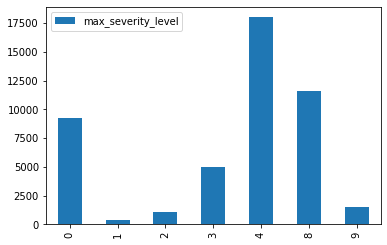
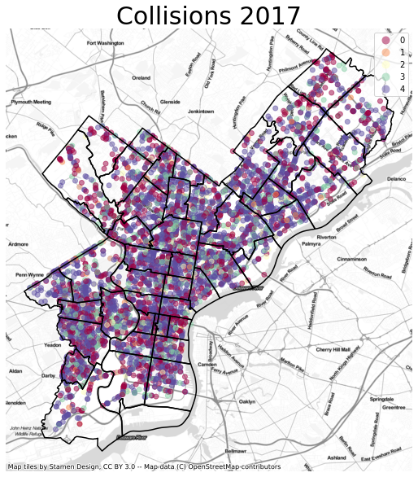

# PHILADELPHIA COLLISION DATASET (Coursera Capstone Project)

## Introduction

Vehicular accidents are a leading cause of injuries in the US. In 2018 motor-vehicle crashes accoundted for 39,404 deaths, 4.5 million medically consulted injuries and resulted in injury costs of $445.6 billion dollars. [NTSC Injury Facts](https://injuryfacts.nsc.org/motor-vehicle/overview/introduction/)

According to the ["Vision Zero"](https://www.nsc.org/Portals/0/Documents/DistractedDrivingDocuments/Driver-Tech/Road%20to%20Zero/The-Report.pdf?ver=2018-04-17-111652-263) Plan put together by the NSC, and important  aspect of reducing the severity of accidents is to design roadways in a way to prevent them.

An important aspect of the procedure to reduce the number of accidents is to identify not only the probelmatic areas, but also the additional factors that drive the severity of those accidents.

Identifying those problem areas and factors is an invaluable tool for both city planners and government officials. It also can prove to be a tool for insurance groups to push local governments into action. Nieghborhood groups can substanciate their claims for improvement in their local area. Finally Police and Emergency Response departments can better plan and hopefully reduce the amount of man hours and divert more resources to other causes when collisions are reduced.

## Business Problem
The city of Philadelphia has been implementing the __Vision Zero__ plant discussed above to improve upon the safety of its inhabitants. [They are using data to make smart decisions for city planning and enformcement.](http://visionzerophl.com/uploads/attachments/ck181ipfv1isp9pd66ww0iw0f-file-print-pages-hq-visionzero-y2-update.pdf) 

So the problem to be addressed in this report is can we identify the severity of collisions based on design and situational parameters to help the city of Philadelphia better design roads and traffic to reduce the severity of the vehicular collisions.

## Data Understanding

The dataset for this analysis is a the dataset used for Philadelphia's Vision Zero project. The data is derived form PennDOT's Crash Incident Dataset filtered to 2013-2017. PennDOT's full dataset can be accessed at their [API](https://data.pa.gov/resource/dc5b-gebx.json?), it does not contain data past 2017. The actual dataset for the city of Philadelphia can be found at the [OpenDataPhilly portal](https://www.opendataphilly.org/dataset/vehicular-crash-data). This project uses both the geojson and csv versions of the data.

Additionally for visualization and some spatial investigation this project makes use of the [zipcodes boundaries](https://www.opendataphilly.org/dataset/zip-codes) obtained at OpenDataPhilly. We will aslo be using the metadata form the same website to idenfity some of the more useful features.


```python
import pandas as pd
import seaborn as sns
import contextily as ctx
import geopandas
import numpy as np
import matplotlib.pyplot as plt
from IPython.display import display, Markdown
```


```python
collisions=pd.read_csv('Data/crash_data_collision_crash_2013_2017_vz.csv')
col_geo=po_districts=geopandas.read_file("Data/crash_data_collision_crash_2013_2017_vz.geojson")
```


```python
collisions.head(5)
```


<div>
<style scoped>
    .dataframe tbody tr th:only-of-type {
        vertical-align: middle;
    }

    .dataframe tbody tr th {
        vertical-align: top;
    }

    .dataframe thead th {
        text-align: right;
    }
</style>
<table border="1" class="dataframe">
  <thead>
    <tr style="text-align: right;">
      <th></th>
      <th>objectid</th>
      <th>crn</th>
      <th>district</th>
      <th>county</th>
      <th>crash_year</th>
      <th>crash_month</th>
      <th>day_of_week</th>
      <th>time_of_day</th>
      <th>hour_of_day</th>
      <th>illumination</th>
      <th>...</th>
      <th>illumination_dark</th>
      <th>running_stop_sign</th>
      <th>train</th>
      <th>trolley</th>
      <th>hit_parked_vehicle</th>
      <th>mc_drinking_driver</th>
      <th>drug_related</th>
      <th>illegal_drug_related</th>
      <th>drugged_driver</th>
      <th>impaired_driver</th>
    </tr>
  </thead>
  <tbody>
    <tr>
      <th>0</th>
      <td>8322</td>
      <td>2014125105</td>
      <td>6</td>
      <td>67</td>
      <td>2014</td>
      <td>12</td>
      <td>2</td>
      <td>600</td>
      <td>6</td>
      <td>3</td>
      <td>...</td>
      <td>1</td>
      <td>0</td>
      <td>0</td>
      <td>0</td>
      <td>0</td>
      <td>0</td>
      <td>0</td>
      <td>0</td>
      <td>0</td>
      <td>0</td>
    </tr>
    <tr>
      <th>1</th>
      <td>8238</td>
      <td>2014130456</td>
      <td>6</td>
      <td>67</td>
      <td>2014</td>
      <td>12</td>
      <td>6</td>
      <td>41</td>
      <td>0</td>
      <td>3</td>
      <td>...</td>
      <td>1</td>
      <td>0</td>
      <td>0</td>
      <td>0</td>
      <td>0</td>
      <td>0</td>
      <td>0</td>
      <td>0</td>
      <td>0</td>
      <td>0</td>
    </tr>
    <tr>
      <th>2</th>
      <td>8728</td>
      <td>2014130560</td>
      <td>6</td>
      <td>67</td>
      <td>2014</td>
      <td>12</td>
      <td>6</td>
      <td>1330</td>
      <td>13</td>
      <td>1</td>
      <td>...</td>
      <td>0</td>
      <td>0</td>
      <td>0</td>
      <td>0</td>
      <td>0</td>
      <td>0</td>
      <td>0</td>
      <td>0</td>
      <td>0</td>
      <td>0</td>
    </tr>
    <tr>
      <th>3</th>
      <td>1</td>
      <td>2017028806</td>
      <td>6</td>
      <td>67</td>
      <td>2017</td>
      <td>2</td>
      <td>5</td>
      <td>921</td>
      <td>9</td>
      <td>1</td>
      <td>...</td>
      <td>0</td>
      <td>0</td>
      <td>0</td>
      <td>0</td>
      <td>0</td>
      <td>0</td>
      <td>0</td>
      <td>0</td>
      <td>0</td>
      <td>0</td>
    </tr>
    <tr>
      <th>4</th>
      <td>2</td>
      <td>2017041347</td>
      <td>6</td>
      <td>67</td>
      <td>2017</td>
      <td>3</td>
      <td>5</td>
      <td>2210</td>
      <td>22</td>
      <td>3</td>
      <td>...</td>
      <td>1</td>
      <td>0</td>
      <td>0</td>
      <td>0</td>
      <td>0</td>
      <td>0</td>
      <td>0</td>
      <td>0</td>
      <td>0</td>
      <td>0</td>
    </tr>
  </tbody>
</table>
<p>5 rows × 96 columns</p>
</div>


```python
col_geo.head(5)
```


<div>
<style scoped>
    .dataframe tbody tr th:only-of-type {
        vertical-align: middle;
    }

    .dataframe tbody tr th {
        vertical-align: top;
    }

    .dataframe thead th {
        text-align: right;
    }
</style>
<table border="1" class="dataframe">
  <thead>
    <tr style="text-align: right;">
      <th></th>
      <th>objectid</th>
      <th>crn</th>
      <th>district</th>
      <th>county</th>
      <th>crash_year</th>
      <th>crash_month</th>
      <th>day_of_week</th>
      <th>time_of_day</th>
      <th>hour_of_day</th>
      <th>illumination</th>
      <th>...</th>
      <th>running_stop_sign</th>
      <th>train</th>
      <th>trolley</th>
      <th>hit_parked_vehicle</th>
      <th>mc_drinking_driver</th>
      <th>drug_related</th>
      <th>illegal_drug_related</th>
      <th>drugged_driver</th>
      <th>impaired_driver</th>
      <th>geometry</th>
    </tr>
  </thead>
  <tbody>
    <tr>
      <th>0</th>
      <td>8322</td>
      <td>2014125105</td>
      <td>6</td>
      <td>67</td>
      <td>2014</td>
      <td>12</td>
      <td>2</td>
      <td>600</td>
      <td>6</td>
      <td>3</td>
      <td>...</td>
      <td>0</td>
      <td>0</td>
      <td>0</td>
      <td>0</td>
      <td>0</td>
      <td>0</td>
      <td>0</td>
      <td>0</td>
      <td>0</td>
      <td>POINT (-75.12215 40.05319)</td>
    </tr>
    <tr>
      <th>1</th>
      <td>8238</td>
      <td>2014130456</td>
      <td>6</td>
      <td>67</td>
      <td>2014</td>
      <td>12</td>
      <td>6</td>
      <td>41</td>
      <td>0</td>
      <td>3</td>
      <td>...</td>
      <td>0</td>
      <td>0</td>
      <td>0</td>
      <td>0</td>
      <td>0</td>
      <td>0</td>
      <td>0</td>
      <td>0</td>
      <td>0</td>
      <td>POINT (-75.03507 40.07460)</td>
    </tr>
    <tr>
      <th>2</th>
      <td>8728</td>
      <td>2014130560</td>
      <td>6</td>
      <td>67</td>
      <td>2014</td>
      <td>12</td>
      <td>6</td>
      <td>1330</td>
      <td>13</td>
      <td>1</td>
      <td>...</td>
      <td>0</td>
      <td>0</td>
      <td>0</td>
      <td>0</td>
      <td>0</td>
      <td>0</td>
      <td>0</td>
      <td>0</td>
      <td>0</td>
      <td>POINT (-75.18808 39.97514)</td>
    </tr>
    <tr>
      <th>3</th>
      <td>1</td>
      <td>2017028806</td>
      <td>6</td>
      <td>67</td>
      <td>2017</td>
      <td>2</td>
      <td>5</td>
      <td>921</td>
      <td>9</td>
      <td>1</td>
      <td>...</td>
      <td>0</td>
      <td>0</td>
      <td>0</td>
      <td>0</td>
      <td>0</td>
      <td>0</td>
      <td>0</td>
      <td>0</td>
      <td>0</td>
      <td>POINT (-75.04050 40.03680)</td>
    </tr>
    <tr>
      <th>4</th>
      <td>2</td>
      <td>2017041347</td>
      <td>6</td>
      <td>67</td>
      <td>2017</td>
      <td>3</td>
      <td>5</td>
      <td>2210</td>
      <td>22</td>
      <td>3</td>
      <td>...</td>
      <td>0</td>
      <td>0</td>
      <td>0</td>
      <td>0</td>
      <td>0</td>
      <td>0</td>
      <td>0</td>
      <td>0</td>
      <td>0</td>
      <td>POINT (-75.13290 39.99110)</td>
    </tr>
  </tbody>
</table>
<p>5 rows × 97 columns</p>
</div>


To better correlate and have descriptions of features we import the metadata


```python
metafields=pd.read_csv('Data/fields.csv')
metafields['Field Name']=metafields['Field Name'].str.lower()
display(metafields.head(5))
```


```python
zipcode_boundaries=geopandas.read_file("Data/Zipcodes_Poly.geojson")
```

The metadata for the collisions dataset can be found [here](https://metadata.phila.gov/#home/datasetdetails/5543865420583086178c4eba/representationdetails/5c4114cde23cad276ca4245c/?view_287_page=5)


```python
len(collisions.columns)
```


    96


The collision data set contains 96 columns.


```python
collisions.columns
```


    Index(['objectid', 'crn', 'district', 'county', 'crash_year', 'crash_month',
           'day_of_week', 'time_of_day', 'hour_of_day', 'illumination', 'weather',
           'road_condition', 'collision_type', 'intersect_type', 'tcd_type',
           'location_type', 'fatal_count', 'injury_count', 'person_count',
           'latitude', 'longitude', 'bicycle_count', 'maj_inj_count',
           'mod_inj_count', 'min_inj_count', 'tot_inj_count', 'ped_count',
           'ped_death_count', 'ped_maj_inj_count', 'max_severity_level',
           'injury_or_fatal', 'fatal_or_maj_inj', 'injury', 'fatal', 'sch_bus_ind',
           'automobile_count', 'motorcycle_count', 'bus_count',
           'small_truck_count', 'heavy_truck_count', 'suv_count', 'van_count',
           'comm_veh_count', 'rdwy_surf_type_cd', 'intersection', 'state_road',
           'signalized_int', 'stop_controlled_int', 'hit_deer', 'hit_tree_shrub',
           'hit_embankment', 'hit_pole', 'hit_gdrail', 'hit_gdrail_end',
           'hit_barrier', 'hit_bridge', 'overturned', 'alcohol_related',
           'drinking_driver', 'underage_drnk_drv', 'distracted', 'cell_phone',
           'running_red_lt', 'tailgating', 'cross_median', 'curved_road',
           'curve_dvr_error', 'limit_65mph', 'speeding', 'speeding_related',
           'aggressive_driving', 'fatigue_asleep', 'driver_count_16yr',
           'driver_count_17yr', 'driver_count_18yr', 'driver_count_19yr',
           'driver_count_20yr', 'driver_count_50_64yr', 'driver_count_65_74yr',
           'driver_count_75plus', 'unbelted_occ_count', 'pedestrian',
           'comm_vehicle', 'psp_reported', 'nhtsa_agg_driving', 'deer_related',
           'illumination_dark', 'running_stop_sign', 'train', 'trolley',
           'hit_parked_vehicle', 'mc_drinking_driver', 'drug_related',
           'illegal_drug_related', 'drugged_driver', 'impaired_driver'],
          dtype='object')


The target value that our program will attempt to predict is the severity of the collision. This is denoted by MAX_SEVERITY_LEVEL in the dataset 

|MAX_SEVERITY_LEVEL |Maximum injury severity level of the crash |
| - | - |
|0 | Not injured
|1 | Killed
|2 | Major injury
|3 | Moderate injury
|4 | Minor injury
|8 | Injury/ Unknown Severity
|9 | Unknown

In order to determine what features/ columns to a count of the unique values per feature is performed. Features with low counts are also presented. From this approach it is clear which columns can be safetly left out of the investigation (for example `county` and `district`).


```python
col_values=[]
for col in collisions.columns:
    num_values=len(collisions[col].unique())
    col_values.append([col,num_values])
col_df=pd.DataFrame(col_values,columns=['column','values'])
col_df.head()
for i in range(1,5):
    print('Number of distinct values: '+str(i))
    display(col_df[col_df.values==i].sort_values('column'))
```

    Number of distinct values: 1
    


<div>
<style scoped>
    .dataframe tbody tr th:only-of-type {
        vertical-align: middle;
    }

    .dataframe tbody tr th {
        vertical-align: top;
    }

    .dataframe thead th {
        text-align: right;
    }
</style>
<table border="1" class="dataframe">
  <thead>
    <tr style="text-align: right;">
      <th></th>
      <th>column</th>
      <th>values</th>
    </tr>
  </thead>
  <tbody>
    <tr>
      <th>3</th>
      <td>county</td>
      <td>1</td>
    </tr>
    <tr>
      <th>2</th>
      <td>district</td>
      <td>1</td>
    </tr>
    <tr>
      <th>67</th>
      <td>limit_65mph</td>
      <td>1</td>
    </tr>
  </tbody>
</table>
</div>


    Number of distinct values: 2
    


<div>
<style scoped>
    .dataframe tbody tr th:only-of-type {
        vertical-align: middle;
    }

    .dataframe tbody tr th {
        vertical-align: top;
    }

    .dataframe thead th {
        text-align: right;
    }
</style>
<table border="1" class="dataframe">
  <thead>
    <tr style="text-align: right;">
      <th></th>
      <th>column</th>
      <th>values</th>
    </tr>
  </thead>
  <tbody>
    <tr>
      <th>70</th>
      <td>aggressive_driving</td>
      <td>2</td>
    </tr>
    <tr>
      <th>57</th>
      <td>alcohol_related</td>
      <td>2</td>
    </tr>
    <tr>
      <th>61</th>
      <td>cell_phone</td>
      <td>2</td>
    </tr>
    <tr>
      <th>82</th>
      <td>comm_vehicle</td>
      <td>2</td>
    </tr>
    <tr>
      <th>64</th>
      <td>cross_median</td>
      <td>2</td>
    </tr>
    <tr>
      <th>66</th>
      <td>curve_dvr_error</td>
      <td>2</td>
    </tr>
    <tr>
      <th>65</th>
      <td>curved_road</td>
      <td>2</td>
    </tr>
    <tr>
      <th>85</th>
      <td>deer_related</td>
      <td>2</td>
    </tr>
    <tr>
      <th>60</th>
      <td>distracted</td>
      <td>2</td>
    </tr>
    <tr>
      <th>58</th>
      <td>drinking_driver</td>
      <td>2</td>
    </tr>
    <tr>
      <th>72</th>
      <td>driver_count_16yr</td>
      <td>2</td>
    </tr>
    <tr>
      <th>73</th>
      <td>driver_count_17yr</td>
      <td>2</td>
    </tr>
    <tr>
      <th>74</th>
      <td>driver_count_18yr</td>
      <td>2</td>
    </tr>
    <tr>
      <th>75</th>
      <td>driver_count_19yr</td>
      <td>2</td>
    </tr>
    <tr>
      <th>76</th>
      <td>driver_count_20yr</td>
      <td>2</td>
    </tr>
    <tr>
      <th>77</th>
      <td>driver_count_50_64yr</td>
      <td>2</td>
    </tr>
    <tr>
      <th>78</th>
      <td>driver_count_65_74yr</td>
      <td>2</td>
    </tr>
    <tr>
      <th>79</th>
      <td>driver_count_75plus</td>
      <td>2</td>
    </tr>
    <tr>
      <th>92</th>
      <td>drug_related</td>
      <td>2</td>
    </tr>
    <tr>
      <th>94</th>
      <td>drugged_driver</td>
      <td>2</td>
    </tr>
    <tr>
      <th>33</th>
      <td>fatal</td>
      <td>2</td>
    </tr>
    <tr>
      <th>31</th>
      <td>fatal_or_maj_inj</td>
      <td>2</td>
    </tr>
    <tr>
      <th>71</th>
      <td>fatigue_asleep</td>
      <td>2</td>
    </tr>
    <tr>
      <th>54</th>
      <td>hit_barrier</td>
      <td>2</td>
    </tr>
    <tr>
      <th>55</th>
      <td>hit_bridge</td>
      <td>2</td>
    </tr>
    <tr>
      <th>48</th>
      <td>hit_deer</td>
      <td>2</td>
    </tr>
    <tr>
      <th>50</th>
      <td>hit_embankment</td>
      <td>2</td>
    </tr>
    <tr>
      <th>52</th>
      <td>hit_gdrail</td>
      <td>2</td>
    </tr>
    <tr>
      <th>53</th>
      <td>hit_gdrail_end</td>
      <td>2</td>
    </tr>
    <tr>
      <th>90</th>
      <td>hit_parked_vehicle</td>
      <td>2</td>
    </tr>
    <tr>
      <th>51</th>
      <td>hit_pole</td>
      <td>2</td>
    </tr>
    <tr>
      <th>49</th>
      <td>hit_tree_shrub</td>
      <td>2</td>
    </tr>
    <tr>
      <th>93</th>
      <td>illegal_drug_related</td>
      <td>2</td>
    </tr>
    <tr>
      <th>86</th>
      <td>illumination_dark</td>
      <td>2</td>
    </tr>
    <tr>
      <th>95</th>
      <td>impaired_driver</td>
      <td>2</td>
    </tr>
    <tr>
      <th>32</th>
      <td>injury</td>
      <td>2</td>
    </tr>
    <tr>
      <th>30</th>
      <td>injury_or_fatal</td>
      <td>2</td>
    </tr>
    <tr>
      <th>44</th>
      <td>intersection</td>
      <td>2</td>
    </tr>
    <tr>
      <th>91</th>
      <td>mc_drinking_driver</td>
      <td>2</td>
    </tr>
    <tr>
      <th>84</th>
      <td>nhtsa_agg_driving</td>
      <td>2</td>
    </tr>
    <tr>
      <th>56</th>
      <td>overturned</td>
      <td>2</td>
    </tr>
    <tr>
      <th>81</th>
      <td>pedestrian</td>
      <td>2</td>
    </tr>
    <tr>
      <th>83</th>
      <td>psp_reported</td>
      <td>2</td>
    </tr>
    <tr>
      <th>62</th>
      <td>running_red_lt</td>
      <td>2</td>
    </tr>
    <tr>
      <th>87</th>
      <td>running_stop_sign</td>
      <td>2</td>
    </tr>
    <tr>
      <th>46</th>
      <td>signalized_int</td>
      <td>2</td>
    </tr>
    <tr>
      <th>68</th>
      <td>speeding</td>
      <td>2</td>
    </tr>
    <tr>
      <th>69</th>
      <td>speeding_related</td>
      <td>2</td>
    </tr>
    <tr>
      <th>45</th>
      <td>state_road</td>
      <td>2</td>
    </tr>
    <tr>
      <th>47</th>
      <td>stop_controlled_int</td>
      <td>2</td>
    </tr>
    <tr>
      <th>63</th>
      <td>tailgating</td>
      <td>2</td>
    </tr>
    <tr>
      <th>88</th>
      <td>train</td>
      <td>2</td>
    </tr>
    <tr>
      <th>89</th>
      <td>trolley</td>
      <td>2</td>
    </tr>
    <tr>
      <th>80</th>
      <td>unbelted_occ_count</td>
      <td>2</td>
    </tr>
    <tr>
      <th>59</th>
      <td>underage_drnk_drv</td>
      <td>2</td>
    </tr>
  </tbody>
</table>
</div>


    Number of distinct values: 3
    


<div>
<style scoped>
    .dataframe tbody tr th:only-of-type {
        vertical-align: middle;
    }

    .dataframe tbody tr th {
        vertical-align: top;
    }

    .dataframe thead th {
        text-align: right;
    }
</style>
<table border="1" class="dataframe">
  <thead>
    <tr style="text-align: right;">
      <th></th>
      <th>column</th>
      <th>values</th>
    </tr>
  </thead>
  <tbody>
    <tr>
      <th>21</th>
      <td>bicycle_count</td>
      <td>3</td>
    </tr>
    <tr>
      <th>37</th>
      <td>bus_count</td>
      <td>3</td>
    </tr>
    <tr>
      <th>39</th>
      <td>heavy_truck_count</td>
      <td>3</td>
    </tr>
  </tbody>
</table>
</div>


    Number of distinct values: 4
    


<div>
<style scoped>
    .dataframe tbody tr th:only-of-type {
        vertical-align: middle;
    }

    .dataframe tbody tr th {
        vertical-align: top;
    }

    .dataframe thead th {
        text-align: right;
    }
</style>
<table border="1" class="dataframe">
  <thead>
    <tr style="text-align: right;">
      <th></th>
      <th>column</th>
      <th>values</th>
    </tr>
  </thead>
  <tbody>
    <tr>
      <th>42</th>
      <td>comm_veh_count</td>
      <td>4</td>
    </tr>
    <tr>
      <th>36</th>
      <td>motorcycle_count</td>
      <td>4</td>
    </tr>
    <tr>
      <th>27</th>
      <td>ped_death_count</td>
      <td>4</td>
    </tr>
    <tr>
      <th>28</th>
      <td>ped_maj_inj_count</td>
      <td>4</td>
    </tr>
    <tr>
      <th>43</th>
      <td>rdwy_surf_type_cd</td>
      <td>4</td>
    </tr>
    <tr>
      <th>34</th>
      <td>sch_bus_ind</td>
      <td>4</td>
    </tr>
    <tr>
      <th>38</th>
      <td>small_truck_count</td>
      <td>4</td>
    </tr>
    <tr>
      <th>41</th>
      <td>van_count</td>
      <td>4</td>
    </tr>
  </tbody>
</table>
</div>


From the previous counts we can also determine that quite a lot of columns are descriptive of the incident outcome and not the conditions (which are more interesting for planning). These can be identified by the prefixes, for example `hit` and `count`.


```python
col_df.sort_values('values',ascending=False).head(5)
```


<div>
<style scoped>
    .dataframe tbody tr th:only-of-type {
        vertical-align: middle;
    }

    .dataframe tbody tr th {
        vertical-align: top;
    }

    .dataframe thead th {
        text-align: right;
    }
</style>
<table border="1" class="dataframe">
  <thead>
    <tr style="text-align: right;">
      <th></th>
      <th>column</th>
      <th>values</th>
    </tr>
  </thead>
  <tbody>
    <tr>
      <th>0</th>
      <td>objectid</td>
      <td>46863</td>
    </tr>
    <tr>
      <th>1</th>
      <td>crn</td>
      <td>46863</td>
    </tr>
    <tr>
      <th>20</th>
      <td>longitude</td>
      <td>7370</td>
    </tr>
    <tr>
      <th>19</th>
      <td>latitude</td>
      <td>7352</td>
    </tr>
    <tr>
      <th>7</th>
      <td>time_of_day</td>
      <td>1441</td>
    </tr>
  </tbody>
</table>
</div>


As far as the values from the largest counts `objectid` and `crn` seem to be identifiers and as such only require one of them.


Since the dataset contains columns not explained in the metadata we want to identify why the diference.


```python
undescribed_cols_CSV = np.setdiff1d(collisions.columns,metafields['Field Name'])
undescribed_cols_CSV
```


    array(['aggressive_driving', 'alcohol_related', 'cell_phone',
           'collision_type', 'comm_vehicle', 'county', 'cross_median',
           'curve_dvr_error', 'curved_road', 'deer_related', 'distracted',
           'district', 'drinking_driver', 'driver_count_16yr',
           'driver_count_17yr', 'driver_count_18yr', 'driver_count_19yr',
           'driver_count_20yr', 'driver_count_50_64yr',
           'driver_count_65_74yr', 'driver_count_75plus', 'drug_related',
           'drugged_driver', 'fatal', 'fatal_or_maj_inj', 'fatigue_asleep',
           'hit_barrier', 'hit_bridge', 'hit_deer', 'hit_embankment',
           'hit_gdrail', 'hit_gdrail_end', 'hit_parked_vehicle', 'hit_pole',
           'hit_tree_shrub', 'illegal_drug_related', 'illumination_dark',
           'impaired_driver', 'injury', 'injury_or_fatal', 'latitude',
           'limit_65mph', 'location_type', 'longitude', 'mc_drinking_driver',
           'nhtsa_agg_driving', 'objectid', 'overturned', 'pedestrian',
           'psp_reported', 'rdwy_surf_type_cd', 'running_red_lt',
           'running_stop_sign', 'signalized_int', 'speeding',
           'speeding_related', 'state_road', 'stop_controlled_int',
           'tailgating', 'tot_inj_count', 'train', 'trolley',
           'underage_drnk_drv', 'weather'], dtype=object)


The fields identified as descriptive of the accident outcome seem to the majority of the extra fields not contained in the metadata


```python
undescribed_cols_META = np.setdiff1d(metafields['Field Name'],collisions.columns)
undescribed_cols_META
```


    array(['belted_death_count', 'belted_maj_inj_count',
           'bicycle_death_count', 'bicycle_maj_inj_count',
           'mcycle_death_count', 'mcycle_maj_inj_count', 'sch_zone_ind',
           'unb_death_count', 'unb_maj_inj_count', 'unk_inj_deg_count',
           'unk_inj_per_count', 'vehicle_count'], dtype=object)


We create a dataframe of only existing fields


```python
efields=metafields[~metafields['Field Name'].isin(undescribed_cols_META)]
efields
```


<div>
<style scoped>
    .dataframe tbody tr th:only-of-type {
        vertical-align: middle;
    }

    .dataframe tbody tr th {
        vertical-align: top;
    }

    .dataframe thead th {
        text-align: right;
    }
</style>
<table border="1" class="dataframe">
  <thead>
    <tr style="text-align: right;">
      <th></th>
      <th>Field Name</th>
      <th>Alias</th>
      <th>Description</th>
      <th>Type</th>
    </tr>
  </thead>
  <tbody>
    <tr>
      <th>0</th>
      <td>automobile_count</td>
      <td>dataset</td>
      <td>Total Amount of Automobiles Involved in crash</td>
      <td>Numeric</td>
    </tr>
    <tr>
      <th>3</th>
      <td>bicycle_count</td>
      <td>dataset</td>
      <td>Total number of bicycles involved</td>
      <td>Numeric</td>
    </tr>
    <tr>
      <th>6</th>
      <td>bus_count</td>
      <td>dataset</td>
      <td>Total number of buses involved</td>
      <td>Numeric</td>
    </tr>
    <tr>
      <th>7</th>
      <td>comm_veh_count</td>
      <td>dataset</td>
      <td>Total number of commercial vehicles involved i...</td>
      <td>Numeric</td>
    </tr>
    <tr>
      <th>8</th>
      <td>crash_month</td>
      <td>dataset</td>
      <td>Month when the crash occurred</td>
      <td>Text</td>
    </tr>
    <tr>
      <th>9</th>
      <td>crash_year</td>
      <td>dataset</td>
      <td>Year in which the crash occurred.</td>
      <td>Text</td>
    </tr>
    <tr>
      <th>10</th>
      <td>crn</td>
      <td>dataset</td>
      <td>Crash record number - unique identifier for ea...</td>
      <td>Numeric</td>
    </tr>
    <tr>
      <th>11</th>
      <td>day_of_week</td>
      <td>dataset</td>
      <td>Day of the Week code when crash occurred-&lt;br /...</td>
      <td>Text</td>
    </tr>
    <tr>
      <th>12</th>
      <td>fatal_count</td>
      <td>dataset</td>
      <td>Total number of fatalities involved</td>
      <td>Numeric</td>
    </tr>
    <tr>
      <th>13</th>
      <td>heavy_truck_count</td>
      <td>dataset</td>
      <td>Total number of heavy trucks involved in crash</td>
      <td>Numeric</td>
    </tr>
    <tr>
      <th>14</th>
      <td>hour_of_day</td>
      <td>dataset</td>
      <td>The hour of the day when the crash occurred - ...</td>
      <td>Text</td>
    </tr>
    <tr>
      <th>15</th>
      <td>illumination</td>
      <td>dataset</td>
      <td>Code that defines lighting  at crash scene -&lt;b...</td>
      <td>Text</td>
    </tr>
    <tr>
      <th>16</th>
      <td>injury_count</td>
      <td>dataset</td>
      <td>Total count of all people who sustained an inj...</td>
      <td>Numeric</td>
    </tr>
    <tr>
      <th>17</th>
      <td>intersect_type</td>
      <td>dataset</td>
      <td>Code that defines the Intersection Type -&lt;br /...</td>
      <td>Text</td>
    </tr>
    <tr>
      <th>18</th>
      <td>intersection</td>
      <td>dataset</td>
      <td>Intersection indicator -&lt;br /&gt;0 = No&lt;br /&gt;1 = Yes</td>
      <td>Numeric</td>
    </tr>
    <tr>
      <th>19</th>
      <td>maj_inj_count</td>
      <td>dataset</td>
      <td>Total number of individuals who sustained majo...</td>
      <td>Numeric</td>
    </tr>
    <tr>
      <th>20</th>
      <td>max_severity_level</td>
      <td>dataset</td>
      <td>Maximum injury severity level of the crash -&lt;b...</td>
      <td>Text</td>
    </tr>
    <tr>
      <th>23</th>
      <td>min_inj_count</td>
      <td>dataset</td>
      <td>Total number of people who sustained minimal i...</td>
      <td>Numeric</td>
    </tr>
    <tr>
      <th>24</th>
      <td>mod_inj_count</td>
      <td>dataset</td>
      <td>Total number of people who sustained moderate ...</td>
      <td>Numeric</td>
    </tr>
    <tr>
      <th>25</th>
      <td>motorcycle_count</td>
      <td>dataset</td>
      <td>Total amount of Motorcycles Involved</td>
      <td>Numeric</td>
    </tr>
    <tr>
      <th>26</th>
      <td>ped_count</td>
      <td>dataset</td>
      <td>Total number of pedestrians involved in the cr...</td>
      <td>Numeric</td>
    </tr>
    <tr>
      <th>27</th>
      <td>ped_death_count</td>
      <td>dataset</td>
      <td>Total number of pedestrians who were killed du...</td>
      <td>Numeric</td>
    </tr>
    <tr>
      <th>28</th>
      <td>ped_maj_inj_count</td>
      <td>dataset</td>
      <td>Total number of pedestrians who sustained majo...</td>
      <td>Numeric</td>
    </tr>
    <tr>
      <th>29</th>
      <td>person_count</td>
      <td>dataset</td>
      <td>Total amount of people involved in crash</td>
      <td>Numeric</td>
    </tr>
    <tr>
      <th>30</th>
      <td>road_condition</td>
      <td>dataset</td>
      <td>Roadway surface condition code -&lt;br /&gt;0 – Dry&lt;...</td>
      <td>Text</td>
    </tr>
    <tr>
      <th>31</th>
      <td>sch_bus_ind</td>
      <td>dataset</td>
      <td>Did the crash involve a School Bus? &lt;br /&gt;Y = ...</td>
      <td>Text</td>
    </tr>
    <tr>
      <th>33</th>
      <td>small_truck_count</td>
      <td>dataset</td>
      <td>Total number of small trucks involved in crash</td>
      <td>Numeric</td>
    </tr>
    <tr>
      <th>34</th>
      <td>suv_count</td>
      <td>dataset</td>
      <td>Total count of sport utility vehicles involved...</td>
      <td>Numeric</td>
    </tr>
    <tr>
      <th>35</th>
      <td>tcd_type</td>
      <td>dataset</td>
      <td>Code that defines the Traffic Control Device -...</td>
      <td>Text</td>
    </tr>
    <tr>
      <th>36</th>
      <td>time_of_day</td>
      <td>dataset</td>
      <td>The time of day when the crash occurred</td>
      <td>Text</td>
    </tr>
    <tr>
      <th>39</th>
      <td>unbelted_occ_count</td>
      <td>dataset</td>
      <td>Total number of unbelted occupants</td>
      <td>Numeric</td>
    </tr>
    <tr>
      <th>42</th>
      <td>van_count</td>
      <td>dataset</td>
      <td>Total number of vans involved</td>
      <td>Numeric</td>
    </tr>
  </tbody>
</table>
</div>


Quick correlation matrix


```python
corr = collisions[efields['Field Name']].corr()
corr.style.background_gradient(cmap='coolwarm')
```


<style  type="text/css" >
    #T_7b268992_fe09_11ea_a046_38dead6f0c10row0_col0 {
            background-color:  #b40426;
            color:  #f1f1f1;
        }    #T_7b268992_fe09_11ea_a046_38dead6f0c10row0_col1 {
            background-color:  #3b4cc0;
            color:  #f1f1f1;
        }    #T_7b268992_fe09_11ea_a046_38dead6f0c10row0_col2 {
            background-color:  #3b4cc0;
            color:  #f1f1f1;
        }    #T_7b268992_fe09_11ea_a046_38dead6f0c10row0_col3 {
            background-color:  #3b4cc0;
            color:  #f1f1f1;
        }    #T_7b268992_fe09_11ea_a046_38dead6f0c10row0_col4 {
            background-color:  #4f69d9;
            color:  #000000;
        }    #T_7b268992_fe09_11ea_a046_38dead6f0c10row0_col5 {
            background-color:  #9abbff;
            color:  #000000;
        }    #T_7b268992_fe09_11ea_a046_38dead6f0c10row0_col6 {
            background-color:  #98b9ff;
            color:  #000000;
        }    #T_7b268992_fe09_11ea_a046_38dead6f0c10row0_col7 {
            background-color:  #3e51c5;
            color:  #f1f1f1;
        }    #T_7b268992_fe09_11ea_a046_38dead6f0c10row0_col8 {
            background-color:  #4b64d5;
            color:  #f1f1f1;
        }    #T_7b268992_fe09_11ea_a046_38dead6f0c10row0_col9 {
            background-color:  #3b4cc0;
            color:  #f1f1f1;
        }    #T_7b268992_fe09_11ea_a046_38dead6f0c10row0_col10 {
            background-color:  #4c66d6;
            color:  #000000;
        }    #T_7b268992_fe09_11ea_a046_38dead6f0c10row0_col11 {
            background-color:  #5470de;
            color:  #000000;
        }    #T_7b268992_fe09_11ea_a046_38dead6f0c10row0_col12 {
            background-color:  #5875e1;
            color:  #000000;
        }    #T_7b268992_fe09_11ea_a046_38dead6f0c10row0_col13 {
            background-color:  #465ecf;
            color:  #f1f1f1;
        }    #T_7b268992_fe09_11ea_a046_38dead6f0c10row0_col14 {
            background-color:  #97b8ff;
            color:  #000000;
        }    #T_7b268992_fe09_11ea_a046_38dead6f0c10row0_col15 {
            background-color:  #516ddb;
            color:  #000000;
        }    #T_7b268992_fe09_11ea_a046_38dead6f0c10row0_col16 {
            background-color:  #4f69d9;
            color:  #000000;
        }    #T_7b268992_fe09_11ea_a046_38dead6f0c10row0_col17 {
            background-color:  #6384eb;
            color:  #000000;
        }    #T_7b268992_fe09_11ea_a046_38dead6f0c10row0_col18 {
            background-color:  #5572df;
            color:  #000000;
        }    #T_7b268992_fe09_11ea_a046_38dead6f0c10row0_col19 {
            background-color:  #3b4cc0;
            color:  #f1f1f1;
        }    #T_7b268992_fe09_11ea_a046_38dead6f0c10row0_col20 {
            background-color:  #3b4cc0;
            color:  #f1f1f1;
        }    #T_7b268992_fe09_11ea_a046_38dead6f0c10row0_col21 {
            background-color:  #4358cb;
            color:  #f1f1f1;
        }    #T_7b268992_fe09_11ea_a046_38dead6f0c10row0_col22 {
            background-color:  #3f53c6;
            color:  #f1f1f1;
        }    #T_7b268992_fe09_11ea_a046_38dead6f0c10row0_col23 {
            background-color:  #84a7fc;
            color:  #000000;
        }    #T_7b268992_fe09_11ea_a046_38dead6f0c10row0_col24 {
            background-color:  #4e68d8;
            color:  #000000;
        }    #T_7b268992_fe09_11ea_a046_38dead6f0c10row0_col25 {
            background-color:  #3b4cc0;
            color:  #f1f1f1;
        }    #T_7b268992_fe09_11ea_a046_38dead6f0c10row0_col26 {
            background-color:  #3b4cc0;
            color:  #f1f1f1;
        }    #T_7b268992_fe09_11ea_a046_38dead6f0c10row0_col27 {
            background-color:  #6180e9;
            color:  #000000;
        }    #T_7b268992_fe09_11ea_a046_38dead6f0c10row0_col28 {
            background-color:  #4c66d6;
            color:  #000000;
        }    #T_7b268992_fe09_11ea_a046_38dead6f0c10row0_col29 {
            background-color:  #5572df;
            color:  #000000;
        }    #T_7b268992_fe09_11ea_a046_38dead6f0c10row0_col30 {
            background-color:  #3b4cc0;
            color:  #f1f1f1;
        }    #T_7b268992_fe09_11ea_a046_38dead6f0c10row1_col0 {
            background-color:  #6384eb;
            color:  #000000;
        }    #T_7b268992_fe09_11ea_a046_38dead6f0c10row1_col1 {
            background-color:  #b40426;
            color:  #f1f1f1;
        }    #T_7b268992_fe09_11ea_a046_38dead6f0c10row1_col2 {
            background-color:  #506bda;
            color:  #000000;
        }    #T_7b268992_fe09_11ea_a046_38dead6f0c10row1_col3 {
            background-color:  #5875e1;
            color:  #000000;
        }    #T_7b268992_fe09_11ea_a046_38dead6f0c10row1_col4 {
            background-color:  #5e7de7;
            color:  #000000;
        }    #T_7b268992_fe09_11ea_a046_38dead6f0c10row1_col5 {
            background-color:  #86a9fc;
            color:  #000000;
        }    #T_7b268992_fe09_11ea_a046_38dead6f0c10row1_col6 {
            background-color:  #85a8fc;
            color:  #000000;
        }    #T_7b268992_fe09_11ea_a046_38dead6f0c10row1_col7 {
            background-color:  #3f53c6;
            color:  #f1f1f1;
        }    #T_7b268992_fe09_11ea_a046_38dead6f0c10row1_col8 {
            background-color:  #5470de;
            color:  #000000;
        }    #T_7b268992_fe09_11ea_a046_38dead6f0c10row1_col9 {
            background-color:  #4f69d9;
            color:  #000000;
        }    #T_7b268992_fe09_11ea_a046_38dead6f0c10row1_col10 {
            background-color:  #516ddb;
            color:  #000000;
        }    #T_7b268992_fe09_11ea_a046_38dead6f0c10row1_col11 {
            background-color:  #445acc;
            color:  #f1f1f1;
        }    #T_7b268992_fe09_11ea_a046_38dead6f0c10row1_col12 {
            background-color:  #455cce;
            color:  #f1f1f1;
        }    #T_7b268992_fe09_11ea_a046_38dead6f0c10row1_col13 {
            background-color:  #445acc;
            color:  #f1f1f1;
        }    #T_7b268992_fe09_11ea_a046_38dead6f0c10row1_col14 {
            background-color:  #94b6ff;
            color:  #000000;
        }    #T_7b268992_fe09_11ea_a046_38dead6f0c10row1_col15 {
            background-color:  #5a78e4;
            color:  #000000;
        }    #T_7b268992_fe09_11ea_a046_38dead6f0c10row1_col16 {
            background-color:  #6b8df0;
            color:  #000000;
        }    #T_7b268992_fe09_11ea_a046_38dead6f0c10row1_col17 {
            background-color:  #5673e0;
            color:  #000000;
        }    #T_7b268992_fe09_11ea_a046_38dead6f0c10row1_col18 {
            background-color:  #6282ea;
            color:  #000000;
        }    #T_7b268992_fe09_11ea_a046_38dead6f0c10row1_col19 {
            background-color:  #536edd;
            color:  #000000;
        }    #T_7b268992_fe09_11ea_a046_38dead6f0c10row1_col20 {
            background-color:  #6282ea;
            color:  #000000;
        }    #T_7b268992_fe09_11ea_a046_38dead6f0c10row1_col21 {
            background-color:  #485fd1;
            color:  #f1f1f1;
        }    #T_7b268992_fe09_11ea_a046_38dead6f0c10row1_col22 {
            background-color:  #465ecf;
            color:  #f1f1f1;
        }    #T_7b268992_fe09_11ea_a046_38dead6f0c10row1_col23 {
            background-color:  #4257c9;
            color:  #f1f1f1;
        }    #T_7b268992_fe09_11ea_a046_38dead6f0c10row1_col24 {
            background-color:  #485fd1;
            color:  #f1f1f1;
        }    #T_7b268992_fe09_11ea_a046_38dead6f0c10row1_col25 {
            background-color:  #5f7fe8;
            color:  #000000;
        }    #T_7b268992_fe09_11ea_a046_38dead6f0c10row1_col26 {
            background-color:  #7597f6;
            color:  #000000;
        }    #T_7b268992_fe09_11ea_a046_38dead6f0c10row1_col27 {
            background-color:  #506bda;
            color:  #000000;
        }    #T_7b268992_fe09_11ea_a046_38dead6f0c10row1_col28 {
            background-color:  #516ddb;
            color:  #000000;
        }    #T_7b268992_fe09_11ea_a046_38dead6f0c10row1_col29 {
            background-color:  #4e68d8;
            color:  #000000;
        }    #T_7b268992_fe09_11ea_a046_38dead6f0c10row1_col30 {
            background-color:  #6180e9;
            color:  #000000;
        }    #T_7b268992_fe09_11ea_a046_38dead6f0c10row2_col0 {
            background-color:  #6f92f3;
            color:  #000000;
        }    #T_7b268992_fe09_11ea_a046_38dead6f0c10row2_col1 {
            background-color:  #5d7ce6;
            color:  #000000;
        }    #T_7b268992_fe09_11ea_a046_38dead6f0c10row2_col2 {
            background-color:  #b40426;
            color:  #f1f1f1;
        }    #T_7b268992_fe09_11ea_a046_38dead6f0c10row2_col3 {
            background-color:  #f7a889;
            color:  #000000;
        }    #T_7b268992_fe09_11ea_a046_38dead6f0c10row2_col4 {
            background-color:  #5572df;
            color:  #000000;
        }    #T_7b268992_fe09_11ea_a046_38dead6f0c10row2_col5 {
            background-color:  #8db0fe;
            color:  #000000;
        }    #T_7b268992_fe09_11ea_a046_38dead6f0c10row2_col6 {
            background-color:  #8db0fe;
            color:  #000000;
        }    #T_7b268992_fe09_11ea_a046_38dead6f0c10row2_col7 {
            background-color:  #3e51c5;
            color:  #f1f1f1;
        }    #T_7b268992_fe09_11ea_a046_38dead6f0c10row2_col8 {
            background-color:  #5b7ae5;
            color:  #000000;
        }    #T_7b268992_fe09_11ea_a046_38dead6f0c10row2_col9 {
            background-color:  #5470de;
            color:  #000000;
        }    #T_7b268992_fe09_11ea_a046_38dead6f0c10row2_col10 {
            background-color:  #4b64d5;
            color:  #f1f1f1;
        }    #T_7b268992_fe09_11ea_a046_38dead6f0c10row2_col11 {
            background-color:  #4257c9;
            color:  #f1f1f1;
        }    #T_7b268992_fe09_11ea_a046_38dead6f0c10row2_col12 {
            background-color:  #6b8df0;
            color:  #000000;
        }    #T_7b268992_fe09_11ea_a046_38dead6f0c10row2_col13 {
            background-color:  #3e51c5;
            color:  #f1f1f1;
        }    #T_7b268992_fe09_11ea_a046_38dead6f0c10row2_col14 {
            background-color:  #8db0fe;
            color:  #000000;
        }    #T_7b268992_fe09_11ea_a046_38dead6f0c10row2_col15 {
            background-color:  #5875e1;
            color:  #000000;
        }    #T_7b268992_fe09_11ea_a046_38dead6f0c10row2_col16 {
            background-color:  #6384eb;
            color:  #000000;
        }    #T_7b268992_fe09_11ea_a046_38dead6f0c10row2_col17 {
            background-color:  #6b8df0;
            color:  #000000;
        }    #T_7b268992_fe09_11ea_a046_38dead6f0c10row2_col18 {
            background-color:  #5b7ae5;
            color:  #000000;
        }    #T_7b268992_fe09_11ea_a046_38dead6f0c10row2_col19 {
            background-color:  #5572df;
            color:  #000000;
        }    #T_7b268992_fe09_11ea_a046_38dead6f0c10row2_col20 {
            background-color:  #7a9df8;
            color:  #000000;
        }    #T_7b268992_fe09_11ea_a046_38dead6f0c10row2_col21 {
            background-color:  #506bda;
            color:  #000000;
        }    #T_7b268992_fe09_11ea_a046_38dead6f0c10row2_col22 {
            background-color:  #4c66d6;
            color:  #000000;
        }    #T_7b268992_fe09_11ea_a046_38dead6f0c10row2_col23 {
            background-color:  #9dbdff;
            color:  #000000;
        }    #T_7b268992_fe09_11ea_a046_38dead6f0c10row2_col24 {
            background-color:  #536edd;
            color:  #000000;
        }    #T_7b268992_fe09_11ea_a046_38dead6f0c10row2_col25 {
            background-color:  #6282ea;
            color:  #000000;
        }    #T_7b268992_fe09_11ea_a046_38dead6f0c10row2_col26 {
            background-color:  #7a9df8;
            color:  #000000;
        }    #T_7b268992_fe09_11ea_a046_38dead6f0c10row2_col27 {
            background-color:  #4b64d5;
            color:  #f1f1f1;
        }    #T_7b268992_fe09_11ea_a046_38dead6f0c10row2_col28 {
            background-color:  #4b64d5;
            color:  #f1f1f1;
        }    #T_7b268992_fe09_11ea_a046_38dead6f0c10row2_col29 {
            background-color:  #4b64d5;
            color:  #f1f1f1;
        }    #T_7b268992_fe09_11ea_a046_38dead6f0c10row2_col30 {
            background-color:  #6485ec;
            color:  #000000;
        }    #T_7b268992_fe09_11ea_a046_38dead6f0c10row3_col0 {
            background-color:  #6485ec;
            color:  #000000;
        }    #T_7b268992_fe09_11ea_a046_38dead6f0c10row3_col1 {
            background-color:  #5977e3;
            color:  #000000;
        }    #T_7b268992_fe09_11ea_a046_38dead6f0c10row3_col2 {
            background-color:  #f7aa8c;
            color:  #000000;
        }    #T_7b268992_fe09_11ea_a046_38dead6f0c10row3_col3 {
            background-color:  #b40426;
            color:  #f1f1f1;
        }    #T_7b268992_fe09_11ea_a046_38dead6f0c10row3_col4 {
            background-color:  #5470de;
            color:  #000000;
        }    #T_7b268992_fe09_11ea_a046_38dead6f0c10row3_col5 {
            background-color:  #8fb1fe;
            color:  #000000;
        }    #T_7b268992_fe09_11ea_a046_38dead6f0c10row3_col6 {
            background-color:  #8db0fe;
            color:  #000000;
        }    #T_7b268992_fe09_11ea_a046_38dead6f0c10row3_col7 {
            background-color:  #3e51c5;
            color:  #f1f1f1;
        }    #T_7b268992_fe09_11ea_a046_38dead6f0c10row3_col8 {
            background-color:  #5b7ae5;
            color:  #000000;
        }    #T_7b268992_fe09_11ea_a046_38dead6f0c10row3_col9 {
            background-color:  #f7af91;
            color:  #000000;
        }    #T_7b268992_fe09_11ea_a046_38dead6f0c10row3_col10 {
            background-color:  #4961d2;
            color:  #f1f1f1;
        }    #T_7b268992_fe09_11ea_a046_38dead6f0c10row3_col11 {
            background-color:  #3d50c3;
            color:  #f1f1f1;
        }    #T_7b268992_fe09_11ea_a046_38dead6f0c10row3_col12 {
            background-color:  #5b7ae5;
            color:  #000000;
        }    #T_7b268992_fe09_11ea_a046_38dead6f0c10row3_col13 {
            background-color:  #3c4ec2;
            color:  #f1f1f1;
        }    #T_7b268992_fe09_11ea_a046_38dead6f0c10row3_col14 {
            background-color:  #89acfd;
            color:  #000000;
        }    #T_7b268992_fe09_11ea_a046_38dead6f0c10row3_col15 {
            background-color:  #5a78e4;
            color:  #000000;
        }    #T_7b268992_fe09_11ea_a046_38dead6f0c10row3_col16 {
            background-color:  #5b7ae5;
            color:  #000000;
        }    #T_7b268992_fe09_11ea_a046_38dead6f0c10row3_col17 {
            background-color:  #6180e9;
            color:  #000000;
        }    #T_7b268992_fe09_11ea_a046_38dead6f0c10row3_col18 {
            background-color:  #5a78e4;
            color:  #000000;
        }    #T_7b268992_fe09_11ea_a046_38dead6f0c10row3_col19 {
            background-color:  #536edd;
            color:  #000000;
        }    #T_7b268992_fe09_11ea_a046_38dead6f0c10row3_col20 {
            background-color:  #7295f4;
            color:  #000000;
        }    #T_7b268992_fe09_11ea_a046_38dead6f0c10row3_col21 {
            background-color:  #4f69d9;
            color:  #000000;
        }    #T_7b268992_fe09_11ea_a046_38dead6f0c10row3_col22 {
            background-color:  #4c66d6;
            color:  #000000;
        }    #T_7b268992_fe09_11ea_a046_38dead6f0c10row3_col23 {
            background-color:  #84a7fc;
            color:  #000000;
        }    #T_7b268992_fe09_11ea_a046_38dead6f0c10row3_col24 {
            background-color:  #536edd;
            color:  #000000;
        }    #T_7b268992_fe09_11ea_a046_38dead6f0c10row3_col25 {
            background-color:  #6180e9;
            color:  #000000;
        }    #T_7b268992_fe09_11ea_a046_38dead6f0c10row3_col26 {
            background-color:  #7699f6;
            color:  #000000;
        }    #T_7b268992_fe09_11ea_a046_38dead6f0c10row3_col27 {
            background-color:  #465ecf;
            color:  #f1f1f1;
        }    #T_7b268992_fe09_11ea_a046_38dead6f0c10row3_col28 {
            background-color:  #4961d2;
            color:  #f1f1f1;
        }    #T_7b268992_fe09_11ea_a046_38dead6f0c10row3_col29 {
            background-color:  #4c66d6;
            color:  #000000;
        }    #T_7b268992_fe09_11ea_a046_38dead6f0c10row3_col30 {
            background-color:  #6282ea;
            color:  #000000;
        }    #T_7b268992_fe09_11ea_a046_38dead6f0c10row4_col0 {
            background-color:  #85a8fc;
            color:  #000000;
        }    #T_7b268992_fe09_11ea_a046_38dead6f0c10row4_col1 {
            background-color:  #6c8ff1;
            color:  #000000;
        }    #T_7b268992_fe09_11ea_a046_38dead6f0c10row4_col2 {
            background-color:  #5673e0;
            color:  #000000;
        }    #T_7b268992_fe09_11ea_a046_38dead6f0c10row4_col3 {
            background-color:  #6180e9;
            color:  #000000;
        }    #T_7b268992_fe09_11ea_a046_38dead6f0c10row4_col4 {
            background-color:  #b40426;
            color:  #f1f1f1;
        }    #T_7b268992_fe09_11ea_a046_38dead6f0c10row4_col5 {
            background-color:  #89acfd;
            color:  #000000;
        }    #T_7b268992_fe09_11ea_a046_38dead6f0c10row4_col6 {
            background-color:  #a2c1ff;
            color:  #000000;
        }    #T_7b268992_fe09_11ea_a046_38dead6f0c10row4_col7 {
            background-color:  #3f53c6;
            color:  #f1f1f1;
        }    #T_7b268992_fe09_11ea_a046_38dead6f0c10row4_col8 {
            background-color:  #5977e3;
            color:  #000000;
        }    #T_7b268992_fe09_11ea_a046_38dead6f0c10row4_col9 {
            background-color:  #5673e0;
            color:  #000000;
        }    #T_7b268992_fe09_11ea_a046_38dead6f0c10row4_col10 {
            background-color:  #4b64d5;
            color:  #f1f1f1;
        }    #T_7b268992_fe09_11ea_a046_38dead6f0c10row4_col11 {
            background-color:  #5977e3;
            color:  #000000;
        }    #T_7b268992_fe09_11ea_a046_38dead6f0c10row4_col12 {
            background-color:  #485fd1;
            color:  #f1f1f1;
        }    #T_7b268992_fe09_11ea_a046_38dead6f0c10row4_col13 {
            background-color:  #3f53c6;
            color:  #f1f1f1;
        }    #T_7b268992_fe09_11ea_a046_38dead6f0c10row4_col14 {
            background-color:  #90b2fe;
            color:  #000000;
        }    #T_7b268992_fe09_11ea_a046_38dead6f0c10row4_col15 {
            background-color:  #5875e1;
            color:  #000000;
        }    #T_7b268992_fe09_11ea_a046_38dead6f0c10row4_col16 {
            background-color:  #5d7ce6;
            color:  #000000;
        }    #T_7b268992_fe09_11ea_a046_38dead6f0c10row4_col17 {
            background-color:  #5470de;
            color:  #000000;
        }    #T_7b268992_fe09_11ea_a046_38dead6f0c10row4_col18 {
            background-color:  #5a78e4;
            color:  #000000;
        }    #T_7b268992_fe09_11ea_a046_38dead6f0c10row4_col19 {
            background-color:  #5d7ce6;
            color:  #000000;
        }    #T_7b268992_fe09_11ea_a046_38dead6f0c10row4_col20 {
            background-color:  #80a3fa;
            color:  #000000;
        }    #T_7b268992_fe09_11ea_a046_38dead6f0c10row4_col21 {
            background-color:  #4f69d9;
            color:  #000000;
        }    #T_7b268992_fe09_11ea_a046_38dead6f0c10row4_col22 {
            background-color:  #4c66d6;
            color:  #000000;
        }    #T_7b268992_fe09_11ea_a046_38dead6f0c10row4_col23 {
            background-color:  #516ddb;
            color:  #000000;
        }    #T_7b268992_fe09_11ea_a046_38dead6f0c10row4_col24 {
            background-color:  #3b4cc0;
            color:  #f1f1f1;
        }    #T_7b268992_fe09_11ea_a046_38dead6f0c10row4_col25 {
            background-color:  #6384eb;
            color:  #000000;
        }    #T_7b268992_fe09_11ea_a046_38dead6f0c10row4_col26 {
            background-color:  #8badfd;
            color:  #000000;
        }    #T_7b268992_fe09_11ea_a046_38dead6f0c10row4_col27 {
            background-color:  #4c66d6;
            color:  #000000;
        }    #T_7b268992_fe09_11ea_a046_38dead6f0c10row4_col28 {
            background-color:  #4b64d5;
            color:  #f1f1f1;
        }    #T_7b268992_fe09_11ea_a046_38dead6f0c10row4_col29 {
            background-color:  #5470de;
            color:  #000000;
        }    #T_7b268992_fe09_11ea_a046_38dead6f0c10row4_col30 {
            background-color:  #6b8df0;
            color:  #000000;
        }    #T_7b268992_fe09_11ea_a046_38dead6f0c10row5_col0 {
            background-color:  #96b7ff;
            color:  #000000;
        }    #T_7b268992_fe09_11ea_a046_38dead6f0c10row5_col1 {
            background-color:  #5a78e4;
            color:  #000000;
        }    #T_7b268992_fe09_11ea_a046_38dead6f0c10row5_col2 {
            background-color:  #5673e0;
            color:  #000000;
        }    #T_7b268992_fe09_11ea_a046_38dead6f0c10row5_col3 {
            background-color:  #6282ea;
            color:  #000000;
        }    #T_7b268992_fe09_11ea_a046_38dead6f0c10row5_col4 {
            background-color:  #506bda;
            color:  #000000;
        }    #T_7b268992_fe09_11ea_a046_38dead6f0c10row5_col5 {
            background-color:  #b40426;
            color:  #f1f1f1;
        }    #T_7b268992_fe09_11ea_a046_38dead6f0c10row5_col6 {
            background-color:  #b8122a;
            color:  #f1f1f1;
        }    #T_7b268992_fe09_11ea_a046_38dead6f0c10row5_col7 {
            background-color:  #3b4cc0;
            color:  #f1f1f1;
        }    #T_7b268992_fe09_11ea_a046_38dead6f0c10row5_col8 {
            background-color:  #5572df;
            color:  #000000;
        }    #T_7b268992_fe09_11ea_a046_38dead6f0c10row5_col9 {
            background-color:  #5a78e4;
            color:  #000000;
        }    #T_7b268992_fe09_11ea_a046_38dead6f0c10row5_col10 {
            background-color:  #3b4cc0;
            color:  #f1f1f1;
        }    #T_7b268992_fe09_11ea_a046_38dead6f0c10row5_col11 {
            background-color:  #516ddb;
            color:  #000000;
        }    #T_7b268992_fe09_11ea_a046_38dead6f0c10row5_col12 {
            background-color:  #485fd1;
            color:  #f1f1f1;
        }    #T_7b268992_fe09_11ea_a046_38dead6f0c10row5_col13 {
            background-color:  #3f53c6;
            color:  #f1f1f1;
        }    #T_7b268992_fe09_11ea_a046_38dead6f0c10row5_col14 {
            background-color:  #3b4cc0;
            color:  #f1f1f1;
        }    #T_7b268992_fe09_11ea_a046_38dead6f0c10row5_col15 {
            background-color:  #5a78e4;
            color:  #000000;
        }    #T_7b268992_fe09_11ea_a046_38dead6f0c10row5_col16 {
            background-color:  #5e7de7;
            color:  #000000;
        }    #T_7b268992_fe09_11ea_a046_38dead6f0c10row5_col17 {
            background-color:  #516ddb;
            color:  #000000;
        }    #T_7b268992_fe09_11ea_a046_38dead6f0c10row5_col18 {
            background-color:  #6180e9;
            color:  #000000;
        }    #T_7b268992_fe09_11ea_a046_38dead6f0c10row5_col19 {
            background-color:  #5a78e4;
            color:  #000000;
        }    #T_7b268992_fe09_11ea_a046_38dead6f0c10row5_col20 {
            background-color:  #7b9ff9;
            color:  #000000;
        }    #T_7b268992_fe09_11ea_a046_38dead6f0c10row5_col21 {
            background-color:  #4c66d6;
            color:  #000000;
        }    #T_7b268992_fe09_11ea_a046_38dead6f0c10row5_col22 {
            background-color:  #4f69d9;
            color:  #000000;
        }    #T_7b268992_fe09_11ea_a046_38dead6f0c10row5_col23 {
            background-color:  #516ddb;
            color:  #000000;
        }    #T_7b268992_fe09_11ea_a046_38dead6f0c10row5_col24 {
            background-color:  #4c66d6;
            color:  #000000;
        }    #T_7b268992_fe09_11ea_a046_38dead6f0c10row5_col25 {
            background-color:  #5a78e4;
            color:  #000000;
        }    #T_7b268992_fe09_11ea_a046_38dead6f0c10row5_col26 {
            background-color:  #aec9fc;
            color:  #000000;
        }    #T_7b268992_fe09_11ea_a046_38dead6f0c10row5_col27 {
            background-color:  #4b64d5;
            color:  #f1f1f1;
        }    #T_7b268992_fe09_11ea_a046_38dead6f0c10row5_col28 {
            background-color:  #3b4cc0;
            color:  #f1f1f1;
        }    #T_7b268992_fe09_11ea_a046_38dead6f0c10row5_col29 {
            background-color:  #89acfd;
            color:  #000000;
        }    #T_7b268992_fe09_11ea_a046_38dead6f0c10row5_col30 {
            background-color:  #7699f6;
            color:  #000000;
        }    #T_7b268992_fe09_11ea_a046_38dead6f0c10row6_col0 {
            background-color:  #96b7ff;
            color:  #000000;
        }    #T_7b268992_fe09_11ea_a046_38dead6f0c10row6_col1 {
            background-color:  #5a78e4;
            color:  #000000;
        }    #T_7b268992_fe09_11ea_a046_38dead6f0c10row6_col2 {
            background-color:  #5673e0;
            color:  #000000;
        }    #T_7b268992_fe09_11ea_a046_38dead6f0c10row6_col3 {
            background-color:  #6282ea;
            color:  #000000;
        }    #T_7b268992_fe09_11ea_a046_38dead6f0c10row6_col4 {
            background-color:  #6c8ff1;
            color:  #000000;
        }    #T_7b268992_fe09_11ea_a046_38dead6f0c10row6_col5 {
            background-color:  #b8122a;
            color:  #f1f1f1;
        }    #T_7b268992_fe09_11ea_a046_38dead6f0c10row6_col6 {
            background-color:  #b40426;
            color:  #f1f1f1;
        }    #T_7b268992_fe09_11ea_a046_38dead6f0c10row6_col7 {
            background-color:  #3b4cc0;
            color:  #f1f1f1;
        }    #T_7b268992_fe09_11ea_a046_38dead6f0c10row6_col8 {
            background-color:  #5673e0;
            color:  #000000;
        }    #T_7b268992_fe09_11ea_a046_38dead6f0c10row6_col9 {
            background-color:  #5a78e4;
            color:  #000000;
        }    #T_7b268992_fe09_11ea_a046_38dead6f0c10row6_col10 {
            background-color:  #3b4cc0;
            color:  #f1f1f1;
        }    #T_7b268992_fe09_11ea_a046_38dead6f0c10row6_col11 {
            background-color:  #5572df;
            color:  #000000;
        }    #T_7b268992_fe09_11ea_a046_38dead6f0c10row6_col12 {
            background-color:  #485fd1;
            color:  #f1f1f1;
        }    #T_7b268992_fe09_11ea_a046_38dead6f0c10row6_col13 {
            background-color:  #3f53c6;
            color:  #f1f1f1;
        }    #T_7b268992_fe09_11ea_a046_38dead6f0c10row6_col14 {
            background-color:  #3b4cc0;
            color:  #f1f1f1;
        }    #T_7b268992_fe09_11ea_a046_38dead6f0c10row6_col15 {
            background-color:  #5a78e4;
            color:  #000000;
        }    #T_7b268992_fe09_11ea_a046_38dead6f0c10row6_col16 {
            background-color:  #5f7fe8;
            color:  #000000;
        }    #T_7b268992_fe09_11ea_a046_38dead6f0c10row6_col17 {
            background-color:  #506bda;
            color:  #000000;
        }    #T_7b268992_fe09_11ea_a046_38dead6f0c10row6_col18 {
            background-color:  #6282ea;
            color:  #000000;
        }    #T_7b268992_fe09_11ea_a046_38dead6f0c10row6_col19 {
            background-color:  #5977e3;
            color:  #000000;
        }    #T_7b268992_fe09_11ea_a046_38dead6f0c10row6_col20 {
            background-color:  #7b9ff9;
            color:  #000000;
        }    #T_7b268992_fe09_11ea_a046_38dead6f0c10row6_col21 {
            background-color:  #4c66d6;
            color:  #000000;
        }    #T_7b268992_fe09_11ea_a046_38dead6f0c10row6_col22 {
            background-color:  #4f69d9;
            color:  #000000;
        }    #T_7b268992_fe09_11ea_a046_38dead6f0c10row6_col23 {
            background-color:  #516ddb;
            color:  #000000;
        }    #T_7b268992_fe09_11ea_a046_38dead6f0c10row6_col24 {
            background-color:  #4f69d9;
            color:  #000000;
        }    #T_7b268992_fe09_11ea_a046_38dead6f0c10row6_col25 {
            background-color:  #5a78e4;
            color:  #000000;
        }    #T_7b268992_fe09_11ea_a046_38dead6f0c10row6_col26 {
            background-color:  #adc9fd;
            color:  #000000;
        }    #T_7b268992_fe09_11ea_a046_38dead6f0c10row6_col27 {
            background-color:  #4c66d6;
            color:  #000000;
        }    #T_7b268992_fe09_11ea_a046_38dead6f0c10row6_col28 {
            background-color:  #3b4cc0;
            color:  #f1f1f1;
        }    #T_7b268992_fe09_11ea_a046_38dead6f0c10row6_col29 {
            background-color:  #88abfd;
            color:  #000000;
        }    #T_7b268992_fe09_11ea_a046_38dead6f0c10row6_col30 {
            background-color:  #7597f6;
            color:  #000000;
        }    #T_7b268992_fe09_11ea_a046_38dead6f0c10row7_col0 {
            background-color:  #89acfd;
            color:  #000000;
        }    #T_7b268992_fe09_11ea_a046_38dead6f0c10row7_col1 {
            background-color:  #6282ea;
            color:  #000000;
        }    #T_7b268992_fe09_11ea_a046_38dead6f0c10row7_col2 {
            background-color:  #5673e0;
            color:  #000000;
        }    #T_7b268992_fe09_11ea_a046_38dead6f0c10row7_col3 {
            background-color:  #6180e9;
            color:  #000000;
        }    #T_7b268992_fe09_11ea_a046_38dead6f0c10row7_col4 {
            background-color:  #5572df;
            color:  #000000;
        }    #T_7b268992_fe09_11ea_a046_38dead6f0c10row7_col5 {
            background-color:  #89acfd;
            color:  #000000;
        }    #T_7b268992_fe09_11ea_a046_38dead6f0c10row7_col6 {
            background-color:  #88abfd;
            color:  #000000;
        }    #T_7b268992_fe09_11ea_a046_38dead6f0c10row7_col7 {
            background-color:  #b40426;
            color:  #f1f1f1;
        }    #T_7b268992_fe09_11ea_a046_38dead6f0c10row7_col8 {
            background-color:  #5470de;
            color:  #000000;
        }    #T_7b268992_fe09_11ea_a046_38dead6f0c10row7_col9 {
            background-color:  #5572df;
            color:  #000000;
        }    #T_7b268992_fe09_11ea_a046_38dead6f0c10row7_col10 {
            background-color:  #516ddb;
            color:  #000000;
        }    #T_7b268992_fe09_11ea_a046_38dead6f0c10row7_col11 {
            background-color:  #516ddb;
            color:  #000000;
        }    #T_7b268992_fe09_11ea_a046_38dead6f0c10row7_col12 {
            background-color:  #4961d2;
            color:  #f1f1f1;
        }    #T_7b268992_fe09_11ea_a046_38dead6f0c10row7_col13 {
            background-color:  #3f53c6;
            color:  #f1f1f1;
        }    #T_7b268992_fe09_11ea_a046_38dead6f0c10row7_col14 {
            background-color:  #8db0fe;
            color:  #000000;
        }    #T_7b268992_fe09_11ea_a046_38dead6f0c10row7_col15 {
            background-color:  #5875e1;
            color:  #000000;
        }    #T_7b268992_fe09_11ea_a046_38dead6f0c10row7_col16 {
            background-color:  #5b7ae5;
            color:  #000000;
        }    #T_7b268992_fe09_11ea_a046_38dead6f0c10row7_col17 {
            background-color:  #5673e0;
            color:  #000000;
        }    #T_7b268992_fe09_11ea_a046_38dead6f0c10row7_col18 {
            background-color:  #5d7ce6;
            color:  #000000;
        }    #T_7b268992_fe09_11ea_a046_38dead6f0c10row7_col19 {
            background-color:  #5977e3;
            color:  #000000;
        }    #T_7b268992_fe09_11ea_a046_38dead6f0c10row7_col20 {
            background-color:  #80a3fa;
            color:  #000000;
        }    #T_7b268992_fe09_11ea_a046_38dead6f0c10row7_col21 {
            background-color:  #4e68d8;
            color:  #000000;
        }    #T_7b268992_fe09_11ea_a046_38dead6f0c10row7_col22 {
            background-color:  #4c66d6;
            color:  #000000;
        }    #T_7b268992_fe09_11ea_a046_38dead6f0c10row7_col23 {
            background-color:  #5572df;
            color:  #000000;
        }    #T_7b268992_fe09_11ea_a046_38dead6f0c10row7_col24 {
            background-color:  #506bda;
            color:  #000000;
        }    #T_7b268992_fe09_11ea_a046_38dead6f0c10row7_col25 {
            background-color:  #6a8bef;
            color:  #000000;
        }    #T_7b268992_fe09_11ea_a046_38dead6f0c10row7_col26 {
            background-color:  #89acfd;
            color:  #000000;
        }    #T_7b268992_fe09_11ea_a046_38dead6f0c10row7_col27 {
            background-color:  #4b64d5;
            color:  #f1f1f1;
        }    #T_7b268992_fe09_11ea_a046_38dead6f0c10row7_col28 {
            background-color:  #516ddb;
            color:  #000000;
        }    #T_7b268992_fe09_11ea_a046_38dead6f0c10row7_col29 {
            background-color:  #4961d2;
            color:  #f1f1f1;
        }    #T_7b268992_fe09_11ea_a046_38dead6f0c10row7_col30 {
            background-color:  #6a8bef;
            color:  #000000;
        }    #T_7b268992_fe09_11ea_a046_38dead6f0c10row8_col0 {
            background-color:  #80a3fa;
            color:  #000000;
        }    #T_7b268992_fe09_11ea_a046_38dead6f0c10row8_col1 {
            background-color:  #5f7fe8;
            color:  #000000;
        }    #T_7b268992_fe09_11ea_a046_38dead6f0c10row8_col2 {
            background-color:  #5b7ae5;
            color:  #000000;
        }    #T_7b268992_fe09_11ea_a046_38dead6f0c10row8_col3 {
            background-color:  #6687ed;
            color:  #000000;
        }    #T_7b268992_fe09_11ea_a046_38dead6f0c10row8_col4 {
            background-color:  #5673e0;
            color:  #000000;
        }    #T_7b268992_fe09_11ea_a046_38dead6f0c10row8_col5 {
            background-color:  #8caffe;
            color:  #000000;
        }    #T_7b268992_fe09_11ea_a046_38dead6f0c10row8_col6 {
            background-color:  #8caffe;
            color:  #000000;
        }    #T_7b268992_fe09_11ea_a046_38dead6f0c10row8_col7 {
            background-color:  #3d50c3;
            color:  #f1f1f1;
        }    #T_7b268992_fe09_11ea_a046_38dead6f0c10row8_col8 {
            background-color:  #b40426;
            color:  #f1f1f1;
        }    #T_7b268992_fe09_11ea_a046_38dead6f0c10row8_col9 {
            background-color:  #5572df;
            color:  #000000;
        }    #T_7b268992_fe09_11ea_a046_38dead6f0c10row8_col10 {
            background-color:  #4961d2;
            color:  #f1f1f1;
        }    #T_7b268992_fe09_11ea_a046_38dead6f0c10row8_col11 {
            background-color:  #5977e3;
            color:  #000000;
        }    #T_7b268992_fe09_11ea_a046_38dead6f0c10row8_col12 {
            background-color:  #4055c8;
            color:  #f1f1f1;
        }    #T_7b268992_fe09_11ea_a046_38dead6f0c10row8_col13 {
            background-color:  #3b4cc0;
            color:  #f1f1f1;
        }    #T_7b268992_fe09_11ea_a046_38dead6f0c10row8_col14 {
            background-color:  #88abfd;
            color:  #000000;
        }    #T_7b268992_fe09_11ea_a046_38dead6f0c10row8_col15 {
            background-color:  #6485ec;
            color:  #000000;
        }    #T_7b268992_fe09_11ea_a046_38dead6f0c10row8_col16 {
            background-color:  #4055c8;
            color:  #f1f1f1;
        }    #T_7b268992_fe09_11ea_a046_38dead6f0c10row8_col17 {
            background-color:  #4b64d5;
            color:  #f1f1f1;
        }    #T_7b268992_fe09_11ea_a046_38dead6f0c10row8_col18 {
            background-color:  #5b7ae5;
            color:  #000000;
        }    #T_7b268992_fe09_11ea_a046_38dead6f0c10row8_col19 {
            background-color:  #6f92f3;
            color:  #000000;
        }    #T_7b268992_fe09_11ea_a046_38dead6f0c10row8_col20 {
            background-color:  #93b5fe;
            color:  #000000;
        }    #T_7b268992_fe09_11ea_a046_38dead6f0c10row8_col21 {
            background-color:  #f7b79b;
            color:  #000000;
        }    #T_7b268992_fe09_11ea_a046_38dead6f0c10row8_col22 {
            background-color:  #4c66d6;
            color:  #000000;
        }    #T_7b268992_fe09_11ea_a046_38dead6f0c10row8_col23 {
            background-color:  #5977e3;
            color:  #000000;
        }    #T_7b268992_fe09_11ea_a046_38dead6f0c10row8_col24 {
            background-color:  #506bda;
            color:  #000000;
        }    #T_7b268992_fe09_11ea_a046_38dead6f0c10row8_col25 {
            background-color:  #6485ec;
            color:  #000000;
        }    #T_7b268992_fe09_11ea_a046_38dead6f0c10row8_col26 {
            background-color:  #85a8fc;
            color:  #000000;
        }    #T_7b268992_fe09_11ea_a046_38dead6f0c10row8_col27 {
            background-color:  #4257c9;
            color:  #f1f1f1;
        }    #T_7b268992_fe09_11ea_a046_38dead6f0c10row8_col28 {
            background-color:  #4961d2;
            color:  #f1f1f1;
        }    #T_7b268992_fe09_11ea_a046_38dead6f0c10row8_col29 {
            background-color:  #4a63d3;
            color:  #f1f1f1;
        }    #T_7b268992_fe09_11ea_a046_38dead6f0c10row8_col30 {
            background-color:  #6b8df0;
            color:  #000000;
        }    #T_7b268992_fe09_11ea_a046_38dead6f0c10row9_col0 {
            background-color:  #6f92f3;
            color:  #000000;
        }    #T_7b268992_fe09_11ea_a046_38dead6f0c10row9_col1 {
            background-color:  #5b7ae5;
            color:  #000000;
        }    #T_7b268992_fe09_11ea_a046_38dead6f0c10row9_col2 {
            background-color:  #5470de;
            color:  #000000;
        }    #T_7b268992_fe09_11ea_a046_38dead6f0c10row9_col3 {
            background-color:  #f7aa8c;
            color:  #000000;
        }    #T_7b268992_fe09_11ea_a046_38dead6f0c10row9_col4 {
            background-color:  #5470de;
            color:  #000000;
        }    #T_7b268992_fe09_11ea_a046_38dead6f0c10row9_col5 {
            background-color:  #90b2fe;
            color:  #000000;
        }    #T_7b268992_fe09_11ea_a046_38dead6f0c10row9_col6 {
            background-color:  #90b2fe;
            color:  #000000;
        }    #T_7b268992_fe09_11ea_a046_38dead6f0c10row9_col7 {
            background-color:  #3e51c5;
            color:  #f1f1f1;
        }    #T_7b268992_fe09_11ea_a046_38dead6f0c10row9_col8 {
            background-color:  #5572df;
            color:  #000000;
        }    #T_7b268992_fe09_11ea_a046_38dead6f0c10row9_col9 {
            background-color:  #b40426;
            color:  #f1f1f1;
        }    #T_7b268992_fe09_11ea_a046_38dead6f0c10row9_col10 {
            background-color:  #4b64d5;
            color:  #f1f1f1;
        }    #T_7b268992_fe09_11ea_a046_38dead6f0c10row9_col11 {
            background-color:  #4257c9;
            color:  #f1f1f1;
        }    #T_7b268992_fe09_11ea_a046_38dead6f0c10row9_col12 {
            background-color:  #445acc;
            color:  #f1f1f1;
        }    #T_7b268992_fe09_11ea_a046_38dead6f0c10row9_col13 {
            background-color:  #3c4ec2;
            color:  #f1f1f1;
        }    #T_7b268992_fe09_11ea_a046_38dead6f0c10row9_col14 {
            background-color:  #88abfd;
            color:  #000000;
        }    #T_7b268992_fe09_11ea_a046_38dead6f0c10row9_col15 {
            background-color:  #5a78e4;
            color:  #000000;
        }    #T_7b268992_fe09_11ea_a046_38dead6f0c10row9_col16 {
            background-color:  #5673e0;
            color:  #000000;
        }    #T_7b268992_fe09_11ea_a046_38dead6f0c10row9_col17 {
            background-color:  #516ddb;
            color:  #000000;
        }    #T_7b268992_fe09_11ea_a046_38dead6f0c10row9_col18 {
            background-color:  #5a78e4;
            color:  #000000;
        }    #T_7b268992_fe09_11ea_a046_38dead6f0c10row9_col19 {
            background-color:  #5572df;
            color:  #000000;
        }    #T_7b268992_fe09_11ea_a046_38dead6f0c10row9_col20 {
            background-color:  #7396f5;
            color:  #000000;
        }    #T_7b268992_fe09_11ea_a046_38dead6f0c10row9_col21 {
            background-color:  #4b64d5;
            color:  #f1f1f1;
        }    #T_7b268992_fe09_11ea_a046_38dead6f0c10row9_col22 {
            background-color:  #4c66d6;
            color:  #000000;
        }    #T_7b268992_fe09_11ea_a046_38dead6f0c10row9_col23 {
            background-color:  #5673e0;
            color:  #000000;
        }    #T_7b268992_fe09_11ea_a046_38dead6f0c10row9_col24 {
            background-color:  #536edd;
            color:  #000000;
        }    #T_7b268992_fe09_11ea_a046_38dead6f0c10row9_col25 {
            background-color:  #6180e9;
            color:  #000000;
        }    #T_7b268992_fe09_11ea_a046_38dead6f0c10row9_col26 {
            background-color:  #7da0f9;
            color:  #000000;
        }    #T_7b268992_fe09_11ea_a046_38dead6f0c10row9_col27 {
            background-color:  #465ecf;
            color:  #f1f1f1;
        }    #T_7b268992_fe09_11ea_a046_38dead6f0c10row9_col28 {
            background-color:  #4b64d5;
            color:  #f1f1f1;
        }    #T_7b268992_fe09_11ea_a046_38dead6f0c10row9_col29 {
            background-color:  #4e68d8;
            color:  #000000;
        }    #T_7b268992_fe09_11ea_a046_38dead6f0c10row9_col30 {
            background-color:  #6384eb;
            color:  #000000;
        }    #T_7b268992_fe09_11ea_a046_38dead6f0c10row10_col0 {
            background-color:  #89acfd;
            color:  #000000;
        }    #T_7b268992_fe09_11ea_a046_38dead6f0c10row10_col1 {
            background-color:  #6687ed;
            color:  #000000;
        }    #T_7b268992_fe09_11ea_a046_38dead6f0c10row10_col2 {
            background-color:  #5470de;
            color:  #000000;
        }    #T_7b268992_fe09_11ea_a046_38dead6f0c10row10_col3 {
            background-color:  #5d7ce6;
            color:  #000000;
        }    #T_7b268992_fe09_11ea_a046_38dead6f0c10row10_col4 {
            background-color:  #516ddb;
            color:  #000000;
        }    #T_7b268992_fe09_11ea_a046_38dead6f0c10row10_col5 {
            background-color:  #7b9ff9;
            color:  #000000;
        }    #T_7b268992_fe09_11ea_a046_38dead6f0c10row10_col6 {
            background-color:  #7a9df8;
            color:  #000000;
        }    #T_7b268992_fe09_11ea_a046_38dead6f0c10row10_col7 {
            background-color:  #4358cb;
            color:  #f1f1f1;
        }    #T_7b268992_fe09_11ea_a046_38dead6f0c10row10_col8 {
            background-color:  #516ddb;
            color:  #000000;
        }    #T_7b268992_fe09_11ea_a046_38dead6f0c10row10_col9 {
            background-color:  #5470de;
            color:  #000000;
        }    #T_7b268992_fe09_11ea_a046_38dead6f0c10row10_col10 {
            background-color:  #b40426;
            color:  #f1f1f1;
        }    #T_7b268992_fe09_11ea_a046_38dead6f0c10row10_col11 {
            background-color:  #516ddb;
            color:  #000000;
        }    #T_7b268992_fe09_11ea_a046_38dead6f0c10row10_col12 {
            background-color:  #4f69d9;
            color:  #000000;
        }    #T_7b268992_fe09_11ea_a046_38dead6f0c10row10_col13 {
            background-color:  #4358cb;
            color:  #f1f1f1;
        }    #T_7b268992_fe09_11ea_a046_38dead6f0c10row10_col14 {
            background-color:  #96b7ff;
            color:  #000000;
        }    #T_7b268992_fe09_11ea_a046_38dead6f0c10row10_col15 {
            background-color:  #5875e1;
            color:  #000000;
        }    #T_7b268992_fe09_11ea_a046_38dead6f0c10row10_col16 {
            background-color:  #6485ec;
            color:  #000000;
        }    #T_7b268992_fe09_11ea_a046_38dead6f0c10row10_col17 {
            background-color:  #5977e3;
            color:  #000000;
        }    #T_7b268992_fe09_11ea_a046_38dead6f0c10row10_col18 {
            background-color:  #5b7ae5;
            color:  #000000;
        }    #T_7b268992_fe09_11ea_a046_38dead6f0c10row10_col19 {
            background-color:  #5f7fe8;
            color:  #000000;
        }    #T_7b268992_fe09_11ea_a046_38dead6f0c10row10_col20 {
            background-color:  #85a8fc;
            color:  #000000;
        }    #T_7b268992_fe09_11ea_a046_38dead6f0c10row10_col21 {
            background-color:  #4a63d3;
            color:  #f1f1f1;
        }    #T_7b268992_fe09_11ea_a046_38dead6f0c10row10_col22 {
            background-color:  #4c66d6;
            color:  #000000;
        }    #T_7b268992_fe09_11ea_a046_38dead6f0c10row10_col23 {
            background-color:  #5b7ae5;
            color:  #000000;
        }    #T_7b268992_fe09_11ea_a046_38dead6f0c10row10_col24 {
            background-color:  #536edd;
            color:  #000000;
        }    #T_7b268992_fe09_11ea_a046_38dead6f0c10row10_col25 {
            background-color:  #688aef;
            color:  #000000;
        }    #T_7b268992_fe09_11ea_a046_38dead6f0c10row10_col26 {
            background-color:  #86a9fc;
            color:  #000000;
        }    #T_7b268992_fe09_11ea_a046_38dead6f0c10row10_col27 {
            background-color:  #506bda;
            color:  #000000;
        }    #T_7b268992_fe09_11ea_a046_38dead6f0c10row10_col28 {
            background-color:  #b40426;
            color:  #f1f1f1;
        }    #T_7b268992_fe09_11ea_a046_38dead6f0c10row10_col29 {
            background-color:  #4b64d5;
            color:  #f1f1f1;
        }    #T_7b268992_fe09_11ea_a046_38dead6f0c10row10_col30 {
            background-color:  #6a8bef;
            color:  #000000;
        }    #T_7b268992_fe09_11ea_a046_38dead6f0c10row11_col0 {
            background-color:  #8db0fe;
            color:  #000000;
        }    #T_7b268992_fe09_11ea_a046_38dead6f0c10row11_col1 {
            background-color:  #5673e0;
            color:  #000000;
        }    #T_7b268992_fe09_11ea_a046_38dead6f0c10row11_col2 {
            background-color:  #485fd1;
            color:  #f1f1f1;
        }    #T_7b268992_fe09_11ea_a046_38dead6f0c10row11_col3 {
            background-color:  #4e68d8;
            color:  #000000;
        }    #T_7b268992_fe09_11ea_a046_38dead6f0c10row11_col4 {
            background-color:  #5d7ce6;
            color:  #000000;
        }    #T_7b268992_fe09_11ea_a046_38dead6f0c10row11_col5 {
            background-color:  #8fb1fe;
            color:  #000000;
        }    #T_7b268992_fe09_11ea_a046_38dead6f0c10row11_col6 {
            background-color:  #92b4fe;
            color:  #000000;
        }    #T_7b268992_fe09_11ea_a046_38dead6f0c10row11_col7 {
            background-color:  #4055c8;
            color:  #f1f1f1;
        }    #T_7b268992_fe09_11ea_a046_38dead6f0c10row11_col8 {
            background-color:  #5f7fe8;
            color:  #000000;
        }    #T_7b268992_fe09_11ea_a046_38dead6f0c10row11_col9 {
            background-color:  #485fd1;
            color:  #f1f1f1;
        }    #T_7b268992_fe09_11ea_a046_38dead6f0c10row11_col10 {
            background-color:  #4f69d9;
            color:  #000000;
        }    #T_7b268992_fe09_11ea_a046_38dead6f0c10row11_col11 {
            background-color:  #b40426;
            color:  #f1f1f1;
        }    #T_7b268992_fe09_11ea_a046_38dead6f0c10row11_col12 {
            background-color:  #3b4cc0;
            color:  #f1f1f1;
        }    #T_7b268992_fe09_11ea_a046_38dead6f0c10row11_col13 {
            background-color:  #3b4cc0;
            color:  #f1f1f1;
        }    #T_7b268992_fe09_11ea_a046_38dead6f0c10row11_col14 {
            background-color:  #82a6fb;
            color:  #000000;
        }    #T_7b268992_fe09_11ea_a046_38dead6f0c10row11_col15 {
            background-color:  #5f7fe8;
            color:  #000000;
        }    #T_7b268992_fe09_11ea_a046_38dead6f0c10row11_col16 {
            background-color:  #4f69d9;
            color:  #000000;
        }    #T_7b268992_fe09_11ea_a046_38dead6f0c10row11_col17 {
            background-color:  #485fd1;
            color:  #f1f1f1;
        }    #T_7b268992_fe09_11ea_a046_38dead6f0c10row11_col18 {
            background-color:  #5f7fe8;
            color:  #000000;
        }    #T_7b268992_fe09_11ea_a046_38dead6f0c10row11_col19 {
            background-color:  #5b7ae5;
            color:  #000000;
        }    #T_7b268992_fe09_11ea_a046_38dead6f0c10row11_col20 {
            background-color:  #7da0f9;
            color:  #000000;
        }    #T_7b268992_fe09_11ea_a046_38dead6f0c10row11_col21 {
            background-color:  #5470de;
            color:  #000000;
        }    #T_7b268992_fe09_11ea_a046_38dead6f0c10row11_col22 {
            background-color:  #5470de;
            color:  #000000;
        }    #T_7b268992_fe09_11ea_a046_38dead6f0c10row11_col23 {
            background-color:  #3e51c5;
            color:  #f1f1f1;
        }    #T_7b268992_fe09_11ea_a046_38dead6f0c10row11_col24 {
            background-color:  #688aef;
            color:  #000000;
        }    #T_7b268992_fe09_11ea_a046_38dead6f0c10row11_col25 {
            background-color:  #5e7de7;
            color:  #000000;
        }    #T_7b268992_fe09_11ea_a046_38dead6f0c10row11_col26 {
            background-color:  #82a6fb;
            color:  #000000;
        }    #T_7b268992_fe09_11ea_a046_38dead6f0c10row11_col27 {
            background-color:  #3b4cc0;
            color:  #f1f1f1;
        }    #T_7b268992_fe09_11ea_a046_38dead6f0c10row11_col28 {
            background-color:  #4f69d9;
            color:  #000000;
        }    #T_7b268992_fe09_11ea_a046_38dead6f0c10row11_col29 {
            background-color:  #4e68d8;
            color:  #000000;
        }    #T_7b268992_fe09_11ea_a046_38dead6f0c10row11_col30 {
            background-color:  #5f7fe8;
            color:  #000000;
        }    #T_7b268992_fe09_11ea_a046_38dead6f0c10row12_col0 {
            background-color:  #96b7ff;
            color:  #000000;
        }    #T_7b268992_fe09_11ea_a046_38dead6f0c10row12_col1 {
            background-color:  #5d7ce6;
            color:  #000000;
        }    #T_7b268992_fe09_11ea_a046_38dead6f0c10row12_col2 {
            background-color:  #779af7;
            color:  #000000;
        }    #T_7b268992_fe09_11ea_a046_38dead6f0c10row12_col3 {
            background-color:  #7295f4;
            color:  #000000;
        }    #T_7b268992_fe09_11ea_a046_38dead6f0c10row12_col4 {
            background-color:  #516ddb;
            color:  #000000;
        }    #T_7b268992_fe09_11ea_a046_38dead6f0c10row12_col5 {
            background-color:  #8caffe;
            color:  #000000;
        }    #T_7b268992_fe09_11ea_a046_38dead6f0c10row12_col6 {
            background-color:  #8badfd;
            color:  #000000;
        }    #T_7b268992_fe09_11ea_a046_38dead6f0c10row12_col7 {
            background-color:  #3d50c3;
            color:  #f1f1f1;
        }    #T_7b268992_fe09_11ea_a046_38dead6f0c10row12_col8 {
            background-color:  #4c66d6;
            color:  #000000;
        }    #T_7b268992_fe09_11ea_a046_38dead6f0c10row12_col9 {
            background-color:  #506bda;
            color:  #000000;
        }    #T_7b268992_fe09_11ea_a046_38dead6f0c10row12_col10 {
            background-color:  #536edd;
            color:  #000000;
        }    #T_7b268992_fe09_11ea_a046_38dead6f0c10row12_col11 {
            background-color:  #3f53c6;
            color:  #f1f1f1;
        }    #T_7b268992_fe09_11ea_a046_38dead6f0c10row12_col12 {
            background-color:  #b40426;
            color:  #f1f1f1;
        }    #T_7b268992_fe09_11ea_a046_38dead6f0c10row12_col13 {
            background-color:  #506bda;
            color:  #000000;
        }    #T_7b268992_fe09_11ea_a046_38dead6f0c10row12_col14 {
            background-color:  #a5c3fe;
            color:  #000000;
        }    #T_7b268992_fe09_11ea_a046_38dead6f0c10row12_col15 {
            background-color:  #7a9df8;
            color:  #000000;
        }    #T_7b268992_fe09_11ea_a046_38dead6f0c10row12_col16 {
            background-color:  #bad0f8;
            color:  #000000;
        }    #T_7b268992_fe09_11ea_a046_38dead6f0c10row12_col17 {
            background-color:  #f4c6af;
            color:  #000000;
        }    #T_7b268992_fe09_11ea_a046_38dead6f0c10row12_col18 {
            background-color:  #b3cdfb;
            color:  #000000;
        }    #T_7b268992_fe09_11ea_a046_38dead6f0c10row12_col19 {
            background-color:  #5a78e4;
            color:  #000000;
        }    #T_7b268992_fe09_11ea_a046_38dead6f0c10row12_col20 {
            background-color:  #82a6fb;
            color:  #000000;
        }    #T_7b268992_fe09_11ea_a046_38dead6f0c10row12_col21 {
            background-color:  #3f53c6;
            color:  #f1f1f1;
        }    #T_7b268992_fe09_11ea_a046_38dead6f0c10row12_col22 {
            background-color:  #506bda;
            color:  #000000;
        }    #T_7b268992_fe09_11ea_a046_38dead6f0c10row12_col23 {
            background-color:  #e8d6cc;
            color:  #000000;
        }    #T_7b268992_fe09_11ea_a046_38dead6f0c10row12_col24 {
            background-color:  #4b64d5;
            color:  #f1f1f1;
        }    #T_7b268992_fe09_11ea_a046_38dead6f0c10row12_col25 {
            background-color:  #688aef;
            color:  #000000;
        }    #T_7b268992_fe09_11ea_a046_38dead6f0c10row12_col26 {
            background-color:  #96b7ff;
            color:  #000000;
        }    #T_7b268992_fe09_11ea_a046_38dead6f0c10row12_col27 {
            background-color:  #688aef;
            color:  #000000;
        }    #T_7b268992_fe09_11ea_a046_38dead6f0c10row12_col28 {
            background-color:  #536edd;
            color:  #000000;
        }    #T_7b268992_fe09_11ea_a046_38dead6f0c10row12_col29 {
            background-color:  #5a78e4;
            color:  #000000;
        }    #T_7b268992_fe09_11ea_a046_38dead6f0c10row12_col30 {
            background-color:  #799cf8;
            color:  #000000;
        }    #T_7b268992_fe09_11ea_a046_38dead6f0c10row13_col0 {
            background-color:  #90b2fe;
            color:  #000000;
        }    #T_7b268992_fe09_11ea_a046_38dead6f0c10row13_col1 {
            background-color:  #6687ed;
            color:  #000000;
        }    #T_7b268992_fe09_11ea_a046_38dead6f0c10row13_col2 {
            background-color:  #5572df;
            color:  #000000;
        }    #T_7b268992_fe09_11ea_a046_38dead6f0c10row13_col3 {
            background-color:  #5d7ce6;
            color:  #000000;
        }    #T_7b268992_fe09_11ea_a046_38dead6f0c10row13_col4 {
            background-color:  #5470de;
            color:  #000000;
        }    #T_7b268992_fe09_11ea_a046_38dead6f0c10row13_col5 {
            background-color:  #8db0fe;
            color:  #000000;
        }    #T_7b268992_fe09_11ea_a046_38dead6f0c10row13_col6 {
            background-color:  #8caffe;
            color:  #000000;
        }    #T_7b268992_fe09_11ea_a046_38dead6f0c10row13_col7 {
            background-color:  #3f53c6;
            color:  #f1f1f1;
        }    #T_7b268992_fe09_11ea_a046_38dead6f0c10row13_col8 {
            background-color:  #516ddb;
            color:  #000000;
        }    #T_7b268992_fe09_11ea_a046_38dead6f0c10row13_col9 {
            background-color:  #536edd;
            color:  #000000;
        }    #T_7b268992_fe09_11ea_a046_38dead6f0c10row13_col10 {
            background-color:  #516ddb;
            color:  #000000;
        }    #T_7b268992_fe09_11ea_a046_38dead6f0c10row13_col11 {
            background-color:  #4a63d3;
            color:  #f1f1f1;
        }    #T_7b268992_fe09_11ea_a046_38dead6f0c10row13_col12 {
            background-color:  #5b7ae5;
            color:  #000000;
        }    #T_7b268992_fe09_11ea_a046_38dead6f0c10row13_col13 {
            background-color:  #b40426;
            color:  #f1f1f1;
        }    #T_7b268992_fe09_11ea_a046_38dead6f0c10row13_col14 {
            background-color:  #f5c4ac;
            color:  #000000;
        }    #T_7b268992_fe09_11ea_a046_38dead6f0c10row13_col15 {
            background-color:  #5875e1;
            color:  #000000;
        }    #T_7b268992_fe09_11ea_a046_38dead6f0c10row13_col16 {
            background-color:  #6384eb;
            color:  #000000;
        }    #T_7b268992_fe09_11ea_a046_38dead6f0c10row13_col17 {
            background-color:  #6384eb;
            color:  #000000;
        }    #T_7b268992_fe09_11ea_a046_38dead6f0c10row13_col18 {
            background-color:  #5e7de7;
            color:  #000000;
        }    #T_7b268992_fe09_11ea_a046_38dead6f0c10row13_col19 {
            background-color:  #5a78e4;
            color:  #000000;
        }    #T_7b268992_fe09_11ea_a046_38dead6f0c10row13_col20 {
            background-color:  #7da0f9;
            color:  #000000;
        }    #T_7b268992_fe09_11ea_a046_38dead6f0c10row13_col21 {
            background-color:  #4961d2;
            color:  #f1f1f1;
        }    #T_7b268992_fe09_11ea_a046_38dead6f0c10row13_col22 {
            background-color:  #4a63d3;
            color:  #f1f1f1;
        }    #T_7b268992_fe09_11ea_a046_38dead6f0c10row13_col23 {
            background-color:  #6c8ff1;
            color:  #000000;
        }    #T_7b268992_fe09_11ea_a046_38dead6f0c10row13_col24 {
            background-color:  #4f69d9;
            color:  #000000;
        }    #T_7b268992_fe09_11ea_a046_38dead6f0c10row13_col25 {
            background-color:  #6a8bef;
            color:  #000000;
        }    #T_7b268992_fe09_11ea_a046_38dead6f0c10row13_col26 {
            background-color:  #88abfd;
            color:  #000000;
        }    #T_7b268992_fe09_11ea_a046_38dead6f0c10row13_col27 {
            background-color:  #d5dbe5;
            color:  #000000;
        }    #T_7b268992_fe09_11ea_a046_38dead6f0c10row13_col28 {
            background-color:  #516ddb;
            color:  #000000;
        }    #T_7b268992_fe09_11ea_a046_38dead6f0c10row13_col29 {
            background-color:  #4961d2;
            color:  #f1f1f1;
        }    #T_7b268992_fe09_11ea_a046_38dead6f0c10row13_col30 {
            background-color:  #6b8df0;
            color:  #000000;
        }    #T_7b268992_fe09_11ea_a046_38dead6f0c10row14_col0 {
            background-color:  #94b6ff;
            color:  #000000;
        }    #T_7b268992_fe09_11ea_a046_38dead6f0c10row14_col1 {
            background-color:  #6b8df0;
            color:  #000000;
        }    #T_7b268992_fe09_11ea_a046_38dead6f0c10row14_col2 {
            background-color:  #5673e0;
            color:  #000000;
        }    #T_7b268992_fe09_11ea_a046_38dead6f0c10row14_col3 {
            background-color:  #5d7ce6;
            color:  #000000;
        }    #T_7b268992_fe09_11ea_a046_38dead6f0c10row14_col4 {
            background-color:  #5875e1;
            color:  #000000;
        }    #T_7b268992_fe09_11ea_a046_38dead6f0c10row14_col5 {
            background-color:  #3b4cc0;
            color:  #f1f1f1;
        }    #T_7b268992_fe09_11ea_a046_38dead6f0c10row14_col6 {
            background-color:  #3b4cc0;
            color:  #f1f1f1;
        }    #T_7b268992_fe09_11ea_a046_38dead6f0c10row14_col7 {
            background-color:  #3f53c6;
            color:  #f1f1f1;
        }    #T_7b268992_fe09_11ea_a046_38dead6f0c10row14_col8 {
            background-color:  #506bda;
            color:  #000000;
        }    #T_7b268992_fe09_11ea_a046_38dead6f0c10row14_col9 {
            background-color:  #516ddb;
            color:  #000000;
        }    #T_7b268992_fe09_11ea_a046_38dead6f0c10row14_col10 {
            background-color:  #5673e0;
            color:  #000000;
        }    #T_7b268992_fe09_11ea_a046_38dead6f0c10row14_col11 {
            background-color:  #445acc;
            color:  #f1f1f1;
        }    #T_7b268992_fe09_11ea_a046_38dead6f0c10row14_col12 {
            background-color:  #6485ec;
            color:  #000000;
        }    #T_7b268992_fe09_11ea_a046_38dead6f0c10row14_col13 {
            background-color:  #e0dbd8;
            color:  #000000;
        }    #T_7b268992_fe09_11ea_a046_38dead6f0c10row14_col14 {
            background-color:  #b40426;
            color:  #f1f1f1;
        }    #T_7b268992_fe09_11ea_a046_38dead6f0c10row14_col15 {
            background-color:  #5572df;
            color:  #000000;
        }    #T_7b268992_fe09_11ea_a046_38dead6f0c10row14_col16 {
            background-color:  #688aef;
            color:  #000000;
        }    #T_7b268992_fe09_11ea_a046_38dead6f0c10row14_col17 {
            background-color:  #6788ee;
            color:  #000000;
        }    #T_7b268992_fe09_11ea_a046_38dead6f0c10row14_col18 {
            background-color:  #5f7fe8;
            color:  #000000;
        }    #T_7b268992_fe09_11ea_a046_38dead6f0c10row14_col19 {
            background-color:  #5977e3;
            color:  #000000;
        }    #T_7b268992_fe09_11ea_a046_38dead6f0c10row14_col20 {
            background-color:  #82a6fb;
            color:  #000000;
        }    #T_7b268992_fe09_11ea_a046_38dead6f0c10row14_col21 {
            background-color:  #4961d2;
            color:  #f1f1f1;
        }    #T_7b268992_fe09_11ea_a046_38dead6f0c10row14_col22 {
            background-color:  #485fd1;
            color:  #f1f1f1;
        }    #T_7b268992_fe09_11ea_a046_38dead6f0c10row14_col23 {
            background-color:  #799cf8;
            color:  #000000;
        }    #T_7b268992_fe09_11ea_a046_38dead6f0c10row14_col24 {
            background-color:  #4c66d6;
            color:  #000000;
        }    #T_7b268992_fe09_11ea_a046_38dead6f0c10row14_col25 {
            background-color:  #6b8df0;
            color:  #000000;
        }    #T_7b268992_fe09_11ea_a046_38dead6f0c10row14_col26 {
            background-color:  #82a6fb;
            color:  #000000;
        }    #T_7b268992_fe09_11ea_a046_38dead6f0c10row14_col27 {
            background-color:  #f3c8b2;
            color:  #000000;
        }    #T_7b268992_fe09_11ea_a046_38dead6f0c10row14_col28 {
            background-color:  #5673e0;
            color:  #000000;
        }    #T_7b268992_fe09_11ea_a046_38dead6f0c10row14_col29 {
            background-color:  #3b4cc0;
            color:  #f1f1f1;
        }    #T_7b268992_fe09_11ea_a046_38dead6f0c10row14_col30 {
            background-color:  #6c8ff1;
            color:  #000000;
        }    #T_7b268992_fe09_11ea_a046_38dead6f0c10row15_col0 {
            background-color:  #82a6fb;
            color:  #000000;
        }    #T_7b268992_fe09_11ea_a046_38dead6f0c10row15_col1 {
            background-color:  #6282ea;
            color:  #000000;
        }    #T_7b268992_fe09_11ea_a046_38dead6f0c10row15_col2 {
            background-color:  #5470de;
            color:  #000000;
        }    #T_7b268992_fe09_11ea_a046_38dead6f0c10row15_col3 {
            background-color:  #6180e9;
            color:  #000000;
        }    #T_7b268992_fe09_11ea_a046_38dead6f0c10row15_col4 {
            background-color:  #536edd;
            color:  #000000;
        }    #T_7b268992_fe09_11ea_a046_38dead6f0c10row15_col5 {
            background-color:  #8db0fe;
            color:  #000000;
        }    #T_7b268992_fe09_11ea_a046_38dead6f0c10row15_col6 {
            background-color:  #8db0fe;
            color:  #000000;
        }    #T_7b268992_fe09_11ea_a046_38dead6f0c10row15_col7 {
            background-color:  #3c4ec2;
            color:  #f1f1f1;
        }    #T_7b268992_fe09_11ea_a046_38dead6f0c10row15_col8 {
            background-color:  #6180e9;
            color:  #000000;
        }    #T_7b268992_fe09_11ea_a046_38dead6f0c10row15_col9 {
            background-color:  #5673e0;
            color:  #000000;
        }    #T_7b268992_fe09_11ea_a046_38dead6f0c10row15_col10 {
            background-color:  #4b64d5;
            color:  #f1f1f1;
        }    #T_7b268992_fe09_11ea_a046_38dead6f0c10row15_col11 {
            background-color:  #5673e0;
            color:  #000000;
        }    #T_7b268992_fe09_11ea_a046_38dead6f0c10row15_col12 {
            background-color:  #6b8df0;
            color:  #000000;
        }    #T_7b268992_fe09_11ea_a046_38dead6f0c10row15_col13 {
            background-color:  #3d50c3;
            color:  #f1f1f1;
        }    #T_7b268992_fe09_11ea_a046_38dead6f0c10row15_col14 {
            background-color:  #89acfd;
            color:  #000000;
        }    #T_7b268992_fe09_11ea_a046_38dead6f0c10row15_col15 {
            background-color:  #b40426;
            color:  #f1f1f1;
        }    #T_7b268992_fe09_11ea_a046_38dead6f0c10row15_col16 {
            background-color:  #3d50c3;
            color:  #f1f1f1;
        }    #T_7b268992_fe09_11ea_a046_38dead6f0c10row15_col17 {
            background-color:  #465ecf;
            color:  #f1f1f1;
        }    #T_7b268992_fe09_11ea_a046_38dead6f0c10row15_col18 {
            background-color:  #5d7ce6;
            color:  #000000;
        }    #T_7b268992_fe09_11ea_a046_38dead6f0c10row15_col19 {
            background-color:  #6b8df0;
            color:  #000000;
        }    #T_7b268992_fe09_11ea_a046_38dead6f0c10row15_col20 {
            background-color:  #8db0fe;
            color:  #000000;
        }    #T_7b268992_fe09_11ea_a046_38dead6f0c10row15_col21 {
            background-color:  #4c66d6;
            color:  #000000;
        }    #T_7b268992_fe09_11ea_a046_38dead6f0c10row15_col22 {
            background-color:  #e3d9d3;
            color:  #000000;
        }    #T_7b268992_fe09_11ea_a046_38dead6f0c10row15_col23 {
            background-color:  #5d7ce6;
            color:  #000000;
        }    #T_7b268992_fe09_11ea_a046_38dead6f0c10row15_col24 {
            background-color:  #506bda;
            color:  #000000;
        }    #T_7b268992_fe09_11ea_a046_38dead6f0c10row15_col25 {
            background-color:  #6788ee;
            color:  #000000;
        }    #T_7b268992_fe09_11ea_a046_38dead6f0c10row15_col26 {
            background-color:  #85a8fc;
            color:  #000000;
        }    #T_7b268992_fe09_11ea_a046_38dead6f0c10row15_col27 {
            background-color:  #445acc;
            color:  #f1f1f1;
        }    #T_7b268992_fe09_11ea_a046_38dead6f0c10row15_col28 {
            background-color:  #4b64d5;
            color:  #f1f1f1;
        }    #T_7b268992_fe09_11ea_a046_38dead6f0c10row15_col29 {
            background-color:  #4f69d9;
            color:  #000000;
        }    #T_7b268992_fe09_11ea_a046_38dead6f0c10row15_col30 {
            background-color:  #6b8df0;
            color:  #000000;
        }    #T_7b268992_fe09_11ea_a046_38dead6f0c10row16_col0 {
            background-color:  #7da0f9;
            color:  #000000;
        }    #T_7b268992_fe09_11ea_a046_38dead6f0c10row16_col1 {
            background-color:  #7093f3;
            color:  #000000;
        }    #T_7b268992_fe09_11ea_a046_38dead6f0c10row16_col2 {
            background-color:  #5d7ce6;
            color:  #000000;
        }    #T_7b268992_fe09_11ea_a046_38dead6f0c10row16_col3 {
            background-color:  #5f7fe8;
            color:  #000000;
        }    #T_7b268992_fe09_11ea_a046_38dead6f0c10row16_col4 {
            background-color:  #5470de;
            color:  #000000;
        }    #T_7b268992_fe09_11ea_a046_38dead6f0c10row16_col5 {
            background-color:  #8fb1fe;
            color:  #000000;
        }    #T_7b268992_fe09_11ea_a046_38dead6f0c10row16_col6 {
            background-color:  #8db0fe;
            color:  #000000;
        }    #T_7b268992_fe09_11ea_a046_38dead6f0c10row16_col7 {
            background-color:  #3d50c3;
            color:  #f1f1f1;
        }    #T_7b268992_fe09_11ea_a046_38dead6f0c10row16_col8 {
            background-color:  #3b4cc0;
            color:  #f1f1f1;
        }    #T_7b268992_fe09_11ea_a046_38dead6f0c10row16_col9 {
            background-color:  #4f69d9;
            color:  #000000;
        }    #T_7b268992_fe09_11ea_a046_38dead6f0c10row16_col10 {
            background-color:  #5572df;
            color:  #000000;
        }    #T_7b268992_fe09_11ea_a046_38dead6f0c10row16_col11 {
            background-color:  #4257c9;
            color:  #f1f1f1;
        }    #T_7b268992_fe09_11ea_a046_38dead6f0c10row16_col12 {
            background-color:  #abc8fd;
            color:  #000000;
        }    #T_7b268992_fe09_11ea_a046_38dead6f0c10row16_col13 {
            background-color:  #465ecf;
            color:  #f1f1f1;
        }    #T_7b268992_fe09_11ea_a046_38dead6f0c10row16_col14 {
            background-color:  #97b8ff;
            color:  #000000;
        }    #T_7b268992_fe09_11ea_a046_38dead6f0c10row16_col15 {
            background-color:  #3b4cc0;
            color:  #f1f1f1;
        }    #T_7b268992_fe09_11ea_a046_38dead6f0c10row16_col16 {
            background-color:  #b40426;
            color:  #f1f1f1;
        }    #T_7b268992_fe09_11ea_a046_38dead6f0c10row16_col17 {
            background-color:  #445acc;
            color:  #f1f1f1;
        }    #T_7b268992_fe09_11ea_a046_38dead6f0c10row16_col18 {
            background-color:  #3b4cc0;
            color:  #f1f1f1;
        }    #T_7b268992_fe09_11ea_a046_38dead6f0c10row16_col19 {
            background-color:  #5b7ae5;
            color:  #000000;
        }    #T_7b268992_fe09_11ea_a046_38dead6f0c10row16_col20 {
            background-color:  #9abbff;
            color:  #000000;
        }    #T_7b268992_fe09_11ea_a046_38dead6f0c10row16_col21 {
            background-color:  #3b4cc0;
            color:  #f1f1f1;
        }    #T_7b268992_fe09_11ea_a046_38dead6f0c10row16_col22 {
            background-color:  #3b4cc0;
            color:  #f1f1f1;
        }    #T_7b268992_fe09_11ea_a046_38dead6f0c10row16_col23 {
            background-color:  #6384eb;
            color:  #000000;
        }    #T_7b268992_fe09_11ea_a046_38dead6f0c10row16_col24 {
            background-color:  #506bda;
            color:  #000000;
        }    #T_7b268992_fe09_11ea_a046_38dead6f0c10row16_col25 {
            background-color:  #6788ee;
            color:  #000000;
        }    #T_7b268992_fe09_11ea_a046_38dead6f0c10row16_col26 {
            background-color:  #85a8fc;
            color:  #000000;
        }    #T_7b268992_fe09_11ea_a046_38dead6f0c10row16_col27 {
            background-color:  #5977e3;
            color:  #000000;
        }    #T_7b268992_fe09_11ea_a046_38dead6f0c10row16_col28 {
            background-color:  #5572df;
            color:  #000000;
        }    #T_7b268992_fe09_11ea_a046_38dead6f0c10row16_col29 {
            background-color:  #4e68d8;
            color:  #000000;
        }    #T_7b268992_fe09_11ea_a046_38dead6f0c10row16_col30 {
            background-color:  #6f92f3;
            color:  #000000;
        }    #T_7b268992_fe09_11ea_a046_38dead6f0c10row17_col0 {
            background-color:  #96b7ff;
            color:  #000000;
        }    #T_7b268992_fe09_11ea_a046_38dead6f0c10row17_col1 {
            background-color:  #6282ea;
            color:  #000000;
        }    #T_7b268992_fe09_11ea_a046_38dead6f0c10row17_col2 {
            background-color:  #6b8df0;
            color:  #000000;
        }    #T_7b268992_fe09_11ea_a046_38dead6f0c10row17_col3 {
            background-color:  #6b8df0;
            color:  #000000;
        }    #T_7b268992_fe09_11ea_a046_38dead6f0c10row17_col4 {
            background-color:  #536edd;
            color:  #000000;
        }    #T_7b268992_fe09_11ea_a046_38dead6f0c10row17_col5 {
            background-color:  #89acfd;
            color:  #000000;
        }    #T_7b268992_fe09_11ea_a046_38dead6f0c10row17_col6 {
            background-color:  #88abfd;
            color:  #000000;
        }    #T_7b268992_fe09_11ea_a046_38dead6f0c10row17_col7 {
            background-color:  #3f53c6;
            color:  #f1f1f1;
        }    #T_7b268992_fe09_11ea_a046_38dead6f0c10row17_col8 {
            background-color:  #4b64d5;
            color:  #f1f1f1;
        }    #T_7b268992_fe09_11ea_a046_38dead6f0c10row17_col9 {
            background-color:  #516ddb;
            color:  #000000;
        }    #T_7b268992_fe09_11ea_a046_38dead6f0c10row17_col10 {
            background-color:  #506bda;
            color:  #000000;
        }    #T_7b268992_fe09_11ea_a046_38dead6f0c10row17_col11 {
            background-color:  #4257c9;
            color:  #f1f1f1;
        }    #T_7b268992_fe09_11ea_a046_38dead6f0c10row17_col12 {
            background-color:  #f2cab5;
            color:  #000000;
        }    #T_7b268992_fe09_11ea_a046_38dead6f0c10row17_col13 {
            background-color:  #4c66d6;
            color:  #000000;
        }    #T_7b268992_fe09_11ea_a046_38dead6f0c10row17_col14 {
            background-color:  #9dbdff;
            color:  #000000;
        }    #T_7b268992_fe09_11ea_a046_38dead6f0c10row17_col15 {
            background-color:  #4a63d3;
            color:  #f1f1f1;
        }    #T_7b268992_fe09_11ea_a046_38dead6f0c10row17_col16 {
            background-color:  #4b64d5;
            color:  #f1f1f1;
        }    #T_7b268992_fe09_11ea_a046_38dead6f0c10row17_col17 {
            background-color:  #b40426;
            color:  #f1f1f1;
        }    #T_7b268992_fe09_11ea_a046_38dead6f0c10row17_col18 {
            background-color:  #4257c9;
            color:  #f1f1f1;
        }    #T_7b268992_fe09_11ea_a046_38dead6f0c10row17_col19 {
            background-color:  #516ddb;
            color:  #000000;
        }    #T_7b268992_fe09_11ea_a046_38dead6f0c10row17_col20 {
            background-color:  #7ea1fa;
            color:  #000000;
        }    #T_7b268992_fe09_11ea_a046_38dead6f0c10row17_col21 {
            background-color:  #445acc;
            color:  #f1f1f1;
        }    #T_7b268992_fe09_11ea_a046_38dead6f0c10row17_col22 {
            background-color:  #3f53c6;
            color:  #f1f1f1;
        }    #T_7b268992_fe09_11ea_a046_38dead6f0c10row17_col23 {
            background-color:  #b2ccfb;
            color:  #000000;
        }    #T_7b268992_fe09_11ea_a046_38dead6f0c10row17_col24 {
            background-color:  #4e68d8;
            color:  #000000;
        }    #T_7b268992_fe09_11ea_a046_38dead6f0c10row17_col25 {
            background-color:  #6788ee;
            color:  #000000;
        }    #T_7b268992_fe09_11ea_a046_38dead6f0c10row17_col26 {
            background-color:  #90b2fe;
            color:  #000000;
        }    #T_7b268992_fe09_11ea_a046_38dead6f0c10row17_col27 {
            background-color:  #6180e9;
            color:  #000000;
        }    #T_7b268992_fe09_11ea_a046_38dead6f0c10row17_col28 {
            background-color:  #506bda;
            color:  #000000;
        }    #T_7b268992_fe09_11ea_a046_38dead6f0c10row17_col29 {
            background-color:  #5470de;
            color:  #000000;
        }    #T_7b268992_fe09_11ea_a046_38dead6f0c10row17_col30 {
            background-color:  #7699f6;
            color:  #000000;
        }    #T_7b268992_fe09_11ea_a046_38dead6f0c10row18_col0 {
            background-color:  #82a6fb;
            color:  #000000;
        }    #T_7b268992_fe09_11ea_a046_38dead6f0c10row18_col1 {
            background-color:  #6788ee;
            color:  #000000;
        }    #T_7b268992_fe09_11ea_a046_38dead6f0c10row18_col2 {
            background-color:  #5572df;
            color:  #000000;
        }    #T_7b268992_fe09_11ea_a046_38dead6f0c10row18_col3 {
            background-color:  #5e7de7;
            color:  #000000;
        }    #T_7b268992_fe09_11ea_a046_38dead6f0c10row18_col4 {
            background-color:  #516ddb;
            color:  #000000;
        }    #T_7b268992_fe09_11ea_a046_38dead6f0c10row18_col5 {
            background-color:  #90b2fe;
            color:  #000000;
        }    #T_7b268992_fe09_11ea_a046_38dead6f0c10row18_col6 {
            background-color:  #90b2fe;
            color:  #000000;
        }    #T_7b268992_fe09_11ea_a046_38dead6f0c10row18_col7 {
            background-color:  #3e51c5;
            color:  #f1f1f1;
        }    #T_7b268992_fe09_11ea_a046_38dead6f0c10row18_col8 {
            background-color:  #5470de;
            color:  #000000;
        }    #T_7b268992_fe09_11ea_a046_38dead6f0c10row18_col9 {
            background-color:  #536edd;
            color:  #000000;
        }    #T_7b268992_fe09_11ea_a046_38dead6f0c10row18_col10 {
            background-color:  #4b64d5;
            color:  #f1f1f1;
        }    #T_7b268992_fe09_11ea_a046_38dead6f0c10row18_col11 {
            background-color:  #536edd;
            color:  #000000;
        }    #T_7b268992_fe09_11ea_a046_38dead6f0c10row18_col12 {
            background-color:  #a6c4fe;
            color:  #000000;
        }    #T_7b268992_fe09_11ea_a046_38dead6f0c10row18_col13 {
            background-color:  #4055c8;
            color:  #f1f1f1;
        }    #T_7b268992_fe09_11ea_a046_38dead6f0c10row18_col14 {
            background-color:  #8fb1fe;
            color:  #000000;
        }    #T_7b268992_fe09_11ea_a046_38dead6f0c10row18_col15 {
            background-color:  #5a78e4;
            color:  #000000;
        }    #T_7b268992_fe09_11ea_a046_38dead6f0c10row18_col16 {
            background-color:  #3b4cc0;
            color:  #f1f1f1;
        }    #T_7b268992_fe09_11ea_a046_38dead6f0c10row18_col17 {
            background-color:  #3b4cc0;
            color:  #f1f1f1;
        }    #T_7b268992_fe09_11ea_a046_38dead6f0c10row18_col18 {
            background-color:  #b40426;
            color:  #f1f1f1;
        }    #T_7b268992_fe09_11ea_a046_38dead6f0c10row18_col19 {
            background-color:  #6c8ff1;
            color:  #000000;
        }    #T_7b268992_fe09_11ea_a046_38dead6f0c10row18_col20 {
            background-color:  #8badfd;
            color:  #000000;
        }    #T_7b268992_fe09_11ea_a046_38dead6f0c10row18_col21 {
            background-color:  #4961d2;
            color:  #f1f1f1;
        }    #T_7b268992_fe09_11ea_a046_38dead6f0c10row18_col22 {
            background-color:  #485fd1;
            color:  #f1f1f1;
        }    #T_7b268992_fe09_11ea_a046_38dead6f0c10row18_col23 {
            background-color:  #7597f6;
            color:  #000000;
        }    #T_7b268992_fe09_11ea_a046_38dead6f0c10row18_col24 {
            background-color:  #506bda;
            color:  #000000;
        }    #T_7b268992_fe09_11ea_a046_38dead6f0c10row18_col25 {
            background-color:  #6687ed;
            color:  #000000;
        }    #T_7b268992_fe09_11ea_a046_38dead6f0c10row18_col26 {
            background-color:  #89acfd;
            color:  #000000;
        }    #T_7b268992_fe09_11ea_a046_38dead6f0c10row18_col27 {
            background-color:  #4c66d6;
            color:  #000000;
        }    #T_7b268992_fe09_11ea_a046_38dead6f0c10row18_col28 {
            background-color:  #4b64d5;
            color:  #f1f1f1;
        }    #T_7b268992_fe09_11ea_a046_38dead6f0c10row18_col29 {
            background-color:  #506bda;
            color:  #000000;
        }    #T_7b268992_fe09_11ea_a046_38dead6f0c10row18_col30 {
            background-color:  #6a8bef;
            color:  #000000;
        }    #T_7b268992_fe09_11ea_a046_38dead6f0c10row19_col0 {
            background-color:  #6a8bef;
            color:  #000000;
        }    #T_7b268992_fe09_11ea_a046_38dead6f0c10row19_col1 {
            background-color:  #5a78e4;
            color:  #000000;
        }    #T_7b268992_fe09_11ea_a046_38dead6f0c10row19_col2 {
            background-color:  #506bda;
            color:  #000000;
        }    #T_7b268992_fe09_11ea_a046_38dead6f0c10row19_col3 {
            background-color:  #5977e3;
            color:  #000000;
        }    #T_7b268992_fe09_11ea_a046_38dead6f0c10row19_col4 {
            background-color:  #5572df;
            color:  #000000;
        }    #T_7b268992_fe09_11ea_a046_38dead6f0c10row19_col5 {
            background-color:  #8caffe;
            color:  #000000;
        }    #T_7b268992_fe09_11ea_a046_38dead6f0c10row19_col6 {
            background-color:  #8badfd;
            color:  #000000;
        }    #T_7b268992_fe09_11ea_a046_38dead6f0c10row19_col7 {
            background-color:  #3d50c3;
            color:  #f1f1f1;
        }    #T_7b268992_fe09_11ea_a046_38dead6f0c10row19_col8 {
            background-color:  #6b8df0;
            color:  #000000;
        }    #T_7b268992_fe09_11ea_a046_38dead6f0c10row19_col9 {
            background-color:  #506bda;
            color:  #000000;
        }    #T_7b268992_fe09_11ea_a046_38dead6f0c10row19_col10 {
            background-color:  #536edd;
            color:  #000000;
        }    #T_7b268992_fe09_11ea_a046_38dead6f0c10row19_col11 {
            background-color:  #506bda;
            color:  #000000;
        }    #T_7b268992_fe09_11ea_a046_38dead6f0c10row19_col12 {
            background-color:  #4961d2;
            color:  #f1f1f1;
        }    #T_7b268992_fe09_11ea_a046_38dead6f0c10row19_col13 {
            background-color:  #3f53c6;
            color:  #f1f1f1;
        }    #T_7b268992_fe09_11ea_a046_38dead6f0c10row19_col14 {
            background-color:  #8badfd;
            color:  #000000;
        }    #T_7b268992_fe09_11ea_a046_38dead6f0c10row19_col15 {
            background-color:  #6a8bef;
            color:  #000000;
        }    #T_7b268992_fe09_11ea_a046_38dead6f0c10row19_col16 {
            background-color:  #5e7de7;
            color:  #000000;
        }    #T_7b268992_fe09_11ea_a046_38dead6f0c10row19_col17 {
            background-color:  #4c66d6;
            color:  #000000;
        }    #T_7b268992_fe09_11ea_a046_38dead6f0c10row19_col18 {
            background-color:  #6e90f2;
            color:  #000000;
        }    #T_7b268992_fe09_11ea_a046_38dead6f0c10row19_col19 {
            background-color:  #b40426;
            color:  #f1f1f1;
        }    #T_7b268992_fe09_11ea_a046_38dead6f0c10row19_col20 {
            background-color:  #7093f3;
            color:  #000000;
        }    #T_7b268992_fe09_11ea_a046_38dead6f0c10row19_col21 {
            background-color:  #4961d2;
            color:  #f1f1f1;
        }    #T_7b268992_fe09_11ea_a046_38dead6f0c10row19_col22 {
            background-color:  #4e68d8;
            color:  #000000;
        }    #T_7b268992_fe09_11ea_a046_38dead6f0c10row19_col23 {
            background-color:  #465ecf;
            color:  #f1f1f1;
        }    #T_7b268992_fe09_11ea_a046_38dead6f0c10row19_col24 {
            background-color:  #4a63d3;
            color:  #f1f1f1;
        }    #T_7b268992_fe09_11ea_a046_38dead6f0c10row19_col25 {
            background-color:  #5f7fe8;
            color:  #000000;
        }    #T_7b268992_fe09_11ea_a046_38dead6f0c10row19_col26 {
            background-color:  #799cf8;
            color:  #000000;
        }    #T_7b268992_fe09_11ea_a046_38dead6f0c10row19_col27 {
            background-color:  #4257c9;
            color:  #f1f1f1;
        }    #T_7b268992_fe09_11ea_a046_38dead6f0c10row19_col28 {
            background-color:  #536edd;
            color:  #000000;
        }    #T_7b268992_fe09_11ea_a046_38dead6f0c10row19_col29 {
            background-color:  #465ecf;
            color:  #f1f1f1;
        }    #T_7b268992_fe09_11ea_a046_38dead6f0c10row19_col30 {
            background-color:  #6384eb;
            color:  #000000;
        }    #T_7b268992_fe09_11ea_a046_38dead6f0c10row20_col0 {
            background-color:  #455cce;
            color:  #f1f1f1;
        }    #T_7b268992_fe09_11ea_a046_38dead6f0c10row20_col1 {
            background-color:  #445acc;
            color:  #f1f1f1;
        }    #T_7b268992_fe09_11ea_a046_38dead6f0c10row20_col2 {
            background-color:  #506bda;
            color:  #000000;
        }    #T_7b268992_fe09_11ea_a046_38dead6f0c10row20_col3 {
            background-color:  #536edd;
            color:  #000000;
        }    #T_7b268992_fe09_11ea_a046_38dead6f0c10row20_col4 {
            background-color:  #5470de;
            color:  #000000;
        }    #T_7b268992_fe09_11ea_a046_38dead6f0c10row20_col5 {
            background-color:  #89acfd;
            color:  #000000;
        }    #T_7b268992_fe09_11ea_a046_38dead6f0c10row20_col6 {
            background-color:  #88abfd;
            color:  #000000;
        }    #T_7b268992_fe09_11ea_a046_38dead6f0c10row20_col7 {
            background-color:  #3f53c6;
            color:  #f1f1f1;
        }    #T_7b268992_fe09_11ea_a046_38dead6f0c10row20_col8 {
            background-color:  #6c8ff1;
            color:  #000000;
        }    #T_7b268992_fe09_11ea_a046_38dead6f0c10row20_col9 {
            background-color:  #4961d2;
            color:  #f1f1f1;
        }    #T_7b268992_fe09_11ea_a046_38dead6f0c10row20_col10 {
            background-color:  #5470de;
            color:  #000000;
        }    #T_7b268992_fe09_11ea_a046_38dead6f0c10row20_col11 {
            background-color:  #4e68d8;
            color:  #000000;
        }    #T_7b268992_fe09_11ea_a046_38dead6f0c10row20_col12 {
            background-color:  #4c66d6;
            color:  #000000;
        }    #T_7b268992_fe09_11ea_a046_38dead6f0c10row20_col13 {
            background-color:  #3d50c3;
            color:  #f1f1f1;
        }    #T_7b268992_fe09_11ea_a046_38dead6f0c10row20_col14 {
            background-color:  #90b2fe;
            color:  #000000;
        }    #T_7b268992_fe09_11ea_a046_38dead6f0c10row20_col15 {
            background-color:  #6a8bef;
            color:  #000000;
        }    #T_7b268992_fe09_11ea_a046_38dead6f0c10row20_col16 {
            background-color:  #7a9df8;
            color:  #000000;
        }    #T_7b268992_fe09_11ea_a046_38dead6f0c10row20_col17 {
            background-color:  #5572df;
            color:  #000000;
        }    #T_7b268992_fe09_11ea_a046_38dead6f0c10row20_col18 {
            background-color:  #6a8bef;
            color:  #000000;
        }    #T_7b268992_fe09_11ea_a046_38dead6f0c10row20_col19 {
            background-color:  #4b64d5;
            color:  #f1f1f1;
        }    #T_7b268992_fe09_11ea_a046_38dead6f0c10row20_col20 {
            background-color:  #b40426;
            color:  #f1f1f1;
        }    #T_7b268992_fe09_11ea_a046_38dead6f0c10row20_col21 {
            background-color:  #7b9ff9;
            color:  #000000;
        }    #T_7b268992_fe09_11ea_a046_38dead6f0c10row20_col22 {
            background-color:  #8badfd;
            color:  #000000;
        }    #T_7b268992_fe09_11ea_a046_38dead6f0c10row20_col23 {
            background-color:  #3b4cc0;
            color:  #f1f1f1;
        }    #T_7b268992_fe09_11ea_a046_38dead6f0c10row20_col24 {
            background-color:  #5572df;
            color:  #000000;
        }    #T_7b268992_fe09_11ea_a046_38dead6f0c10row20_col25 {
            background-color:  #5a78e4;
            color:  #000000;
        }    #T_7b268992_fe09_11ea_a046_38dead6f0c10row20_col26 {
            background-color:  #6788ee;
            color:  #000000;
        }    #T_7b268992_fe09_11ea_a046_38dead6f0c10row20_col27 {
            background-color:  #455cce;
            color:  #f1f1f1;
        }    #T_7b268992_fe09_11ea_a046_38dead6f0c10row20_col28 {
            background-color:  #5470de;
            color:  #000000;
        }    #T_7b268992_fe09_11ea_a046_38dead6f0c10row20_col29 {
            background-color:  #4c66d6;
            color:  #000000;
        }    #T_7b268992_fe09_11ea_a046_38dead6f0c10row20_col30 {
            background-color:  #5d7ce6;
            color:  #000000;
        }    #T_7b268992_fe09_11ea_a046_38dead6f0c10row21_col0 {
            background-color:  #80a3fa;
            color:  #000000;
        }    #T_7b268992_fe09_11ea_a046_38dead6f0c10row21_col1 {
            background-color:  #5e7de7;
            color:  #000000;
        }    #T_7b268992_fe09_11ea_a046_38dead6f0c10row21_col2 {
            background-color:  #5a78e4;
            color:  #000000;
        }    #T_7b268992_fe09_11ea_a046_38dead6f0c10row21_col3 {
            background-color:  #6282ea;
            color:  #000000;
        }    #T_7b268992_fe09_11ea_a046_38dead6f0c10row21_col4 {
            background-color:  #5673e0;
            color:  #000000;
        }    #T_7b268992_fe09_11ea_a046_38dead6f0c10row21_col5 {
            background-color:  #8db0fe;
            color:  #000000;
        }    #T_7b268992_fe09_11ea_a046_38dead6f0c10row21_col6 {
            background-color:  #8caffe;
            color:  #000000;
        }    #T_7b268992_fe09_11ea_a046_38dead6f0c10row21_col7 {
            background-color:  #3f53c6;
            color:  #f1f1f1;
        }    #T_7b268992_fe09_11ea_a046_38dead6f0c10row21_col8 {
            background-color:  #f7b396;
            color:  #000000;
        }    #T_7b268992_fe09_11ea_a046_38dead6f0c10row21_col9 {
            background-color:  #5572df;
            color:  #000000;
        }    #T_7b268992_fe09_11ea_a046_38dead6f0c10row21_col10 {
            background-color:  #4b64d5;
            color:  #f1f1f1;
        }    #T_7b268992_fe09_11ea_a046_38dead6f0c10row21_col11 {
            background-color:  #5673e0;
            color:  #000000;
        }    #T_7b268992_fe09_11ea_a046_38dead6f0c10row21_col12 {
            background-color:  #3d50c3;
            color:  #f1f1f1;
        }    #T_7b268992_fe09_11ea_a046_38dead6f0c10row21_col13 {
            background-color:  #3c4ec2;
            color:  #f1f1f1;
        }    #T_7b268992_fe09_11ea_a046_38dead6f0c10row21_col14 {
            background-color:  #89acfd;
            color:  #000000;
        }    #T_7b268992_fe09_11ea_a046_38dead6f0c10row21_col15 {
            background-color:  #5a78e4;
            color:  #000000;
        }    #T_7b268992_fe09_11ea_a046_38dead6f0c10row21_col16 {
            background-color:  #4a63d3;
            color:  #f1f1f1;
        }    #T_7b268992_fe09_11ea_a046_38dead6f0c10row21_col17 {
            background-color:  #4e68d8;
            color:  #000000;
        }    #T_7b268992_fe09_11ea_a046_38dead6f0c10row21_col18 {
            background-color:  #5977e3;
            color:  #000000;
        }    #T_7b268992_fe09_11ea_a046_38dead6f0c10row21_col19 {
            background-color:  #5875e1;
            color:  #000000;
        }    #T_7b268992_fe09_11ea_a046_38dead6f0c10row21_col20 {
            background-color:  #a7c5fe;
            color:  #000000;
        }    #T_7b268992_fe09_11ea_a046_38dead6f0c10row21_col21 {
            background-color:  #b40426;
            color:  #f1f1f1;
        }    #T_7b268992_fe09_11ea_a046_38dead6f0c10row21_col22 {
            background-color:  #4f69d9;
            color:  #000000;
        }    #T_7b268992_fe09_11ea_a046_38dead6f0c10row21_col23 {
            background-color:  #5875e1;
            color:  #000000;
        }    #T_7b268992_fe09_11ea_a046_38dead6f0c10row21_col24 {
            background-color:  #516ddb;
            color:  #000000;
        }    #T_7b268992_fe09_11ea_a046_38dead6f0c10row21_col25 {
            background-color:  #6687ed;
            color:  #000000;
        }    #T_7b268992_fe09_11ea_a046_38dead6f0c10row21_col26 {
            background-color:  #85a8fc;
            color:  #000000;
        }    #T_7b268992_fe09_11ea_a046_38dead6f0c10row21_col27 {
            background-color:  #455cce;
            color:  #f1f1f1;
        }    #T_7b268992_fe09_11ea_a046_38dead6f0c10row21_col28 {
            background-color:  #4b64d5;
            color:  #f1f1f1;
        }    #T_7b268992_fe09_11ea_a046_38dead6f0c10row21_col29 {
            background-color:  #4a63d3;
            color:  #f1f1f1;
        }    #T_7b268992_fe09_11ea_a046_38dead6f0c10row21_col30 {
            background-color:  #6b8df0;
            color:  #000000;
        }    #T_7b268992_fe09_11ea_a046_38dead6f0c10row22_col0 {
            background-color:  #7b9ff9;
            color:  #000000;
        }    #T_7b268992_fe09_11ea_a046_38dead6f0c10row22_col1 {
            background-color:  #5b7ae5;
            color:  #000000;
        }    #T_7b268992_fe09_11ea_a046_38dead6f0c10row22_col2 {
            background-color:  #5572df;
            color:  #000000;
        }    #T_7b268992_fe09_11ea_a046_38dead6f0c10row22_col3 {
            background-color:  #5f7fe8;
            color:  #000000;
        }    #T_7b268992_fe09_11ea_a046_38dead6f0c10row22_col4 {
            background-color:  #536edd;
            color:  #000000;
        }    #T_7b268992_fe09_11ea_a046_38dead6f0c10row22_col5 {
            background-color:  #8db0fe;
            color:  #000000;
        }    #T_7b268992_fe09_11ea_a046_38dead6f0c10row22_col6 {
            background-color:  #8db0fe;
            color:  #000000;
        }    #T_7b268992_fe09_11ea_a046_38dead6f0c10row22_col7 {
            background-color:  #3e51c5;
            color:  #f1f1f1;
        }    #T_7b268992_fe09_11ea_a046_38dead6f0c10row22_col8 {
            background-color:  #5572df;
            color:  #000000;
        }    #T_7b268992_fe09_11ea_a046_38dead6f0c10row22_col9 {
            background-color:  #5470de;
            color:  #000000;
        }    #T_7b268992_fe09_11ea_a046_38dead6f0c10row22_col10 {
            background-color:  #4c66d6;
            color:  #000000;
        }    #T_7b268992_fe09_11ea_a046_38dead6f0c10row22_col11 {
            background-color:  #5673e0;
            color:  #000000;
        }    #T_7b268992_fe09_11ea_a046_38dead6f0c10row22_col12 {
            background-color:  #4b64d5;
            color:  #f1f1f1;
        }    #T_7b268992_fe09_11ea_a046_38dead6f0c10row22_col13 {
            background-color:  #3c4ec2;
            color:  #f1f1f1;
        }    #T_7b268992_fe09_11ea_a046_38dead6f0c10row22_col14 {
            background-color:  #88abfd;
            color:  #000000;
        }    #T_7b268992_fe09_11ea_a046_38dead6f0c10row22_col15 {
            background-color:  #e8d6cc;
            color:  #000000;
        }    #T_7b268992_fe09_11ea_a046_38dead6f0c10row22_col16 {
            background-color:  #4961d2;
            color:  #f1f1f1;
        }    #T_7b268992_fe09_11ea_a046_38dead6f0c10row22_col17 {
            background-color:  #465ecf;
            color:  #f1f1f1;
        }    #T_7b268992_fe09_11ea_a046_38dead6f0c10row22_col18 {
            background-color:  #5875e1;
            color:  #000000;
        }    #T_7b268992_fe09_11ea_a046_38dead6f0c10row22_col19 {
            background-color:  #5a78e4;
            color:  #000000;
        }    #T_7b268992_fe09_11ea_a046_38dead6f0c10row22_col20 {
            background-color:  #b3cdfb;
            color:  #000000;
        }    #T_7b268992_fe09_11ea_a046_38dead6f0c10row22_col21 {
            background-color:  #4e68d8;
            color:  #000000;
        }    #T_7b268992_fe09_11ea_a046_38dead6f0c10row22_col22 {
            background-color:  #b40426;
            color:  #f1f1f1;
        }    #T_7b268992_fe09_11ea_a046_38dead6f0c10row22_col23 {
            background-color:  #506bda;
            color:  #000000;
        }    #T_7b268992_fe09_11ea_a046_38dead6f0c10row22_col24 {
            background-color:  #536edd;
            color:  #000000;
        }    #T_7b268992_fe09_11ea_a046_38dead6f0c10row22_col25 {
            background-color:  #6485ec;
            color:  #000000;
        }    #T_7b268992_fe09_11ea_a046_38dead6f0c10row22_col26 {
            background-color:  #82a6fb;
            color:  #000000;
        }    #T_7b268992_fe09_11ea_a046_38dead6f0c10row22_col27 {
            background-color:  #445acc;
            color:  #f1f1f1;
        }    #T_7b268992_fe09_11ea_a046_38dead6f0c10row22_col28 {
            background-color:  #4c66d6;
            color:  #000000;
        }    #T_7b268992_fe09_11ea_a046_38dead6f0c10row22_col29 {
            background-color:  #4b64d5;
            color:  #f1f1f1;
        }    #T_7b268992_fe09_11ea_a046_38dead6f0c10row22_col30 {
            background-color:  #688aef;
            color:  #000000;
        }    #T_7b268992_fe09_11ea_a046_38dead6f0c10row23_col0 {
            background-color:  #b2ccfb;
            color:  #000000;
        }    #T_7b268992_fe09_11ea_a046_38dead6f0c10row23_col1 {
            background-color:  #506bda;
            color:  #000000;
        }    #T_7b268992_fe09_11ea_a046_38dead6f0c10row23_col2 {
            background-color:  #9ebeff;
            color:  #000000;
        }    #T_7b268992_fe09_11ea_a046_38dead6f0c10row23_col3 {
            background-color:  #8fb1fe;
            color:  #000000;
        }    #T_7b268992_fe09_11ea_a046_38dead6f0c10row23_col4 {
            background-color:  #516ddb;
            color:  #000000;
        }    #T_7b268992_fe09_11ea_a046_38dead6f0c10row23_col5 {
            background-color:  #8badfd;
            color:  #000000;
        }    #T_7b268992_fe09_11ea_a046_38dead6f0c10row23_col6 {
            background-color:  #89acfd;
            color:  #000000;
        }    #T_7b268992_fe09_11ea_a046_38dead6f0c10row23_col7 {
            background-color:  #3f53c6;
            color:  #f1f1f1;
        }    #T_7b268992_fe09_11ea_a046_38dead6f0c10row23_col8 {
            background-color:  #5a78e4;
            color:  #000000;
        }    #T_7b268992_fe09_11ea_a046_38dead6f0c10row23_col9 {
            background-color:  #5875e1;
            color:  #000000;
        }    #T_7b268992_fe09_11ea_a046_38dead6f0c10row23_col10 {
            background-color:  #5470de;
            color:  #000000;
        }    #T_7b268992_fe09_11ea_a046_38dead6f0c10row23_col11 {
            background-color:  #3b4cc0;
            color:  #f1f1f1;
        }    #T_7b268992_fe09_11ea_a046_38dead6f0c10row23_col12 {
            background-color:  #e4d9d2;
            color:  #000000;
        }    #T_7b268992_fe09_11ea_a046_38dead6f0c10row23_col13 {
            background-color:  #5875e1;
            color:  #000000;
        }    #T_7b268992_fe09_11ea_a046_38dead6f0c10row23_col14 {
            background-color:  #abc8fd;
            color:  #000000;
        }    #T_7b268992_fe09_11ea_a046_38dead6f0c10row23_col15 {
            background-color:  #6282ea;
            color:  #000000;
        }    #T_7b268992_fe09_11ea_a046_38dead6f0c10row23_col16 {
            background-color:  #6b8df0;
            color:  #000000;
        }    #T_7b268992_fe09_11ea_a046_38dead6f0c10row23_col17 {
            background-color:  #b2ccfb;
            color:  #000000;
        }    #T_7b268992_fe09_11ea_a046_38dead6f0c10row23_col18 {
            background-color:  #7ea1fa;
            color:  #000000;
        }    #T_7b268992_fe09_11ea_a046_38dead6f0c10row23_col19 {
            background-color:  #4c66d6;
            color:  #000000;
        }    #T_7b268992_fe09_11ea_a046_38dead6f0c10row23_col20 {
            background-color:  #6687ed;
            color:  #000000;
        }    #T_7b268992_fe09_11ea_a046_38dead6f0c10row23_col21 {
            background-color:  #506bda;
            color:  #000000;
        }    #T_7b268992_fe09_11ea_a046_38dead6f0c10row23_col22 {
            background-color:  #4a63d3;
            color:  #f1f1f1;
        }    #T_7b268992_fe09_11ea_a046_38dead6f0c10row23_col23 {
            background-color:  #b40426;
            color:  #f1f1f1;
        }    #T_7b268992_fe09_11ea_a046_38dead6f0c10row23_col24 {
            background-color:  #4b64d5;
            color:  #f1f1f1;
        }    #T_7b268992_fe09_11ea_a046_38dead6f0c10row23_col25 {
            background-color:  #7295f4;
            color:  #000000;
        }    #T_7b268992_fe09_11ea_a046_38dead6f0c10row23_col26 {
            background-color:  #a6c4fe;
            color:  #000000;
        }    #T_7b268992_fe09_11ea_a046_38dead6f0c10row23_col27 {
            background-color:  #779af7;
            color:  #000000;
        }    #T_7b268992_fe09_11ea_a046_38dead6f0c10row23_col28 {
            background-color:  #5470de;
            color:  #000000;
        }    #T_7b268992_fe09_11ea_a046_38dead6f0c10row23_col29 {
            background-color:  #5875e1;
            color:  #000000;
        }    #T_7b268992_fe09_11ea_a046_38dead6f0c10row23_col30 {
            background-color:  #86a9fc;
            color:  #000000;
        }    #T_7b268992_fe09_11ea_a046_38dead6f0c10row24_col0 {
            background-color:  #85a8fc;
            color:  #000000;
        }    #T_7b268992_fe09_11ea_a046_38dead6f0c10row24_col1 {
            background-color:  #5673e0;
            color:  #000000;
        }    #T_7b268992_fe09_11ea_a046_38dead6f0c10row24_col2 {
            background-color:  #5470de;
            color:  #000000;
        }    #T_7b268992_fe09_11ea_a046_38dead6f0c10row24_col3 {
            background-color:  #5f7fe8;
            color:  #000000;
        }    #T_7b268992_fe09_11ea_a046_38dead6f0c10row24_col4 {
            background-color:  #3b4cc0;
            color:  #f1f1f1;
        }    #T_7b268992_fe09_11ea_a046_38dead6f0c10row24_col5 {
            background-color:  #86a9fc;
            color:  #000000;
        }    #T_7b268992_fe09_11ea_a046_38dead6f0c10row24_col6 {
            background-color:  #88abfd;
            color:  #000000;
        }    #T_7b268992_fe09_11ea_a046_38dead6f0c10row24_col7 {
            background-color:  #3b4cc0;
            color:  #f1f1f1;
        }    #T_7b268992_fe09_11ea_a046_38dead6f0c10row24_col8 {
            background-color:  #536edd;
            color:  #000000;
        }    #T_7b268992_fe09_11ea_a046_38dead6f0c10row24_col9 {
            background-color:  #5572df;
            color:  #000000;
        }    #T_7b268992_fe09_11ea_a046_38dead6f0c10row24_col10 {
            background-color:  #4c66d6;
            color:  #000000;
        }    #T_7b268992_fe09_11ea_a046_38dead6f0c10row24_col11 {
            background-color:  #6485ec;
            color:  #000000;
        }    #T_7b268992_fe09_11ea_a046_38dead6f0c10row24_col12 {
            background-color:  #4257c9;
            color:  #f1f1f1;
        }    #T_7b268992_fe09_11ea_a046_38dead6f0c10row24_col13 {
            background-color:  #3b4cc0;
            color:  #f1f1f1;
        }    #T_7b268992_fe09_11ea_a046_38dead6f0c10row24_col14 {
            background-color:  #86a9fc;
            color:  #000000;
        }    #T_7b268992_fe09_11ea_a046_38dead6f0c10row24_col15 {
            background-color:  #5673e0;
            color:  #000000;
        }    #T_7b268992_fe09_11ea_a046_38dead6f0c10row24_col16 {
            background-color:  #5a78e4;
            color:  #000000;
        }    #T_7b268992_fe09_11ea_a046_38dead6f0c10row24_col17 {
            background-color:  #4f69d9;
            color:  #000000;
        }    #T_7b268992_fe09_11ea_a046_38dead6f0c10row24_col18 {
            background-color:  #5977e3;
            color:  #000000;
        }    #T_7b268992_fe09_11ea_a046_38dead6f0c10row24_col19 {
            background-color:  #516ddb;
            color:  #000000;
        }    #T_7b268992_fe09_11ea_a046_38dead6f0c10row24_col20 {
            background-color:  #81a4fb;
            color:  #000000;
        }    #T_7b268992_fe09_11ea_a046_38dead6f0c10row24_col21 {
            background-color:  #4a63d3;
            color:  #f1f1f1;
        }    #T_7b268992_fe09_11ea_a046_38dead6f0c10row24_col22 {
            background-color:  #4c66d6;
            color:  #000000;
        }    #T_7b268992_fe09_11ea_a046_38dead6f0c10row24_col23 {
            background-color:  #4c66d6;
            color:  #000000;
        }    #T_7b268992_fe09_11ea_a046_38dead6f0c10row24_col24 {
            background-color:  #b40426;
            color:  #f1f1f1;
        }    #T_7b268992_fe09_11ea_a046_38dead6f0c10row24_col25 {
            background-color:  #6b8df0;
            color:  #000000;
        }    #T_7b268992_fe09_11ea_a046_38dead6f0c10row24_col26 {
            background-color:  #85a8fc;
            color:  #000000;
        }    #T_7b268992_fe09_11ea_a046_38dead6f0c10row24_col27 {
            background-color:  #4257c9;
            color:  #f1f1f1;
        }    #T_7b268992_fe09_11ea_a046_38dead6f0c10row24_col28 {
            background-color:  #4c66d6;
            color:  #000000;
        }    #T_7b268992_fe09_11ea_a046_38dead6f0c10row24_col29 {
            background-color:  #4358cb;
            color:  #f1f1f1;
        }    #T_7b268992_fe09_11ea_a046_38dead6f0c10row24_col30 {
            background-color:  #688aef;
            color:  #000000;
        }    #T_7b268992_fe09_11ea_a046_38dead6f0c10row25_col0 {
            background-color:  #5d7ce6;
            color:  #000000;
        }    #T_7b268992_fe09_11ea_a046_38dead6f0c10row25_col1 {
            background-color:  #5977e3;
            color:  #000000;
        }    #T_7b268992_fe09_11ea_a046_38dead6f0c10row25_col2 {
            background-color:  #506bda;
            color:  #000000;
        }    #T_7b268992_fe09_11ea_a046_38dead6f0c10row25_col3 {
            background-color:  #5977e3;
            color:  #000000;
        }    #T_7b268992_fe09_11ea_a046_38dead6f0c10row25_col4 {
            background-color:  #4e68d8;
            color:  #000000;
        }    #T_7b268992_fe09_11ea_a046_38dead6f0c10row25_col5 {
            background-color:  #80a3fa;
            color:  #000000;
        }    #T_7b268992_fe09_11ea_a046_38dead6f0c10row25_col6 {
            background-color:  #80a3fa;
            color:  #000000;
        }    #T_7b268992_fe09_11ea_a046_38dead6f0c10row25_col7 {
            background-color:  #4055c8;
            color:  #f1f1f1;
        }    #T_7b268992_fe09_11ea_a046_38dead6f0c10row25_col8 {
            background-color:  #536edd;
            color:  #000000;
        }    #T_7b268992_fe09_11ea_a046_38dead6f0c10row25_col9 {
            background-color:  #4e68d8;
            color:  #000000;
        }    #T_7b268992_fe09_11ea_a046_38dead6f0c10row25_col10 {
            background-color:  #4e68d8;
            color:  #000000;
        }    #T_7b268992_fe09_11ea_a046_38dead6f0c10row25_col11 {
            background-color:  #455cce;
            color:  #f1f1f1;
        }    #T_7b268992_fe09_11ea_a046_38dead6f0c10row25_col12 {
            background-color:  #4961d2;
            color:  #f1f1f1;
        }    #T_7b268992_fe09_11ea_a046_38dead6f0c10row25_col13 {
            background-color:  #4055c8;
            color:  #f1f1f1;
        }    #T_7b268992_fe09_11ea_a046_38dead6f0c10row25_col14 {
            background-color:  #90b2fe;
            color:  #000000;
        }    #T_7b268992_fe09_11ea_a046_38dead6f0c10row25_col15 {
            background-color:  #5977e3;
            color:  #000000;
        }    #T_7b268992_fe09_11ea_a046_38dead6f0c10row25_col16 {
            background-color:  #5b7ae5;
            color:  #000000;
        }    #T_7b268992_fe09_11ea_a046_38dead6f0c10row25_col17 {
            background-color:  #5470de;
            color:  #000000;
        }    #T_7b268992_fe09_11ea_a046_38dead6f0c10row25_col18 {
            background-color:  #5a78e4;
            color:  #000000;
        }    #T_7b268992_fe09_11ea_a046_38dead6f0c10row25_col19 {
            background-color:  #516ddb;
            color:  #000000;
        }    #T_7b268992_fe09_11ea_a046_38dead6f0c10row25_col20 {
            background-color:  #7295f4;
            color:  #000000;
        }    #T_7b268992_fe09_11ea_a046_38dead6f0c10row25_col21 {
            background-color:  #4a63d3;
            color:  #f1f1f1;
        }    #T_7b268992_fe09_11ea_a046_38dead6f0c10row25_col22 {
            background-color:  #4961d2;
            color:  #f1f1f1;
        }    #T_7b268992_fe09_11ea_a046_38dead6f0c10row25_col23 {
            background-color:  #5e7de7;
            color:  #000000;
        }    #T_7b268992_fe09_11ea_a046_38dead6f0c10row25_col24 {
            background-color:  #5673e0;
            color:  #000000;
        }    #T_7b268992_fe09_11ea_a046_38dead6f0c10row25_col25 {
            background-color:  #b40426;
            color:  #f1f1f1;
        }    #T_7b268992_fe09_11ea_a046_38dead6f0c10row25_col26 {
            background-color:  #7396f5;
            color:  #000000;
        }    #T_7b268992_fe09_11ea_a046_38dead6f0c10row25_col27 {
            background-color:  #4b64d5;
            color:  #f1f1f1;
        }    #T_7b268992_fe09_11ea_a046_38dead6f0c10row25_col28 {
            background-color:  #4e68d8;
            color:  #000000;
        }    #T_7b268992_fe09_11ea_a046_38dead6f0c10row25_col29 {
            background-color:  #4c66d6;
            color:  #000000;
        }    #T_7b268992_fe09_11ea_a046_38dead6f0c10row25_col30 {
            background-color:  #5f7fe8;
            color:  #000000;
        }    #T_7b268992_fe09_11ea_a046_38dead6f0c10row26_col0 {
            background-color:  #3b4cc0;
            color:  #f1f1f1;
        }    #T_7b268992_fe09_11ea_a046_38dead6f0c10row26_col1 {
            background-color:  #4c66d6;
            color:  #000000;
        }    #T_7b268992_fe09_11ea_a046_38dead6f0c10row26_col2 {
            background-color:  #455cce;
            color:  #f1f1f1;
        }    #T_7b268992_fe09_11ea_a046_38dead6f0c10row26_col3 {
            background-color:  #4b64d5;
            color:  #f1f1f1;
        }    #T_7b268992_fe09_11ea_a046_38dead6f0c10row26_col4 {
            background-color:  #5572df;
            color:  #000000;
        }    #T_7b268992_fe09_11ea_a046_38dead6f0c10row26_col5 {
            background-color:  #b1cbfc;
            color:  #000000;
        }    #T_7b268992_fe09_11ea_a046_38dead6f0c10row26_col6 {
            background-color:  #afcafc;
            color:  #000000;
        }    #T_7b268992_fe09_11ea_a046_38dead6f0c10row26_col7 {
            background-color:  #3e51c5;
            color:  #f1f1f1;
        }    #T_7b268992_fe09_11ea_a046_38dead6f0c10row26_col8 {
            background-color:  #516ddb;
            color:  #000000;
        }    #T_7b268992_fe09_11ea_a046_38dead6f0c10row26_col9 {
            background-color:  #485fd1;
            color:  #f1f1f1;
        }    #T_7b268992_fe09_11ea_a046_38dead6f0c10row26_col10 {
            background-color:  #4a63d3;
            color:  #f1f1f1;
        }    #T_7b268992_fe09_11ea_a046_38dead6f0c10row26_col11 {
            background-color:  #4961d2;
            color:  #f1f1f1;
        }    #T_7b268992_fe09_11ea_a046_38dead6f0c10row26_col12 {
            background-color:  #5673e0;
            color:  #000000;
        }    #T_7b268992_fe09_11ea_a046_38dead6f0c10row26_col13 {
            background-color:  #3e51c5;
            color:  #f1f1f1;
        }    #T_7b268992_fe09_11ea_a046_38dead6f0c10row26_col14 {
            background-color:  #85a8fc;
            color:  #000000;
        }    #T_7b268992_fe09_11ea_a046_38dead6f0c10row26_col15 {
            background-color:  #5572df;
            color:  #000000;
        }    #T_7b268992_fe09_11ea_a046_38dead6f0c10row26_col16 {
            background-color:  #5977e3;
            color:  #000000;
        }    #T_7b268992_fe09_11ea_a046_38dead6f0c10row26_col17 {
            background-color:  #5d7ce6;
            color:  #000000;
        }    #T_7b268992_fe09_11ea_a046_38dead6f0c10row26_col18 {
            background-color:  #5d7ce6;
            color:  #000000;
        }    #T_7b268992_fe09_11ea_a046_38dead6f0c10row26_col19 {
            background-color:  #4961d2;
            color:  #f1f1f1;
        }    #T_7b268992_fe09_11ea_a046_38dead6f0c10row26_col20 {
            background-color:  #5d7ce6;
            color:  #000000;
        }    #T_7b268992_fe09_11ea_a046_38dead6f0c10row26_col21 {
            background-color:  #485fd1;
            color:  #f1f1f1;
        }    #T_7b268992_fe09_11ea_a046_38dead6f0c10row26_col22 {
            background-color:  #455cce;
            color:  #f1f1f1;
        }    #T_7b268992_fe09_11ea_a046_38dead6f0c10row26_col23 {
            background-color:  #7699f6;
            color:  #000000;
        }    #T_7b268992_fe09_11ea_a046_38dead6f0c10row26_col24 {
            background-color:  #4f69d9;
            color:  #000000;
        }    #T_7b268992_fe09_11ea_a046_38dead6f0c10row26_col25 {
            background-color:  #506bda;
            color:  #000000;
        }    #T_7b268992_fe09_11ea_a046_38dead6f0c10row26_col26 {
            background-color:  #b40426;
            color:  #f1f1f1;
        }    #T_7b268992_fe09_11ea_a046_38dead6f0c10row26_col27 {
            background-color:  #506bda;
            color:  #000000;
        }    #T_7b268992_fe09_11ea_a046_38dead6f0c10row26_col28 {
            background-color:  #4a63d3;
            color:  #f1f1f1;
        }    #T_7b268992_fe09_11ea_a046_38dead6f0c10row26_col29 {
            background-color:  #516ddb;
            color:  #000000;
        }    #T_7b268992_fe09_11ea_a046_38dead6f0c10row26_col30 {
            background-color:  #5572df;
            color:  #000000;
        }    #T_7b268992_fe09_11ea_a046_38dead6f0c10row27_col0 {
            background-color:  #9dbdff;
            color:  #000000;
        }    #T_7b268992_fe09_11ea_a046_38dead6f0c10row27_col1 {
            background-color:  #6788ee;
            color:  #000000;
        }    #T_7b268992_fe09_11ea_a046_38dead6f0c10row27_col2 {
            background-color:  #5673e0;
            color:  #000000;
        }    #T_7b268992_fe09_11ea_a046_38dead6f0c10row27_col3 {
            background-color:  #5d7ce6;
            color:  #000000;
        }    #T_7b268992_fe09_11ea_a046_38dead6f0c10row27_col4 {
            background-color:  #5572df;
            color:  #000000;
        }    #T_7b268992_fe09_11ea_a046_38dead6f0c10row27_col5 {
            background-color:  #8db0fe;
            color:  #000000;
        }    #T_7b268992_fe09_11ea_a046_38dead6f0c10row27_col6 {
            background-color:  #8db0fe;
            color:  #000000;
        }    #T_7b268992_fe09_11ea_a046_38dead6f0c10row27_col7 {
            background-color:  #3e51c5;
            color:  #f1f1f1;
        }    #T_7b268992_fe09_11ea_a046_38dead6f0c10row27_col8 {
            background-color:  #4e68d8;
            color:  #000000;
        }    #T_7b268992_fe09_11ea_a046_38dead6f0c10row27_col9 {
            background-color:  #516ddb;
            color:  #000000;
        }    #T_7b268992_fe09_11ea_a046_38dead6f0c10row27_col10 {
            background-color:  #516ddb;
            color:  #000000;
        }    #T_7b268992_fe09_11ea_a046_38dead6f0c10row27_col11 {
            background-color:  #3f53c6;
            color:  #f1f1f1;
        }    #T_7b268992_fe09_11ea_a046_38dead6f0c10row27_col12 {
            background-color:  #688aef;
            color:  #000000;
        }    #T_7b268992_fe09_11ea_a046_38dead6f0c10row27_col13 {
            background-color:  #cedaeb;
            color:  #000000;
        }    #T_7b268992_fe09_11ea_a046_38dead6f0c10row27_col14 {
            background-color:  #f7af91;
            color:  #000000;
        }    #T_7b268992_fe09_11ea_a046_38dead6f0c10row27_col15 {
            background-color:  #536edd;
            color:  #000000;
        }    #T_7b268992_fe09_11ea_a046_38dead6f0c10row27_col16 {
            background-color:  #6b8df0;
            color:  #000000;
        }    #T_7b268992_fe09_11ea_a046_38dead6f0c10row27_col17 {
            background-color:  #6b8df0;
            color:  #000000;
        }    #T_7b268992_fe09_11ea_a046_38dead6f0c10row27_col18 {
            background-color:  #5f7fe8;
            color:  #000000;
        }    #T_7b268992_fe09_11ea_a046_38dead6f0c10row27_col19 {
            background-color:  #536edd;
            color:  #000000;
        }    #T_7b268992_fe09_11ea_a046_38dead6f0c10row27_col20 {
            background-color:  #7a9df8;
            color:  #000000;
        }    #T_7b268992_fe09_11ea_a046_38dead6f0c10row27_col21 {
            background-color:  #465ecf;
            color:  #f1f1f1;
        }    #T_7b268992_fe09_11ea_a046_38dead6f0c10row27_col22 {
            background-color:  #485fd1;
            color:  #f1f1f1;
        }    #T_7b268992_fe09_11ea_a046_38dead6f0c10row27_col23 {
            background-color:  #80a3fa;
            color:  #000000;
        }    #T_7b268992_fe09_11ea_a046_38dead6f0c10row27_col24 {
            background-color:  #4a63d3;
            color:  #f1f1f1;
        }    #T_7b268992_fe09_11ea_a046_38dead6f0c10row27_col25 {
            background-color:  #688aef;
            color:  #000000;
        }    #T_7b268992_fe09_11ea_a046_38dead6f0c10row27_col26 {
            background-color:  #8fb1fe;
            color:  #000000;
        }    #T_7b268992_fe09_11ea_a046_38dead6f0c10row27_col27 {
            background-color:  #b40426;
            color:  #f1f1f1;
        }    #T_7b268992_fe09_11ea_a046_38dead6f0c10row27_col28 {
            background-color:  #516ddb;
            color:  #000000;
        }    #T_7b268992_fe09_11ea_a046_38dead6f0c10row27_col29 {
            background-color:  #4c66d6;
            color:  #000000;
        }    #T_7b268992_fe09_11ea_a046_38dead6f0c10row27_col30 {
            background-color:  #6f92f3;
            color:  #000000;
        }    #T_7b268992_fe09_11ea_a046_38dead6f0c10row28_col0 {
            background-color:  #89acfd;
            color:  #000000;
        }    #T_7b268992_fe09_11ea_a046_38dead6f0c10row28_col1 {
            background-color:  #6687ed;
            color:  #000000;
        }    #T_7b268992_fe09_11ea_a046_38dead6f0c10row28_col2 {
            background-color:  #5470de;
            color:  #000000;
        }    #T_7b268992_fe09_11ea_a046_38dead6f0c10row28_col3 {
            background-color:  #5d7ce6;
            color:  #000000;
        }    #T_7b268992_fe09_11ea_a046_38dead6f0c10row28_col4 {
            background-color:  #516ddb;
            color:  #000000;
        }    #T_7b268992_fe09_11ea_a046_38dead6f0c10row28_col5 {
            background-color:  #7b9ff9;
            color:  #000000;
        }    #T_7b268992_fe09_11ea_a046_38dead6f0c10row28_col6 {
            background-color:  #7a9df8;
            color:  #000000;
        }    #T_7b268992_fe09_11ea_a046_38dead6f0c10row28_col7 {
            background-color:  #4358cb;
            color:  #f1f1f1;
        }    #T_7b268992_fe09_11ea_a046_38dead6f0c10row28_col8 {
            background-color:  #516ddb;
            color:  #000000;
        }    #T_7b268992_fe09_11ea_a046_38dead6f0c10row28_col9 {
            background-color:  #5470de;
            color:  #000000;
        }    #T_7b268992_fe09_11ea_a046_38dead6f0c10row28_col10 {
            background-color:  #b40426;
            color:  #f1f1f1;
        }    #T_7b268992_fe09_11ea_a046_38dead6f0c10row28_col11 {
            background-color:  #516ddb;
            color:  #000000;
        }    #T_7b268992_fe09_11ea_a046_38dead6f0c10row28_col12 {
            background-color:  #4f69d9;
            color:  #000000;
        }    #T_7b268992_fe09_11ea_a046_38dead6f0c10row28_col13 {
            background-color:  #4358cb;
            color:  #f1f1f1;
        }    #T_7b268992_fe09_11ea_a046_38dead6f0c10row28_col14 {
            background-color:  #96b7ff;
            color:  #000000;
        }    #T_7b268992_fe09_11ea_a046_38dead6f0c10row28_col15 {
            background-color:  #5875e1;
            color:  #000000;
        }    #T_7b268992_fe09_11ea_a046_38dead6f0c10row28_col16 {
            background-color:  #6485ec;
            color:  #000000;
        }    #T_7b268992_fe09_11ea_a046_38dead6f0c10row28_col17 {
            background-color:  #5977e3;
            color:  #000000;
        }    #T_7b268992_fe09_11ea_a046_38dead6f0c10row28_col18 {
            background-color:  #5b7ae5;
            color:  #000000;
        }    #T_7b268992_fe09_11ea_a046_38dead6f0c10row28_col19 {
            background-color:  #5f7fe8;
            color:  #000000;
        }    #T_7b268992_fe09_11ea_a046_38dead6f0c10row28_col20 {
            background-color:  #85a8fc;
            color:  #000000;
        }    #T_7b268992_fe09_11ea_a046_38dead6f0c10row28_col21 {
            background-color:  #4a63d3;
            color:  #f1f1f1;
        }    #T_7b268992_fe09_11ea_a046_38dead6f0c10row28_col22 {
            background-color:  #4c66d6;
            color:  #000000;
        }    #T_7b268992_fe09_11ea_a046_38dead6f0c10row28_col23 {
            background-color:  #5b7ae5;
            color:  #000000;
        }    #T_7b268992_fe09_11ea_a046_38dead6f0c10row28_col24 {
            background-color:  #536edd;
            color:  #000000;
        }    #T_7b268992_fe09_11ea_a046_38dead6f0c10row28_col25 {
            background-color:  #688aef;
            color:  #000000;
        }    #T_7b268992_fe09_11ea_a046_38dead6f0c10row28_col26 {
            background-color:  #86a9fc;
            color:  #000000;
        }    #T_7b268992_fe09_11ea_a046_38dead6f0c10row28_col27 {
            background-color:  #506bda;
            color:  #000000;
        }    #T_7b268992_fe09_11ea_a046_38dead6f0c10row28_col28 {
            background-color:  #b40426;
            color:  #f1f1f1;
        }    #T_7b268992_fe09_11ea_a046_38dead6f0c10row28_col29 {
            background-color:  #4b64d5;
            color:  #f1f1f1;
        }    #T_7b268992_fe09_11ea_a046_38dead6f0c10row28_col30 {
            background-color:  #6a8bef;
            color:  #000000;
        }    #T_7b268992_fe09_11ea_a046_38dead6f0c10row29_col0 {
            background-color:  #92b4fe;
            color:  #000000;
        }    #T_7b268992_fe09_11ea_a046_38dead6f0c10row29_col1 {
            background-color:  #6384eb;
            color:  #000000;
        }    #T_7b268992_fe09_11ea_a046_38dead6f0c10row29_col2 {
            background-color:  #5572df;
            color:  #000000;
        }    #T_7b268992_fe09_11ea_a046_38dead6f0c10row29_col3 {
            background-color:  #6282ea;
            color:  #000000;
        }    #T_7b268992_fe09_11ea_a046_38dead6f0c10row29_col4 {
            background-color:  #5b7ae5;
            color:  #000000;
        }    #T_7b268992_fe09_11ea_a046_38dead6f0c10row29_col5 {
            background-color:  #bfd3f6;
            color:  #000000;
        }    #T_7b268992_fe09_11ea_a046_38dead6f0c10row29_col6 {
            background-color:  #bed2f6;
            color:  #000000;
        }    #T_7b268992_fe09_11ea_a046_38dead6f0c10row29_col7 {
            background-color:  #3c4ec2;
            color:  #f1f1f1;
        }    #T_7b268992_fe09_11ea_a046_38dead6f0c10row29_col8 {
            background-color:  #5572df;
            color:  #000000;
        }    #T_7b268992_fe09_11ea_a046_38dead6f0c10row29_col9 {
            background-color:  #5875e1;
            color:  #000000;
        }    #T_7b268992_fe09_11ea_a046_38dead6f0c10row29_col10 {
            background-color:  #4c66d6;
            color:  #000000;
        }    #T_7b268992_fe09_11ea_a046_38dead6f0c10row29_col11 {
            background-color:  #516ddb;
            color:  #000000;
        }    #T_7b268992_fe09_11ea_a046_38dead6f0c10row29_col12 {
            background-color:  #5977e3;
            color:  #000000;
        }    #T_7b268992_fe09_11ea_a046_38dead6f0c10row29_col13 {
            background-color:  #3d50c3;
            color:  #f1f1f1;
        }    #T_7b268992_fe09_11ea_a046_38dead6f0c10row29_col14 {
            background-color:  #7da0f9;
            color:  #000000;
        }    #T_7b268992_fe09_11ea_a046_38dead6f0c10row29_col15 {
            background-color:  #5d7ce6;
            color:  #000000;
        }    #T_7b268992_fe09_11ea_a046_38dead6f0c10row29_col16 {
            background-color:  #5e7de7;
            color:  #000000;
        }    #T_7b268992_fe09_11ea_a046_38dead6f0c10row29_col17 {
            background-color:  #5d7ce6;
            color:  #000000;
        }    #T_7b268992_fe09_11ea_a046_38dead6f0c10row29_col18 {
            background-color:  #6180e9;
            color:  #000000;
        }    #T_7b268992_fe09_11ea_a046_38dead6f0c10row29_col19 {
            background-color:  #5572df;
            color:  #000000;
        }    #T_7b268992_fe09_11ea_a046_38dead6f0c10row29_col20 {
            background-color:  #80a3fa;
            color:  #000000;
        }    #T_7b268992_fe09_11ea_a046_38dead6f0c10row29_col21 {
            background-color:  #4a63d3;
            color:  #f1f1f1;
        }    #T_7b268992_fe09_11ea_a046_38dead6f0c10row29_col22 {
            background-color:  #4c66d6;
            color:  #000000;
        }    #T_7b268992_fe09_11ea_a046_38dead6f0c10row29_col23 {
            background-color:  #5f7fe8;
            color:  #000000;
        }    #T_7b268992_fe09_11ea_a046_38dead6f0c10row29_col24 {
            background-color:  #4a63d3;
            color:  #f1f1f1;
        }    #T_7b268992_fe09_11ea_a046_38dead6f0c10row29_col25 {
            background-color:  #688aef;
            color:  #000000;
        }    #T_7b268992_fe09_11ea_a046_38dead6f0c10row29_col26 {
            background-color:  #8fb1fe;
            color:  #000000;
        }    #T_7b268992_fe09_11ea_a046_38dead6f0c10row29_col27 {
            background-color:  #4b64d5;
            color:  #f1f1f1;
        }    #T_7b268992_fe09_11ea_a046_38dead6f0c10row29_col28 {
            background-color:  #4c66d6;
            color:  #000000;
        }    #T_7b268992_fe09_11ea_a046_38dead6f0c10row29_col29 {
            background-color:  #b40426;
            color:  #f1f1f1;
        }    #T_7b268992_fe09_11ea_a046_38dead6f0c10row29_col30 {
            background-color:  #7396f5;
            color:  #000000;
        }    #T_7b268992_fe09_11ea_a046_38dead6f0c10row30_col0 {
            background-color:  #5977e3;
            color:  #000000;
        }    #T_7b268992_fe09_11ea_a046_38dead6f0c10row30_col1 {
            background-color:  #5875e1;
            color:  #000000;
        }    #T_7b268992_fe09_11ea_a046_38dead6f0c10row30_col2 {
            background-color:  #4f69d9;
            color:  #000000;
        }    #T_7b268992_fe09_11ea_a046_38dead6f0c10row30_col3 {
            background-color:  #5673e0;
            color:  #000000;
        }    #T_7b268992_fe09_11ea_a046_38dead6f0c10row30_col4 {
            background-color:  #536edd;
            color:  #000000;
        }    #T_7b268992_fe09_11ea_a046_38dead6f0c10row30_col5 {
            background-color:  #96b7ff;
            color:  #000000;
        }    #T_7b268992_fe09_11ea_a046_38dead6f0c10row30_col6 {
            background-color:  #94b6ff;
            color:  #000000;
        }    #T_7b268992_fe09_11ea_a046_38dead6f0c10row30_col7 {
            background-color:  #3c4ec2;
            color:  #f1f1f1;
        }    #T_7b268992_fe09_11ea_a046_38dead6f0c10row30_col8 {
            background-color:  #5572df;
            color:  #000000;
        }    #T_7b268992_fe09_11ea_a046_38dead6f0c10row30_col9 {
            background-color:  #4e68d8;
            color:  #000000;
        }    #T_7b268992_fe09_11ea_a046_38dead6f0c10row30_col10 {
            background-color:  #4b64d5;
            color:  #f1f1f1;
        }    #T_7b268992_fe09_11ea_a046_38dead6f0c10row30_col11 {
            background-color:  #4358cb;
            color:  #f1f1f1;
        }    #T_7b268992_fe09_11ea_a046_38dead6f0c10row30_col12 {
            background-color:  #5673e0;
            color:  #000000;
        }    #T_7b268992_fe09_11ea_a046_38dead6f0c10row30_col13 {
            background-color:  #3f53c6;
            color:  #f1f1f1;
        }    #T_7b268992_fe09_11ea_a046_38dead6f0c10row30_col14 {
            background-color:  #8db0fe;
            color:  #000000;
        }    #T_7b268992_fe09_11ea_a046_38dead6f0c10row30_col15 {
            background-color:  #5a78e4;
            color:  #000000;
        }    #T_7b268992_fe09_11ea_a046_38dead6f0c10row30_col16 {
            background-color:  #5f7fe8;
            color:  #000000;
        }    #T_7b268992_fe09_11ea_a046_38dead6f0c10row30_col17 {
            background-color:  #6180e9;
            color:  #000000;
        }    #T_7b268992_fe09_11ea_a046_38dead6f0c10row30_col18 {
            background-color:  #5b7ae5;
            color:  #000000;
        }    #T_7b268992_fe09_11ea_a046_38dead6f0c10row30_col19 {
            background-color:  #536edd;
            color:  #000000;
        }    #T_7b268992_fe09_11ea_a046_38dead6f0c10row30_col20 {
            background-color:  #7093f3;
            color:  #000000;
        }    #T_7b268992_fe09_11ea_a046_38dead6f0c10row30_col21 {
            background-color:  #4c66d6;
            color:  #000000;
        }    #T_7b268992_fe09_11ea_a046_38dead6f0c10row30_col22 {
            background-color:  #4a63d3;
            color:  #f1f1f1;
        }    #T_7b268992_fe09_11ea_a046_38dead6f0c10row30_col23 {
            background-color:  #6f92f3;
            color:  #000000;
        }    #T_7b268992_fe09_11ea_a046_38dead6f0c10row30_col24 {
            background-color:  #516ddb;
            color:  #000000;
        }    #T_7b268992_fe09_11ea_a046_38dead6f0c10row30_col25 {
            background-color:  #5b7ae5;
            color:  #000000;
        }    #T_7b268992_fe09_11ea_a046_38dead6f0c10row30_col26 {
            background-color:  #7597f6;
            color:  #000000;
        }    #T_7b268992_fe09_11ea_a046_38dead6f0c10row30_col27 {
            background-color:  #4f69d9;
            color:  #000000;
        }    #T_7b268992_fe09_11ea_a046_38dead6f0c10row30_col28 {
            background-color:  #4b64d5;
            color:  #f1f1f1;
        }    #T_7b268992_fe09_11ea_a046_38dead6f0c10row30_col29 {
            background-color:  #5470de;
            color:  #000000;
        }    #T_7b268992_fe09_11ea_a046_38dead6f0c10row30_col30 {
            background-color:  #b40426;
            color:  #f1f1f1;
        }</style><table id="T_7b268992_fe09_11ea_a046_38dead6f0c10" ><thead>    <tr>        <th class="blank level0" ></th>        <th class="col_heading level0 col0" >automobile_count</th>        <th class="col_heading level0 col1" >bicycle_count</th>        <th class="col_heading level0 col2" >bus_count</th>        <th class="col_heading level0 col3" >comm_veh_count</th>        <th class="col_heading level0 col4" >crash_month</th>        <th class="col_heading level0 col5" >crash_year</th>        <th class="col_heading level0 col6" >crn</th>        <th class="col_heading level0 col7" >day_of_week</th>        <th class="col_heading level0 col8" >fatal_count</th>        <th class="col_heading level0 col9" >heavy_truck_count</th>        <th class="col_heading level0 col10" >hour_of_day</th>        <th class="col_heading level0 col11" >illumination</th>        <th class="col_heading level0 col12" >injury_count</th>        <th class="col_heading level0 col13" >intersect_type</th>        <th class="col_heading level0 col14" >intersection</th>        <th class="col_heading level0 col15" >maj_inj_count</th>        <th class="col_heading level0 col16" >max_severity_level</th>        <th class="col_heading level0 col17" >min_inj_count</th>        <th class="col_heading level0 col18" >mod_inj_count</th>        <th class="col_heading level0 col19" >motorcycle_count</th>        <th class="col_heading level0 col20" >ped_count</th>        <th class="col_heading level0 col21" >ped_death_count</th>        <th class="col_heading level0 col22" >ped_maj_inj_count</th>        <th class="col_heading level0 col23" >person_count</th>        <th class="col_heading level0 col24" >road_condition</th>        <th class="col_heading level0 col25" >small_truck_count</th>        <th class="col_heading level0 col26" >suv_count</th>        <th class="col_heading level0 col27" >tcd_type</th>        <th class="col_heading level0 col28" >time_of_day</th>        <th class="col_heading level0 col29" >unbelted_occ_count</th>        <th class="col_heading level0 col30" >van_count</th>    </tr></thead><tbody>
                <tr>
                        <th id="T_7b268992_fe09_11ea_a046_38dead6f0c10level0_row0" class="row_heading level0 row0" >automobile_count</th>
                        <td id="T_7b268992_fe09_11ea_a046_38dead6f0c10row0_col0" class="data row0 col0" >1.000000</td>
                        <td id="T_7b268992_fe09_11ea_a046_38dead6f0c10row0_col1" class="data row0 col1" >-0.143088</td>
                        <td id="T_7b268992_fe09_11ea_a046_38dead6f0c10row0_col2" class="data row0 col2" >-0.096694</td>
                        <td id="T_7b268992_fe09_11ea_a046_38dead6f0c10row0_col3" class="data row0 col3" >-0.136759</td>
                        <td id="T_7b268992_fe09_11ea_a046_38dead6f0c10row0_col4" class="data row0 col4" >-0.013179</td>
                        <td id="T_7b268992_fe09_11ea_a046_38dead6f0c10row0_col5" class="data row0 col5" >0.049462</td>
                        <td id="T_7b268992_fe09_11ea_a046_38dead6f0c10row0_col6" class="data row0 col6" >0.049311</td>
                        <td id="T_7b268992_fe09_11ea_a046_38dead6f0c10row0_col7" class="data row0 col7" >0.000909</td>
                        <td id="T_7b268992_fe09_11ea_a046_38dead6f0c10row0_col8" class="data row0 col8" >-0.036213</td>
                        <td id="T_7b268992_fe09_11ea_a046_38dead6f0c10row0_col9" class="data row0 col9" >-0.097145</td>
                        <td id="T_7b268992_fe09_11ea_a046_38dead6f0c10row0_col10" class="data row0 col10" >-0.001427</td>
                        <td id="T_7b268992_fe09_11ea_a046_38dead6f0c10row0_col11" class="data row0 col11" >0.017199</td>
                        <td id="T_7b268992_fe09_11ea_a046_38dead6f0c10row0_col12" class="data row0 col12" >0.048541</td>
                        <td id="T_7b268992_fe09_11ea_a046_38dead6f0c10row0_col13" class="data row0 col13" >0.025390</td>
                        <td id="T_7b268992_fe09_11ea_a046_38dead6f0c10row0_col14" class="data row0 col14" >0.042169</td>
                        <td id="T_7b268992_fe09_11ea_a046_38dead6f0c10row0_col15" class="data row0 col15" >-0.026290</td>
                        <td id="T_7b268992_fe09_11ea_a046_38dead6f0c10row0_col16" class="data row0 col16" >-0.045017</td>
                        <td id="T_7b268992_fe09_11ea_a046_38dead6f0c10row0_col17" class="data row0 col17" >0.046656</td>
                        <td id="T_7b268992_fe09_11ea_a046_38dead6f0c10row0_col18" class="data row0 col18" >-0.024983</td>
                        <td id="T_7b268992_fe09_11ea_a046_38dead6f0c10row0_col19" class="data row0 col19" >-0.114706</td>
                        <td id="T_7b268992_fe09_11ea_a046_38dead6f0c10row0_col20" class="data row0 col20" >-0.265840</td>
                        <td id="T_7b268992_fe09_11ea_a046_38dead6f0c10row0_col21" class="data row0 col21" >-0.032719</td>
                        <td id="T_7b268992_fe09_11ea_a046_38dead6f0c10row0_col22" class="data row0 col22" >-0.049158</td>
                        <td id="T_7b268992_fe09_11ea_a046_38dead6f0c10row0_col23" class="data row0 col23" >0.156169</td>
                        <td id="T_7b268992_fe09_11ea_a046_38dead6f0c10row0_col24" class="data row0 col24" >-0.016640</td>
                        <td id="T_7b268992_fe09_11ea_a046_38dead6f0c10row0_col25" class="data row0 col25" >-0.168534</td>
                        <td id="T_7b268992_fe09_11ea_a046_38dead6f0c10row0_col26" class="data row0 col26" >-0.314758</td>
                        <td id="T_7b268992_fe09_11ea_a046_38dead6f0c10row0_col27" class="data row0 col27" >0.071835</td>
                        <td id="T_7b268992_fe09_11ea_a046_38dead6f0c10row0_col28" class="data row0 col28" >-0.001321</td>
                        <td id="T_7b268992_fe09_11ea_a046_38dead6f0c10row0_col29" class="data row0 col29" >0.031306</td>
                        <td id="T_7b268992_fe09_11ea_a046_38dead6f0c10row0_col30" class="data row0 col30" >-0.182177</td>
            </tr>
            <tr>
                        <th id="T_7b268992_fe09_11ea_a046_38dead6f0c10level0_row1" class="row_heading level0 row1" >bicycle_count</th>
                        <td id="T_7b268992_fe09_11ea_a046_38dead6f0c10row1_col0" class="data row1 col0" >-0.143088</td>
                        <td id="T_7b268992_fe09_11ea_a046_38dead6f0c10row1_col1" class="data row1 col1" >1.000000</td>
                        <td id="T_7b268992_fe09_11ea_a046_38dead6f0c10row1_col2" class="data row1 col2" >-0.016798</td>
                        <td id="T_7b268992_fe09_11ea_a046_38dead6f0c10row1_col3" class="data row1 col3" >-0.028494</td>
                        <td id="T_7b268992_fe09_11ea_a046_38dead6f0c10row1_col4" class="data row1 col4" >0.037701</td>
                        <td id="T_7b268992_fe09_11ea_a046_38dead6f0c10row1_col5" class="data row1 col5" >-0.022885</td>
                        <td id="T_7b268992_fe09_11ea_a046_38dead6f0c10row1_col6" class="data row1 col6" >-0.026510</td>
                        <td id="T_7b268992_fe09_11ea_a046_38dead6f0c10row1_col7" class="data row1 col7" >0.003053</td>
                        <td id="T_7b268992_fe09_11ea_a046_38dead6f0c10row1_col8" class="data row1 col8" >-0.006974</td>
                        <td id="T_7b268992_fe09_11ea_a046_38dead6f0c10row1_col9" class="data row1 col9" >-0.021205</td>
                        <td id="T_7b268992_fe09_11ea_a046_38dead6f0c10row1_col10" class="data row1 col10" >0.014885</td>
                        <td id="T_7b268992_fe09_11ea_a046_38dead6f0c10row1_col11" class="data row1 col11" >-0.038335</td>
                        <td id="T_7b268992_fe09_11ea_a046_38dead6f0c10row1_col12" class="data row1 col12" >-0.014753</td>
                        <td id="T_7b268992_fe09_11ea_a046_38dead6f0c10row1_col13" class="data row1 col13" >0.017145</td>
                        <td id="T_7b268992_fe09_11ea_a046_38dead6f0c10row1_col14" class="data row1 col14" >0.031110</td>
                        <td id="T_7b268992_fe09_11ea_a046_38dead6f0c10row1_col15" class="data row1 col15" >0.002992</td>
                        <td id="T_7b268992_fe09_11ea_a046_38dead6f0c10row1_col16" class="data row1 col16" >0.051063</td>
                        <td id="T_7b268992_fe09_11ea_a046_38dead6f0c10row1_col17" class="data row1 col17" >0.002945</td>
                        <td id="T_7b268992_fe09_11ea_a046_38dead6f0c10row1_col18" class="data row1 col18" >0.017724</td>
                        <td id="T_7b268992_fe09_11ea_a046_38dead6f0c10row1_col19" class="data row1 col19" >-0.026544</td>
                        <td id="T_7b268992_fe09_11ea_a046_38dead6f0c10row1_col20" class="data row1 col20" >-0.104043</td>
                        <td id="T_7b268992_fe09_11ea_a046_38dead6f0c10row1_col21" class="data row1 col21" >-0.013370</td>
                        <td id="T_7b268992_fe09_11ea_a046_38dead6f0c10row1_col22" class="data row1 col22" >-0.020418</td>
                        <td id="T_7b268992_fe09_11ea_a046_38dead6f0c10row1_col23" class="data row1 col23" >-0.061490</td>
                        <td id="T_7b268992_fe09_11ea_a046_38dead6f0c10row1_col24" class="data row1 col24" >-0.038980</td>
                        <td id="T_7b268992_fe09_11ea_a046_38dead6f0c10row1_col25" class="data row1 col25" >-0.028766</td>
                        <td id="T_7b268992_fe09_11ea_a046_38dead6f0c10row1_col26" class="data row1 col26" >-0.073796</td>
                        <td id="T_7b268992_fe09_11ea_a046_38dead6f0c10row1_col27" class="data row1 col27" >0.019923</td>
                        <td id="T_7b268992_fe09_11ea_a046_38dead6f0c10row1_col28" class="data row1 col28" >0.014679</td>
                        <td id="T_7b268992_fe09_11ea_a046_38dead6f0c10row1_col29" class="data row1 col29" >0.006772</td>
                        <td id="T_7b268992_fe09_11ea_a046_38dead6f0c10row1_col30" class="data row1 col30" >-0.035165</td>
            </tr>
            <tr>
                        <th id="T_7b268992_fe09_11ea_a046_38dead6f0c10level0_row2" class="row_heading level0 row2" >bus_count</th>
                        <td id="T_7b268992_fe09_11ea_a046_38dead6f0c10row2_col0" class="data row2 col0" >-0.096694</td>
                        <td id="T_7b268992_fe09_11ea_a046_38dead6f0c10row2_col1" class="data row2 col1" >-0.016798</td>
                        <td id="T_7b268992_fe09_11ea_a046_38dead6f0c10row2_col2" class="data row2 col2" >1.000000</td>
                        <td id="T_7b268992_fe09_11ea_a046_38dead6f0c10row2_col3" class="data row2 col3" >0.675674</td>
                        <td id="T_7b268992_fe09_11ea_a046_38dead6f0c10row2_col4" class="data row2 col4" >0.006028</td>
                        <td id="T_7b268992_fe09_11ea_a046_38dead6f0c10row2_col5" class="data row2 col5" >0.005269</td>
                        <td id="T_7b268992_fe09_11ea_a046_38dead6f0c10row2_col6" class="data row2 col6" >0.004918</td>
                        <td id="T_7b268992_fe09_11ea_a046_38dead6f0c10row2_col7" class="data row2 col7" >0.002397</td>
                        <td id="T_7b268992_fe09_11ea_a046_38dead6f0c10row2_col8" class="data row2 col8" >0.019168</td>
                        <td id="T_7b268992_fe09_11ea_a046_38dead6f0c10row2_col9" class="data row2 col9" >-0.003740</td>
                        <td id="T_7b268992_fe09_11ea_a046_38dead6f0c10row2_col10" class="data row2 col10" >-0.005956</td>
                        <td id="T_7b268992_fe09_11ea_a046_38dead6f0c10row2_col11" class="data row2 col11" >-0.046360</td>
                        <td id="T_7b268992_fe09_11ea_a046_38dead6f0c10row2_col12" class="data row2 col12" >0.108940</td>
                        <td id="T_7b268992_fe09_11ea_a046_38dead6f0c10row2_col13" class="data row2 col13" >-0.000825</td>
                        <td id="T_7b268992_fe09_11ea_a046_38dead6f0c10row2_col14" class="data row2 col14" >0.005656</td>
                        <td id="T_7b268992_fe09_11ea_a046_38dead6f0c10row2_col15" class="data row2 col15" >-0.003724</td>
                        <td id="T_7b268992_fe09_11ea_a046_38dead6f0c10row2_col16" class="data row2 col16" >0.023821</td>
                        <td id="T_7b268992_fe09_11ea_a046_38dead6f0c10row2_col17" class="data row2 col17" >0.074081</td>
                        <td id="T_7b268992_fe09_11ea_a046_38dead6f0c10row2_col18" class="data row2 col18" >-0.001102</td>
                        <td id="T_7b268992_fe09_11ea_a046_38dead6f0c10row2_col19" class="data row2 col19" >-0.017601</td>
                        <td id="T_7b268992_fe09_11ea_a046_38dead6f0c10row2_col20" class="data row2 col20" >-0.016628</td>
                        <td id="T_7b268992_fe09_11ea_a046_38dead6f0c10row2_col21" class="data row2 col21" >0.015634</td>
                        <td id="T_7b268992_fe09_11ea_a046_38dead6f0c10row2_col22" class="data row2 col22" >-0.001551</td>
                        <td id="T_7b268992_fe09_11ea_a046_38dead6f0c10row2_col23" class="data row2 col23" >0.231196</td>
                        <td id="T_7b268992_fe09_11ea_a046_38dead6f0c10row2_col24" class="data row2 col24" >-0.002717</td>
                        <td id="T_7b268992_fe09_11ea_a046_38dead6f0c10row2_col25" class="data row2 col25" >-0.018996</td>
                        <td id="T_7b268992_fe09_11ea_a046_38dead6f0c10row2_col26" class="data row2 col26" >-0.056144</td>
                        <td id="T_7b268992_fe09_11ea_a046_38dead6f0c10row2_col27" class="data row2 col27" >0.005300</td>
                        <td id="T_7b268992_fe09_11ea_a046_38dead6f0c10row2_col28" class="data row2 col28" >-0.005886</td>
                        <td id="T_7b268992_fe09_11ea_a046_38dead6f0c10row2_col29" class="data row2 col29" >-0.000470</td>
                        <td id="T_7b268992_fe09_11ea_a046_38dead6f0c10row2_col30" class="data row2 col30" >-0.021309</td>
            </tr>
            <tr>
                        <th id="T_7b268992_fe09_11ea_a046_38dead6f0c10level0_row3" class="row_heading level0 row3" >comm_veh_count</th>
                        <td id="T_7b268992_fe09_11ea_a046_38dead6f0c10row3_col0" class="data row3 col0" >-0.136759</td>
                        <td id="T_7b268992_fe09_11ea_a046_38dead6f0c10row3_col1" class="data row3 col1" >-0.028494</td>
                        <td id="T_7b268992_fe09_11ea_a046_38dead6f0c10row3_col2" class="data row3 col2" >0.675674</td>
                        <td id="T_7b268992_fe09_11ea_a046_38dead6f0c10row3_col3" class="data row3 col3" >1.000000</td>
                        <td id="T_7b268992_fe09_11ea_a046_38dead6f0c10row3_col4" class="data row3 col4" >0.003237</td>
                        <td id="T_7b268992_fe09_11ea_a046_38dead6f0c10row3_col5" class="data row3 col5" >0.009488</td>
                        <td id="T_7b268992_fe09_11ea_a046_38dead6f0c10row3_col6" class="data row3 col6" >0.009051</td>
                        <td id="T_7b268992_fe09_11ea_a046_38dead6f0c10row3_col7" class="data row3 col7" >0.001868</td>
                        <td id="T_7b268992_fe09_11ea_a046_38dead6f0c10row3_col8" class="data row3 col8" >0.019909</td>
                        <td id="T_7b268992_fe09_11ea_a046_38dead6f0c10row3_col9" class="data row3 col9" >0.662993</td>
                        <td id="T_7b268992_fe09_11ea_a046_38dead6f0c10row3_col10" class="data row3 col10" >-0.011649</td>
                        <td id="T_7b268992_fe09_11ea_a046_38dead6f0c10row3_col11" class="data row3 col11" >-0.064494</td>
                        <td id="T_7b268992_fe09_11ea_a046_38dead6f0c10row3_col12" class="data row3 col12" >0.060374</td>
                        <td id="T_7b268992_fe09_11ea_a046_38dead6f0c10row3_col13" class="data row3 col13" >-0.010825</td>
                        <td id="T_7b268992_fe09_11ea_a046_38dead6f0c10row3_col14" class="data row3 col14" >-0.012012</td>
                        <td id="T_7b268992_fe09_11ea_a046_38dead6f0c10row3_col15" class="data row3 col15" >0.003025</td>
                        <td id="T_7b268992_fe09_11ea_a046_38dead6f0c10row3_col16" class="data row3 col16" >-0.001143</td>
                        <td id="T_7b268992_fe09_11ea_a046_38dead6f0c10row3_col17" class="data row3 col17" >0.038883</td>
                        <td id="T_7b268992_fe09_11ea_a046_38dead6f0c10row3_col18" class="data row3 col18" >-0.006686</td>
                        <td id="T_7b268992_fe09_11ea_a046_38dead6f0c10row3_col19" class="data row3 col19" >-0.024056</td>
                        <td id="T_7b268992_fe09_11ea_a046_38dead6f0c10row3_col20" class="data row3 col20" >-0.044058</td>
                        <td id="T_7b268992_fe09_11ea_a046_38dead6f0c10row3_col21" class="data row3 col21" >0.009060</td>
                        <td id="T_7b268992_fe09_11ea_a046_38dead6f0c10row3_col22" class="data row3 col22" >-0.002698</td>
                        <td id="T_7b268992_fe09_11ea_a046_38dead6f0c10row3_col23" class="data row3 col23" >0.154855</td>
                        <td id="T_7b268992_fe09_11ea_a046_38dead6f0c10row3_col24" class="data row3 col24" >-0.001601</td>
                        <td id="T_7b268992_fe09_11ea_a046_38dead6f0c10row3_col25" class="data row3 col25" >-0.024625</td>
                        <td id="T_7b268992_fe09_11ea_a046_38dead6f0c10row3_col26" class="data row3 col26" >-0.071918</td>
                        <td id="T_7b268992_fe09_11ea_a046_38dead6f0c10row3_col27" class="data row3 col27" >-0.012071</td>
                        <td id="T_7b268992_fe09_11ea_a046_38dead6f0c10row3_col28" class="data row3 col28" >-0.011559</td>
                        <td id="T_7b268992_fe09_11ea_a046_38dead6f0c10row3_col29" class="data row3 col29" >0.005787</td>
                        <td id="T_7b268992_fe09_11ea_a046_38dead6f0c10row3_col30" class="data row3 col30" >-0.031216</td>
            </tr>
            <tr>
                        <th id="T_7b268992_fe09_11ea_a046_38dead6f0c10level0_row4" class="row_heading level0 row4" >crash_month</th>
                        <td id="T_7b268992_fe09_11ea_a046_38dead6f0c10row4_col0" class="data row4 col0" >-0.013179</td>
                        <td id="T_7b268992_fe09_11ea_a046_38dead6f0c10row4_col1" class="data row4 col1" >0.037701</td>
                        <td id="T_7b268992_fe09_11ea_a046_38dead6f0c10row4_col2" class="data row4 col2" >0.006028</td>
                        <td id="T_7b268992_fe09_11ea_a046_38dead6f0c10row4_col3" class="data row4 col3" >0.003237</td>
                        <td id="T_7b268992_fe09_11ea_a046_38dead6f0c10row4_col4" class="data row4 col4" >1.000000</td>
                        <td id="T_7b268992_fe09_11ea_a046_38dead6f0c10row4_col5" class="data row4 col5" >-0.008943</td>
                        <td id="T_7b268992_fe09_11ea_a046_38dead6f0c10row4_col6" class="data row4 col6" >0.084221</td>
                        <td id="T_7b268992_fe09_11ea_a046_38dead6f0c10row4_col7" class="data row4 col7" >0.005646</td>
                        <td id="T_7b268992_fe09_11ea_a046_38dead6f0c10row4_col8" class="data row4 col8" >0.010069</td>
                        <td id="T_7b268992_fe09_11ea_a046_38dead6f0c10row4_col9" class="data row4 col9" >0.003856</td>
                        <td id="T_7b268992_fe09_11ea_a046_38dead6f0c10row4_col10" class="data row4 col10" >-0.005433</td>
                        <td id="T_7b268992_fe09_11ea_a046_38dead6f0c10row4_col11" class="data row4 col11" >0.034092</td>
                        <td id="T_7b268992_fe09_11ea_a046_38dead6f0c10row4_col12" class="data row4 col12" >-0.006072</td>
                        <td id="T_7b268992_fe09_11ea_a046_38dead6f0c10row4_col13" class="data row4 col13" >0.004255</td>
                        <td id="T_7b268992_fe09_11ea_a046_38dead6f0c10row4_col14" class="data row4 col14" >0.014296</td>
                        <td id="T_7b268992_fe09_11ea_a046_38dead6f0c10row4_col15" class="data row4 col15" >-0.002441</td>
                        <td id="T_7b268992_fe09_11ea_a046_38dead6f0c10row4_col16" class="data row4 col16" >0.003820</td>
                        <td id="T_7b268992_fe09_11ea_a046_38dead6f0c10row4_col17" class="data row4 col17" >-0.002298</td>
                        <td id="T_7b268992_fe09_11ea_a046_38dead6f0c10row4_col18" class="data row4 col18" >-0.005006</td>
                        <td id="T_7b268992_fe09_11ea_a046_38dead6f0c10row4_col19" class="data row4 col19" >0.009317</td>
                        <td id="T_7b268992_fe09_11ea_a046_38dead6f0c10row4_col20" class="data row4 col20" >0.004799</td>
                        <td id="T_7b268992_fe09_11ea_a046_38dead6f0c10row4_col21" class="data row4 col21" >0.009934</td>
                        <td id="T_7b268992_fe09_11ea_a046_38dead6f0c10row4_col22" class="data row4 col22" >0.000199</td>
                        <td id="T_7b268992_fe09_11ea_a046_38dead6f0c10row4_col23" class="data row4 col23" >-0.006348</td>
                        <td id="T_7b268992_fe09_11ea_a046_38dead6f0c10row4_col24" class="data row4 col24" >-0.088207</td>
                        <td id="T_7b268992_fe09_11ea_a046_38dead6f0c10row4_col25" class="data row4 col25" >-0.017775</td>
                        <td id="T_7b268992_fe09_11ea_a046_38dead6f0c10row4_col26" class="data row4 col26" >0.008649</td>
                        <td id="T_7b268992_fe09_11ea_a046_38dead6f0c10row4_col27" class="data row4 col27" >0.008281</td>
                        <td id="T_7b268992_fe09_11ea_a046_38dead6f0c10row4_col28" class="data row4 col28" >-0.005480</td>
                        <td id="T_7b268992_fe09_11ea_a046_38dead6f0c10row4_col29" class="data row4 col29" >0.030693</td>
                        <td id="T_7b268992_fe09_11ea_a046_38dead6f0c10row4_col30" class="data row4 col30" >-0.000172</td>
            </tr>
            <tr>
                        <th id="T_7b268992_fe09_11ea_a046_38dead6f0c10level0_row5" class="row_heading level0 row5" >crash_year</th>
                        <td id="T_7b268992_fe09_11ea_a046_38dead6f0c10row5_col0" class="data row5 col0" >0.049462</td>
                        <td id="T_7b268992_fe09_11ea_a046_38dead6f0c10row5_col1" class="data row5 col1" >-0.022885</td>
                        <td id="T_7b268992_fe09_11ea_a046_38dead6f0c10row5_col2" class="data row5 col2" >0.005269</td>
                        <td id="T_7b268992_fe09_11ea_a046_38dead6f0c10row5_col3" class="data row5 col3" >0.009488</td>
                        <td id="T_7b268992_fe09_11ea_a046_38dead6f0c10row5_col4" class="data row5 col4" >-0.008943</td>
                        <td id="T_7b268992_fe09_11ea_a046_38dead6f0c10row5_col5" class="data row5 col5" >1.000000</td>
                        <td id="T_7b268992_fe09_11ea_a046_38dead6f0c10row5_col6" class="data row5 col6" >0.983878</td>
                        <td id="T_7b268992_fe09_11ea_a046_38dead6f0c10row5_col7" class="data row5 col7" >-0.013382</td>
                        <td id="T_7b268992_fe09_11ea_a046_38dead6f0c10row5_col8" class="data row5 col8" >0.000149</td>
                        <td id="T_7b268992_fe09_11ea_a046_38dead6f0c10row5_col9" class="data row5 col9" >0.017088</td>
                        <td id="T_7b268992_fe09_11ea_a046_38dead6f0c10row5_col10" class="data row5 col10" >-0.064339</td>
                        <td id="T_7b268992_fe09_11ea_a046_38dead6f0c10row5_col11" class="data row5 col11" >0.009637</td>
                        <td id="T_7b268992_fe09_11ea_a046_38dead6f0c10row5_col12" class="data row5 col12" >-0.003537</td>
                        <td id="T_7b268992_fe09_11ea_a046_38dead6f0c10row5_col13" class="data row5 col13" >0.002354</td>
                        <td id="T_7b268992_fe09_11ea_a046_38dead6f0c10row5_col14" class="data row5 col14" >-0.331179</td>
                        <td id="T_7b268992_fe09_11ea_a046_38dead6f0c10row5_col15" class="data row5 col15" >0.003522</td>
                        <td id="T_7b268992_fe09_11ea_a046_38dead6f0c10row5_col16" class="data row5 col16" >0.007381</td>
                        <td id="T_7b268992_fe09_11ea_a046_38dead6f0c10row5_col17" class="data row5 col17" >-0.012319</td>
                        <td id="T_7b268992_fe09_11ea_a046_38dead6f0c10row5_col18" class="data row5 col18" >0.016863</td>
                        <td id="T_7b268992_fe09_11ea_a046_38dead6f0c10row5_col19" class="data row5 col19" >0.000686</td>
                        <td id="T_7b268992_fe09_11ea_a046_38dead6f0c10row5_col20" class="data row5 col20" >-0.013435</td>
                        <td id="T_7b268992_fe09_11ea_a046_38dead6f0c10row5_col21" class="data row5 col21" >0.001910</td>
                        <td id="T_7b268992_fe09_11ea_a046_38dead6f0c10row5_col22" class="data row5 col22" >0.005676</td>
                        <td id="T_7b268992_fe09_11ea_a046_38dead6f0c10row5_col23" class="data row5 col23" >-0.005750</td>
                        <td id="T_7b268992_fe09_11ea_a046_38dead6f0c10row5_col24" class="data row5 col24" >-0.021634</td>
                        <td id="T_7b268992_fe09_11ea_a046_38dead6f0c10row5_col25" class="data row5 col25" >-0.047566</td>
                        <td id="T_7b268992_fe09_11ea_a046_38dead6f0c10row5_col26" class="data row5 col26" >0.137815</td>
                        <td id="T_7b268992_fe09_11ea_a046_38dead6f0c10row5_col27" class="data row5 col27" >0.005629</td>
                        <td id="T_7b268992_fe09_11ea_a046_38dead6f0c10row5_col28" class="data row5 col28" >-0.064318</td>
                        <td id="T_7b268992_fe09_11ea_a046_38dead6f0c10row5_col29" class="data row5 col29" >0.195392</td>
                        <td id="T_7b268992_fe09_11ea_a046_38dead6f0c10row5_col30" class="data row5 col30" >0.035756</td>
            </tr>
            <tr>
                        <th id="T_7b268992_fe09_11ea_a046_38dead6f0c10level0_row6" class="row_heading level0 row6" >crn</th>
                        <td id="T_7b268992_fe09_11ea_a046_38dead6f0c10row6_col0" class="data row6 col0" >0.049311</td>
                        <td id="T_7b268992_fe09_11ea_a046_38dead6f0c10row6_col1" class="data row6 col1" >-0.026510</td>
                        <td id="T_7b268992_fe09_11ea_a046_38dead6f0c10row6_col2" class="data row6 col2" >0.004918</td>
                        <td id="T_7b268992_fe09_11ea_a046_38dead6f0c10row6_col3" class="data row6 col3" >0.009051</td>
                        <td id="T_7b268992_fe09_11ea_a046_38dead6f0c10row6_col4" class="data row6 col4" >0.084221</td>
                        <td id="T_7b268992_fe09_11ea_a046_38dead6f0c10row6_col5" class="data row6 col5" >0.983878</td>
                        <td id="T_7b268992_fe09_11ea_a046_38dead6f0c10row6_col6" class="data row6 col6" >1.000000</td>
                        <td id="T_7b268992_fe09_11ea_a046_38dead6f0c10row6_col7" class="data row6 col7" >-0.011720</td>
                        <td id="T_7b268992_fe09_11ea_a046_38dead6f0c10row6_col8" class="data row6 col8" >0.001548</td>
                        <td id="T_7b268992_fe09_11ea_a046_38dead6f0c10row6_col9" class="data row6 col9" >0.016862</td>
                        <td id="T_7b268992_fe09_11ea_a046_38dead6f0c10row6_col10" class="data row6 col10" >-0.064516</td>
                        <td id="T_7b268992_fe09_11ea_a046_38dead6f0c10row6_col11" class="data row6 col11" >0.021353</td>
                        <td id="T_7b268992_fe09_11ea_a046_38dead6f0c10row6_col12" class="data row6 col12" >-0.005230</td>
                        <td id="T_7b268992_fe09_11ea_a046_38dead6f0c10row6_col13" class="data row6 col13" >0.003321</td>
                        <td id="T_7b268992_fe09_11ea_a046_38dead6f0c10row6_col14" class="data row6 col14" >-0.327962</td>
                        <td id="T_7b268992_fe09_11ea_a046_38dead6f0c10row6_col15" class="data row6 col15" >0.005167</td>
                        <td id="T_7b268992_fe09_11ea_a046_38dead6f0c10row6_col16" class="data row6 col16" >0.008884</td>
                        <td id="T_7b268992_fe09_11ea_a046_38dead6f0c10row6_col17" class="data row6 col17" >-0.016503</td>
                        <td id="T_7b268992_fe09_11ea_a046_38dead6f0c10row6_col18" class="data row6 col18" >0.018347</td>
                        <td id="T_7b268992_fe09_11ea_a046_38dead6f0c10row6_col19" class="data row6 col19" >-0.003458</td>
                        <td id="T_7b268992_fe09_11ea_a046_38dead6f0c10row6_col20" class="data row6 col20" >-0.013130</td>
                        <td id="T_7b268992_fe09_11ea_a046_38dead6f0c10row6_col21" class="data row6 col21" >0.003491</td>
                        <td id="T_7b268992_fe09_11ea_a046_38dead6f0c10row6_col22" class="data row6 col22" >0.005941</td>
                        <td id="T_7b268992_fe09_11ea_a046_38dead6f0c10row6_col23" class="data row6 col23" >-0.007672</td>
                        <td id="T_7b268992_fe09_11ea_a046_38dead6f0c10row6_col24" class="data row6 col24" >-0.012993</td>
                        <td id="T_7b268992_fe09_11ea_a046_38dead6f0c10row6_col25" class="data row6 col25" >-0.047326</td>
                        <td id="T_7b268992_fe09_11ea_a046_38dead6f0c10row6_col26" class="data row6 col26" >0.136039</td>
                        <td id="T_7b268992_fe09_11ea_a046_38dead6f0c10row6_col27" class="data row6 col27" >0.006386</td>
                        <td id="T_7b268992_fe09_11ea_a046_38dead6f0c10row6_col28" class="data row6 col28" >-0.064498</td>
                        <td id="T_7b268992_fe09_11ea_a046_38dead6f0c10row6_col29" class="data row6 col29" >0.191899</td>
                        <td id="T_7b268992_fe09_11ea_a046_38dead6f0c10row6_col30" class="data row6 col30" >0.033278</td>
            </tr>
            <tr>
                        <th id="T_7b268992_fe09_11ea_a046_38dead6f0c10level0_row7" class="row_heading level0 row7" >day_of_week</th>
                        <td id="T_7b268992_fe09_11ea_a046_38dead6f0c10row7_col0" class="data row7 col0" >0.000909</td>
                        <td id="T_7b268992_fe09_11ea_a046_38dead6f0c10row7_col1" class="data row7 col1" >0.003053</td>
                        <td id="T_7b268992_fe09_11ea_a046_38dead6f0c10row7_col2" class="data row7 col2" >0.002397</td>
                        <td id="T_7b268992_fe09_11ea_a046_38dead6f0c10row7_col3" class="data row7 col3" >0.001868</td>
                        <td id="T_7b268992_fe09_11ea_a046_38dead6f0c10row7_col4" class="data row7 col4" >0.005646</td>
                        <td id="T_7b268992_fe09_11ea_a046_38dead6f0c10row7_col5" class="data row7 col5" >-0.013382</td>
                        <td id="T_7b268992_fe09_11ea_a046_38dead6f0c10row7_col6" class="data row7 col6" >-0.011720</td>
                        <td id="T_7b268992_fe09_11ea_a046_38dead6f0c10row7_col7" class="data row7 col7" >1.000000</td>
                        <td id="T_7b268992_fe09_11ea_a046_38dead6f0c10row7_col8" class="data row7 col8" >-0.005084</td>
                        <td id="T_7b268992_fe09_11ea_a046_38dead6f0c10row7_col9" class="data row7 col9" >-0.000895</td>
                        <td id="T_7b268992_fe09_11ea_a046_38dead6f0c10row7_col10" class="data row7 col10" >0.014850</td>
                        <td id="T_7b268992_fe09_11ea_a046_38dead6f0c10row7_col11" class="data row7 col11" >0.007923</td>
                        <td id="T_7b268992_fe09_11ea_a046_38dead6f0c10row7_col12" class="data row7 col12" >-0.002413</td>
                        <td id="T_7b268992_fe09_11ea_a046_38dead6f0c10row7_col13" class="data row7 col13" >0.004034</td>
                        <td id="T_7b268992_fe09_11ea_a046_38dead6f0c10row7_col14" class="data row7 col14" >0.006109</td>
                        <td id="T_7b268992_fe09_11ea_a046_38dead6f0c10row7_col15" class="data row7 col15" >-0.005805</td>
                        <td id="T_7b268992_fe09_11ea_a046_38dead6f0c10row7_col16" class="data row7 col16" >-0.002237</td>
                        <td id="T_7b268992_fe09_11ea_a046_38dead6f0c10row7_col17" class="data row7 col17" >0.005433</td>
                        <td id="T_7b268992_fe09_11ea_a046_38dead6f0c10row7_col18" class="data row7 col18" >-0.000162</td>
                        <td id="T_7b268992_fe09_11ea_a046_38dead6f0c10row7_col19" class="data row7 col19" >-0.004416</td>
                        <td id="T_7b268992_fe09_11ea_a046_38dead6f0c10row7_col20" class="data row7 col20" >0.005420</td>
                        <td id="T_7b268992_fe09_11ea_a046_38dead6f0c10row7_col21" class="data row7 col21" >0.004023</td>
                        <td id="T_7b268992_fe09_11ea_a046_38dead6f0c10row7_col22" class="data row7 col22" >-0.000060</td>
                        <td id="T_7b268992_fe09_11ea_a046_38dead6f0c10row7_col23" class="data row7 col23" >0.006279</td>
                        <td id="T_7b268992_fe09_11ea_a046_38dead6f0c10row7_col24" class="data row7 col24" >-0.009606</td>
                        <td id="T_7b268992_fe09_11ea_a046_38dead6f0c10row7_col25" class="data row7 col25" >0.007821</td>
                        <td id="T_7b268992_fe09_11ea_a046_38dead6f0c10row7_col26" class="data row7 col26" >0.001172</td>
                        <td id="T_7b268992_fe09_11ea_a046_38dead6f0c10row7_col27" class="data row7 col27" >0.001875</td>
                        <td id="T_7b268992_fe09_11ea_a046_38dead6f0c10row7_col28" class="data row7 col28" >0.014730</td>
                        <td id="T_7b268992_fe09_11ea_a046_38dead6f0c10row7_col29" class="data row7 col29" >-0.007035</td>
                        <td id="T_7b268992_fe09_11ea_a046_38dead6f0c10row7_col30" class="data row7 col30" >-0.006218</td>
            </tr>
            <tr>
                        <th id="T_7b268992_fe09_11ea_a046_38dead6f0c10level0_row8" class="row_heading level0 row8" >fatal_count</th>
                        <td id="T_7b268992_fe09_11ea_a046_38dead6f0c10row8_col0" class="data row8 col0" >-0.036213</td>
                        <td id="T_7b268992_fe09_11ea_a046_38dead6f0c10row8_col1" class="data row8 col1" >-0.006974</td>
                        <td id="T_7b268992_fe09_11ea_a046_38dead6f0c10row8_col2" class="data row8 col2" >0.019168</td>
                        <td id="T_7b268992_fe09_11ea_a046_38dead6f0c10row8_col3" class="data row8 col3" >0.019909</td>
                        <td id="T_7b268992_fe09_11ea_a046_38dead6f0c10row8_col4" class="data row8 col4" >0.010069</td>
                        <td id="T_7b268992_fe09_11ea_a046_38dead6f0c10row8_col5" class="data row8 col5" >0.000149</td>
                        <td id="T_7b268992_fe09_11ea_a046_38dead6f0c10row8_col6" class="data row8 col6" >0.001548</td>
                        <td id="T_7b268992_fe09_11ea_a046_38dead6f0c10row8_col7" class="data row8 col7" >-0.005084</td>
                        <td id="T_7b268992_fe09_11ea_a046_38dead6f0c10row8_col8" class="data row8 col8" >1.000000</td>
                        <td id="T_7b268992_fe09_11ea_a046_38dead6f0c10row8_col9" class="data row8 col9" >-0.000479</td>
                        <td id="T_7b268992_fe09_11ea_a046_38dead6f0c10row8_col10" class="data row8 col10" >-0.014120</td>
                        <td id="T_7b268992_fe09_11ea_a046_38dead6f0c10row8_col11" class="data row8 col11" >0.032116</td>
                        <td id="T_7b268992_fe09_11ea_a046_38dead6f0c10row8_col12" class="data row8 col12" >-0.029580</td>
                        <td id="T_7b268992_fe09_11ea_a046_38dead6f0c10row8_col13" class="data row8 col13" >-0.015408</td>
                        <td id="T_7b268992_fe09_11ea_a046_38dead6f0c10row8_col14" class="data row8 col14" >-0.018906</td>
                        <td id="T_7b268992_fe09_11ea_a046_38dead6f0c10row8_col15" class="data row8 col15" >0.039011</td>
                        <td id="T_7b268992_fe09_11ea_a046_38dead6f0c10row8_col16" class="data row8 col16" >-0.097845</td>
                        <td id="T_7b268992_fe09_11ea_a046_38dead6f0c10row8_col17" class="data row8 col17" >-0.034042</td>
                        <td id="T_7b268992_fe09_11ea_a046_38dead6f0c10row8_col18" class="data row8 col18" >-0.004186</td>
                        <td id="T_7b268992_fe09_11ea_a046_38dead6f0c10row8_col19" class="data row8 col19" >0.071787</td>
                        <td id="T_7b268992_fe09_11ea_a046_38dead6f0c10row8_col20" class="data row8 col20" >0.074918</td>
                        <td id="T_7b268992_fe09_11ea_a046_38dead6f0c10row8_col21" class="data row8 col21" >0.649488</td>
                        <td id="T_7b268992_fe09_11ea_a046_38dead6f0c10row8_col22" class="data row8 col22" >-0.000513</td>
                        <td id="T_7b268992_fe09_11ea_a046_38dead6f0c10row8_col23" class="data row8 col23" >0.017411</td>
                        <td id="T_7b268992_fe09_11ea_a046_38dead6f0c10row8_col24" class="data row8 col24" >-0.009289</td>
                        <td id="T_7b268992_fe09_11ea_a046_38dead6f0c10row8_col25" class="data row8 col25" >-0.009684</td>
                        <td id="T_7b268992_fe09_11ea_a046_38dead6f0c10row8_col26" class="data row8 col26" >-0.013794</td>
                        <td id="T_7b268992_fe09_11ea_a046_38dead6f0c10row8_col27" class="data row8 col27" >-0.027567</td>
                        <td id="T_7b268992_fe09_11ea_a046_38dead6f0c10row8_col28" class="data row8 col28" >-0.014044</td>
                        <td id="T_7b268992_fe09_11ea_a046_38dead6f0c10row8_col29" class="data row8 col29" >-0.003044</td>
                        <td id="T_7b268992_fe09_11ea_a046_38dead6f0c10row8_col30" class="data row8 col30" >-0.001679</td>
            </tr>
            <tr>
                        <th id="T_7b268992_fe09_11ea_a046_38dead6f0c10level0_row9" class="row_heading level0 row9" >heavy_truck_count</th>
                        <td id="T_7b268992_fe09_11ea_a046_38dead6f0c10row9_col0" class="data row9 col0" >-0.097145</td>
                        <td id="T_7b268992_fe09_11ea_a046_38dead6f0c10row9_col1" class="data row9 col1" >-0.021205</td>
                        <td id="T_7b268992_fe09_11ea_a046_38dead6f0c10row9_col2" class="data row9 col2" >-0.003740</td>
                        <td id="T_7b268992_fe09_11ea_a046_38dead6f0c10row9_col3" class="data row9 col3" >0.662993</td>
                        <td id="T_7b268992_fe09_11ea_a046_38dead6f0c10row9_col4" class="data row9 col4" >0.003856</td>
                        <td id="T_7b268992_fe09_11ea_a046_38dead6f0c10row9_col5" class="data row9 col5" >0.017088</td>
                        <td id="T_7b268992_fe09_11ea_a046_38dead6f0c10row9_col6" class="data row9 col6" >0.016862</td>
                        <td id="T_7b268992_fe09_11ea_a046_38dead6f0c10row9_col7" class="data row9 col7" >-0.000895</td>
                        <td id="T_7b268992_fe09_11ea_a046_38dead6f0c10row9_col8" class="data row9 col8" >-0.000479</td>
                        <td id="T_7b268992_fe09_11ea_a046_38dead6f0c10row9_col9" class="data row9 col9" >1.000000</td>
                        <td id="T_7b268992_fe09_11ea_a046_38dead6f0c10row9_col10" class="data row9 col10" >-0.005258</td>
                        <td id="T_7b268992_fe09_11ea_a046_38dead6f0c10row9_col11" class="data row9 col11" >-0.047886</td>
                        <td id="T_7b268992_fe09_11ea_a046_38dead6f0c10row9_col12" class="data row9 col12" >-0.016680</td>
                        <td id="T_7b268992_fe09_11ea_a046_38dead6f0c10row9_col13" class="data row9 col13" >-0.008477</td>
                        <td id="T_7b268992_fe09_11ea_a046_38dead6f0c10row9_col14" class="data row9 col14" >-0.015293</td>
                        <td id="T_7b268992_fe09_11ea_a046_38dead6f0c10row9_col15" class="data row9 col15" >0.003963</td>
                        <td id="T_7b268992_fe09_11ea_a046_38dead6f0c10row9_col16" class="data row9 col16" >-0.021303</td>
                        <td id="T_7b268992_fe09_11ea_a046_38dead6f0c10row9_col17" class="data row9 col17" >-0.013988</td>
                        <td id="T_7b268992_fe09_11ea_a046_38dead6f0c10row9_col18" class="data row9 col18" >-0.007473</td>
                        <td id="T_7b268992_fe09_11ea_a046_38dead6f0c10row9_col19" class="data row9 col19" >-0.016565</td>
                        <td id="T_7b268992_fe09_11ea_a046_38dead6f0c10row9_col20" class="data row9 col20" >-0.042129</td>
                        <td id="T_7b268992_fe09_11ea_a046_38dead6f0c10row9_col21" class="data row9 col21" >-0.002168</td>
                        <td id="T_7b268992_fe09_11ea_a046_38dead6f0c10row9_col22" class="data row9 col22" >-0.003695</td>
                        <td id="T_7b268992_fe09_11ea_a046_38dead6f0c10row9_col23" class="data row9 col23" >0.009146</td>
                        <td id="T_7b268992_fe09_11ea_a046_38dead6f0c10row9_col24" class="data row9 col24" >-0.000299</td>
                        <td id="T_7b268992_fe09_11ea_a046_38dead6f0c10row9_col25" class="data row9 col25" >-0.025206</td>
                        <td id="T_7b268992_fe09_11ea_a046_38dead6f0c10row9_col26" class="data row9 col26" >-0.045972</td>
                        <td id="T_7b268992_fe09_11ea_a046_38dead6f0c10row9_col27" class="data row9 col27" >-0.013025</td>
                        <td id="T_7b268992_fe09_11ea_a046_38dead6f0c10row9_col28" class="data row9 col28" >-0.005212</td>
                        <td id="T_7b268992_fe09_11ea_a046_38dead6f0c10row9_col29" class="data row9 col29" >0.009607</td>
                        <td id="T_7b268992_fe09_11ea_a046_38dead6f0c10row9_col30" class="data row9 col30" >-0.025228</td>
            </tr>
            <tr>
                        <th id="T_7b268992_fe09_11ea_a046_38dead6f0c10level0_row10" class="row_heading level0 row10" >hour_of_day</th>
                        <td id="T_7b268992_fe09_11ea_a046_38dead6f0c10row10_col0" class="data row10 col0" >-0.001427</td>
                        <td id="T_7b268992_fe09_11ea_a046_38dead6f0c10row10_col1" class="data row10 col1" >0.014885</td>
                        <td id="T_7b268992_fe09_11ea_a046_38dead6f0c10row10_col2" class="data row10 col2" >-0.005956</td>
                        <td id="T_7b268992_fe09_11ea_a046_38dead6f0c10row10_col3" class="data row10 col3" >-0.011649</td>
                        <td id="T_7b268992_fe09_11ea_a046_38dead6f0c10row10_col4" class="data row10 col4" >-0.005433</td>
                        <td id="T_7b268992_fe09_11ea_a046_38dead6f0c10row10_col5" class="data row10 col5" >-0.064339</td>
                        <td id="T_7b268992_fe09_11ea_a046_38dead6f0c10row10_col6" class="data row10 col6" >-0.064516</td>
                        <td id="T_7b268992_fe09_11ea_a046_38dead6f0c10row10_col7" class="data row10 col7" >0.014850</td>
                        <td id="T_7b268992_fe09_11ea_a046_38dead6f0c10row10_col8" class="data row10 col8" >-0.014120</td>
                        <td id="T_7b268992_fe09_11ea_a046_38dead6f0c10row10_col9" class="data row10 col9" >-0.005258</td>
                        <td id="T_7b268992_fe09_11ea_a046_38dead6f0c10row10_col10" class="data row10 col10" >1.000000</td>
                        <td id="T_7b268992_fe09_11ea_a046_38dead6f0c10row10_col11" class="data row10 col11" >0.009365</td>
                        <td id="T_7b268992_fe09_11ea_a046_38dead6f0c10row10_col12" class="data row10 col12" >0.020896</td>
                        <td id="T_7b268992_fe09_11ea_a046_38dead6f0c10row10_col13" class="data row10 col13" >0.016075</td>
                        <td id="T_7b268992_fe09_11ea_a046_38dead6f0c10row10_col14" class="data row10 col14" >0.033501</td>
                        <td id="T_7b268992_fe09_11ea_a046_38dead6f0c10row10_col15" class="data row10 col15" >-0.005787</td>
                        <td id="T_7b268992_fe09_11ea_a046_38dead6f0c10row10_col16" class="data row10 col16" >0.029618</td>
                        <td id="T_7b268992_fe09_11ea_a046_38dead6f0c10row10_col17" class="data row10 col17" >0.011593</td>
                        <td id="T_7b268992_fe09_11ea_a046_38dead6f0c10row10_col18" class="data row10 col18" >-0.003297</td>
                        <td id="T_7b268992_fe09_11ea_a046_38dead6f0c10row10_col19" class="data row10 col19" >0.019438</td>
                        <td id="T_7b268992_fe09_11ea_a046_38dead6f0c10row10_col20" class="data row10 col20" >0.024913</td>
                        <td id="T_7b268992_fe09_11ea_a046_38dead6f0c10row10_col21" class="data row10 col21" >-0.005778</td>
                        <td id="T_7b268992_fe09_11ea_a046_38dead6f0c10row10_col22" class="data row10 col22" >-0.000113</td>
                        <td id="T_7b268992_fe09_11ea_a046_38dead6f0c10row10_col23" class="data row10 col23" >0.025687</td>
                        <td id="T_7b268992_fe09_11ea_a046_38dead6f0c10row10_col24" class="data row10 col24" >0.000129</td>
                        <td id="T_7b268992_fe09_11ea_a046_38dead6f0c10row10_col25" class="data row10 col25" >0.002723</td>
                        <td id="T_7b268992_fe09_11ea_a046_38dead6f0c10row10_col26" class="data row10 col26" >-0.008642</td>
                        <td id="T_7b268992_fe09_11ea_a046_38dead6f0c10row10_col27" class="data row10 col27" >0.018197</td>
                        <td id="T_7b268992_fe09_11ea_a046_38dead6f0c10row10_col28" class="data row10 col28" >0.999955</td>
                        <td id="T_7b268992_fe09_11ea_a046_38dead6f0c10row10_col29" class="data row10 col29" >0.000110</td>
                        <td id="T_7b268992_fe09_11ea_a046_38dead6f0c10row10_col30" class="data row10 col30" >-0.002420</td>
            </tr>
            <tr>
                        <th id="T_7b268992_fe09_11ea_a046_38dead6f0c10level0_row11" class="row_heading level0 row11" >illumination</th>
                        <td id="T_7b268992_fe09_11ea_a046_38dead6f0c10row11_col0" class="data row11 col0" >0.017199</td>
                        <td id="T_7b268992_fe09_11ea_a046_38dead6f0c10row11_col1" class="data row11 col1" >-0.038335</td>
                        <td id="T_7b268992_fe09_11ea_a046_38dead6f0c10row11_col2" class="data row11 col2" >-0.046360</td>
                        <td id="T_7b268992_fe09_11ea_a046_38dead6f0c10row11_col3" class="data row11 col3" >-0.064494</td>
                        <td id="T_7b268992_fe09_11ea_a046_38dead6f0c10row11_col4" class="data row11 col4" >0.034092</td>
                        <td id="T_7b268992_fe09_11ea_a046_38dead6f0c10row11_col5" class="data row11 col5" >0.009637</td>
                        <td id="T_7b268992_fe09_11ea_a046_38dead6f0c10row11_col6" class="data row11 col6" >0.021353</td>
                        <td id="T_7b268992_fe09_11ea_a046_38dead6f0c10row11_col7" class="data row11 col7" >0.007923</td>
                        <td id="T_7b268992_fe09_11ea_a046_38dead6f0c10row11_col8" class="data row11 col8" >0.032116</td>
                        <td id="T_7b268992_fe09_11ea_a046_38dead6f0c10row11_col9" class="data row11 col9" >-0.047886</td>
                        <td id="T_7b268992_fe09_11ea_a046_38dead6f0c10row11_col10" class="data row11 col10" >0.009365</td>
                        <td id="T_7b268992_fe09_11ea_a046_38dead6f0c10row11_col11" class="data row11 col11" >1.000000</td>
                        <td id="T_7b268992_fe09_11ea_a046_38dead6f0c10row11_col12" class="data row11 col12" >-0.052609</td>
                        <td id="T_7b268992_fe09_11ea_a046_38dead6f0c10row11_col13" class="data row11 col13" >-0.015413</td>
                        <td id="T_7b268992_fe09_11ea_a046_38dead6f0c10row11_col14" class="data row11 col14" >-0.039670</td>
                        <td id="T_7b268992_fe09_11ea_a046_38dead6f0c10row11_col15" class="data row11 col15" >0.023252</td>
                        <td id="T_7b268992_fe09_11ea_a046_38dead6f0c10row11_col16" class="data row11 col16" >-0.045170</td>
                        <td id="T_7b268992_fe09_11ea_a046_38dead6f0c10row11_col17" class="data row11 col17" >-0.044830</td>
                        <td id="T_7b268992_fe09_11ea_a046_38dead6f0c10row11_col18" class="data row11 col18" >0.012837</td>
                        <td id="T_7b268992_fe09_11ea_a046_38dead6f0c10row11_col19" class="data row11 col19" >0.003847</td>
                        <td id="T_7b268992_fe09_11ea_a046_38dead6f0c10row11_col20" class="data row11 col20" >-0.005470</td>
                        <td id="T_7b268992_fe09_11ea_a046_38dead6f0c10row11_col21" class="data row11 col21" >0.025858</td>
                        <td id="T_7b268992_fe09_11ea_a046_38dead6f0c10row11_col22" class="data row11 col22" >0.024382</td>
                        <td id="T_7b268992_fe09_11ea_a046_38dead6f0c10row11_col23" class="data row11 col23" >-0.073501</td>
                        <td id="T_7b268992_fe09_11ea_a046_38dead6f0c10row11_col24" class="data row11 col24" >0.070700</td>
                        <td id="T_7b268992_fe09_11ea_a046_38dead6f0c10row11_col25" class="data row11 col25" >-0.032864</td>
                        <td id="T_7b268992_fe09_11ea_a046_38dead6f0c10row11_col26" class="data row11 col26" >-0.023043</td>
                        <td id="T_7b268992_fe09_11ea_a046_38dead6f0c10row11_col27" class="data row11 col27" >-0.056162</td>
                        <td id="T_7b268992_fe09_11ea_a046_38dead6f0c10row11_col28" class="data row11 col28" >0.009199</td>
                        <td id="T_7b268992_fe09_11ea_a046_38dead6f0c10row11_col29" class="data row11 col29" >0.006812</td>
                        <td id="T_7b268992_fe09_11ea_a046_38dead6f0c10row11_col30" class="data row11 col30" >-0.040094</td>
            </tr>
            <tr>
                        <th id="T_7b268992_fe09_11ea_a046_38dead6f0c10level0_row12" class="row_heading level0 row12" >injury_count</th>
                        <td id="T_7b268992_fe09_11ea_a046_38dead6f0c10row12_col0" class="data row12 col0" >0.048541</td>
                        <td id="T_7b268992_fe09_11ea_a046_38dead6f0c10row12_col1" class="data row12 col1" >-0.014753</td>
                        <td id="T_7b268992_fe09_11ea_a046_38dead6f0c10row12_col2" class="data row12 col2" >0.108940</td>
                        <td id="T_7b268992_fe09_11ea_a046_38dead6f0c10row12_col3" class="data row12 col3" >0.060374</td>
                        <td id="T_7b268992_fe09_11ea_a046_38dead6f0c10row12_col4" class="data row12 col4" >-0.006072</td>
                        <td id="T_7b268992_fe09_11ea_a046_38dead6f0c10row12_col5" class="data row12 col5" >-0.003537</td>
                        <td id="T_7b268992_fe09_11ea_a046_38dead6f0c10row12_col6" class="data row12 col6" >-0.005230</td>
                        <td id="T_7b268992_fe09_11ea_a046_38dead6f0c10row12_col7" class="data row12 col7" >-0.002413</td>
                        <td id="T_7b268992_fe09_11ea_a046_38dead6f0c10row12_col8" class="data row12 col8" >-0.029580</td>
                        <td id="T_7b268992_fe09_11ea_a046_38dead6f0c10row12_col9" class="data row12 col9" >-0.016680</td>
                        <td id="T_7b268992_fe09_11ea_a046_38dead6f0c10row12_col10" class="data row12 col10" >0.020896</td>
                        <td id="T_7b268992_fe09_11ea_a046_38dead6f0c10row12_col11" class="data row12 col11" >-0.052609</td>
                        <td id="T_7b268992_fe09_11ea_a046_38dead6f0c10row12_col12" class="data row12 col12" >1.000000</td>
                        <td id="T_7b268992_fe09_11ea_a046_38dead6f0c10row12_col13" class="data row12 col13" >0.059753</td>
                        <td id="T_7b268992_fe09_11ea_a046_38dead6f0c10row12_col14" class="data row12 col14" >0.090310</td>
                        <td id="T_7b268992_fe09_11ea_a046_38dead6f0c10row12_col15" class="data row12 col15" >0.107984</td>
                        <td id="T_7b268992_fe09_11ea_a046_38dead6f0c10row12_col16" class="data row12 col16" >0.303861</td>
                        <td id="T_7b268992_fe09_11ea_a046_38dead6f0c10row12_col17" class="data row12 col17" >0.583705</td>
                        <td id="T_7b268992_fe09_11ea_a046_38dead6f0c10row12_col18" class="data row12 col18" >0.284827</td>
                        <td id="T_7b268992_fe09_11ea_a046_38dead6f0c10row12_col19" class="data row12 col19" >0.000029</td>
                        <td id="T_7b268992_fe09_11ea_a046_38dead6f0c10row12_col20" class="data row12 col20" >0.011942</td>
                        <td id="T_7b268992_fe09_11ea_a046_38dead6f0c10row12_col21" class="data row12 col21" >-0.042443</td>
                        <td id="T_7b268992_fe09_11ea_a046_38dead6f0c10row12_col22" class="data row12 col22" >0.008777</td>
                        <td id="T_7b268992_fe09_11ea_a046_38dead6f0c10row12_col23" class="data row12 col23" >0.502823</td>
                        <td id="T_7b268992_fe09_11ea_a046_38dead6f0c10row12_col24" class="data row12 col24" >-0.025289</td>
                        <td id="T_7b268992_fe09_11ea_a046_38dead6f0c10row12_col25" class="data row12 col25" >0.000754</td>
                        <td id="T_7b268992_fe09_11ea_a046_38dead6f0c10row12_col26" class="data row12 col26" >0.045022</td>
                        <td id="T_7b268992_fe09_11ea_a046_38dead6f0c10row12_col27" class="data row12 col27" >0.100230</td>
                        <td id="T_7b268992_fe09_11ea_a046_38dead6f0c10row12_col28" class="data row12 col28" >0.020865</td>
                        <td id="T_7b268992_fe09_11ea_a046_38dead6f0c10row12_col29" class="data row12 col29" >0.050499</td>
                        <td id="T_7b268992_fe09_11ea_a046_38dead6f0c10row12_col30" class="data row12 col30" >0.045920</td>
            </tr>
            <tr>
                        <th id="T_7b268992_fe09_11ea_a046_38dead6f0c10level0_row13" class="row_heading level0 row13" >intersect_type</th>
                        <td id="T_7b268992_fe09_11ea_a046_38dead6f0c10row13_col0" class="data row13 col0" >0.025390</td>
                        <td id="T_7b268992_fe09_11ea_a046_38dead6f0c10row13_col1" class="data row13 col1" >0.017145</td>
                        <td id="T_7b268992_fe09_11ea_a046_38dead6f0c10row13_col2" class="data row13 col2" >-0.000825</td>
                        <td id="T_7b268992_fe09_11ea_a046_38dead6f0c10row13_col3" class="data row13 col3" >-0.010825</td>
                        <td id="T_7b268992_fe09_11ea_a046_38dead6f0c10row13_col4" class="data row13 col4" >0.004255</td>
                        <td id="T_7b268992_fe09_11ea_a046_38dead6f0c10row13_col5" class="data row13 col5" >0.002354</td>
                        <td id="T_7b268992_fe09_11ea_a046_38dead6f0c10row13_col6" class="data row13 col6" >0.003321</td>
                        <td id="T_7b268992_fe09_11ea_a046_38dead6f0c10row13_col7" class="data row13 col7" >0.004034</td>
                        <td id="T_7b268992_fe09_11ea_a046_38dead6f0c10row13_col8" class="data row13 col8" >-0.015408</td>
                        <td id="T_7b268992_fe09_11ea_a046_38dead6f0c10row13_col9" class="data row13 col9" >-0.008477</td>
                        <td id="T_7b268992_fe09_11ea_a046_38dead6f0c10row13_col10" class="data row13 col10" >0.016075</td>
                        <td id="T_7b268992_fe09_11ea_a046_38dead6f0c10row13_col11" class="data row13 col11" >-0.015413</td>
                        <td id="T_7b268992_fe09_11ea_a046_38dead6f0c10row13_col12" class="data row13 col12" >0.059753</td>
                        <td id="T_7b268992_fe09_11ea_a046_38dead6f0c10row13_col13" class="data row13 col13" >1.000000</td>
                        <td id="T_7b268992_fe09_11ea_a046_38dead6f0c10row13_col14" class="data row13 col14" >0.505317</td>
                        <td id="T_7b268992_fe09_11ea_a046_38dead6f0c10row13_col15" class="data row13 col15" >-0.005009</td>
                        <td id="T_7b268992_fe09_11ea_a046_38dead6f0c10row13_col16" class="data row13 col16" >0.025442</td>
                        <td id="T_7b268992_fe09_11ea_a046_38dead6f0c10row13_col17" class="data row13 col17" >0.045790</td>
                        <td id="T_7b268992_fe09_11ea_a046_38dead6f0c10row13_col18" class="data row13 col18" >0.005013</td>
                        <td id="T_7b268992_fe09_11ea_a046_38dead6f0c10row13_col19" class="data row13 col19" >0.000851</td>
                        <td id="T_7b268992_fe09_11ea_a046_38dead6f0c10row13_col20" class="data row13 col20" >-0.006200</td>
                        <td id="T_7b268992_fe09_11ea_a046_38dead6f0c10row13_col21" class="data row13 col21" >-0.011078</td>
                        <td id="T_7b268992_fe09_11ea_a046_38dead6f0c10row13_col22" class="data row13 col22" >-0.010800</td>
                        <td id="T_7b268992_fe09_11ea_a046_38dead6f0c10row13_col23" class="data row13 col23" >0.083303</td>
                        <td id="T_7b268992_fe09_11ea_a046_38dead6f0c10row13_col24" class="data row13 col24" >-0.014602</td>
                        <td id="T_7b268992_fe09_11ea_a046_38dead6f0c10row13_col25" class="data row13 col25" >0.006667</td>
                        <td id="T_7b268992_fe09_11ea_a046_38dead6f0c10row13_col26" class="data row13 col26" >-0.002602</td>
                        <td id="T_7b268992_fe09_11ea_a046_38dead6f0c10row13_col27" class="data row13 col27" >0.440265</td>
                        <td id="T_7b268992_fe09_11ea_a046_38dead6f0c10row13_col28" class="data row13 col28" >0.016081</td>
                        <td id="T_7b268992_fe09_11ea_a046_38dead6f0c10row13_col29" class="data row13 col29" >-0.006650</td>
                        <td id="T_7b268992_fe09_11ea_a046_38dead6f0c10row13_col30" class="data row13 col30" >0.001786</td>
            </tr>
            <tr>
                        <th id="T_7b268992_fe09_11ea_a046_38dead6f0c10level0_row14" class="row_heading level0 row14" >intersection</th>
                        <td id="T_7b268992_fe09_11ea_a046_38dead6f0c10row14_col0" class="data row14 col0" >0.042169</td>
                        <td id="T_7b268992_fe09_11ea_a046_38dead6f0c10row14_col1" class="data row14 col1" >0.031110</td>
                        <td id="T_7b268992_fe09_11ea_a046_38dead6f0c10row14_col2" class="data row14 col2" >0.005656</td>
                        <td id="T_7b268992_fe09_11ea_a046_38dead6f0c10row14_col3" class="data row14 col3" >-0.012012</td>
                        <td id="T_7b268992_fe09_11ea_a046_38dead6f0c10row14_col4" class="data row14 col4" >0.014296</td>
                        <td id="T_7b268992_fe09_11ea_a046_38dead6f0c10row14_col5" class="data row14 col5" >-0.331179</td>
                        <td id="T_7b268992_fe09_11ea_a046_38dead6f0c10row14_col6" class="data row14 col6" >-0.327962</td>
                        <td id="T_7b268992_fe09_11ea_a046_38dead6f0c10row14_col7" class="data row14 col7" >0.006109</td>
                        <td id="T_7b268992_fe09_11ea_a046_38dead6f0c10row14_col8" class="data row14 col8" >-0.018906</td>
                        <td id="T_7b268992_fe09_11ea_a046_38dead6f0c10row14_col9" class="data row14 col9" >-0.015293</td>
                        <td id="T_7b268992_fe09_11ea_a046_38dead6f0c10row14_col10" class="data row14 col10" >0.033501</td>
                        <td id="T_7b268992_fe09_11ea_a046_38dead6f0c10row14_col11" class="data row14 col11" >-0.039670</td>
                        <td id="T_7b268992_fe09_11ea_a046_38dead6f0c10row14_col12" class="data row14 col12" >0.090310</td>
                        <td id="T_7b268992_fe09_11ea_a046_38dead6f0c10row14_col13" class="data row14 col13" >0.505317</td>
                        <td id="T_7b268992_fe09_11ea_a046_38dead6f0c10row14_col14" class="data row14 col14" >1.000000</td>
                        <td id="T_7b268992_fe09_11ea_a046_38dead6f0c10row14_col15" class="data row14 col15" >-0.011269</td>
                        <td id="T_7b268992_fe09_11ea_a046_38dead6f0c10row14_col16" class="data row14 col16" >0.042832</td>
                        <td id="T_7b268992_fe09_11ea_a046_38dead6f0c10row14_col17" class="data row14 col17" >0.061854</td>
                        <td id="T_7b268992_fe09_11ea_a046_38dead6f0c10row14_col18" class="data row14 col18" >0.008579</td>
                        <td id="T_7b268992_fe09_11ea_a046_38dead6f0c10row14_col19" class="data row14 col19" >-0.005588</td>
                        <td id="T_7b268992_fe09_11ea_a046_38dead6f0c10row14_col20" class="data row14 col20" >0.015948</td>
                        <td id="T_7b268992_fe09_11ea_a046_38dead6f0c10row14_col21" class="data row14 col21" >-0.012661</td>
                        <td id="T_7b268992_fe09_11ea_a046_38dead6f0c10row14_col22" class="data row14 col22" >-0.017140</td>
                        <td id="T_7b268992_fe09_11ea_a046_38dead6f0c10row14_col23" class="data row14 col23" >0.119506</td>
                        <td id="T_7b268992_fe09_11ea_a046_38dead6f0c10row14_col24" class="data row14 col24" >-0.023271</td>
                        <td id="T_7b268992_fe09_11ea_a046_38dead6f0c10row14_col25" class="data row14 col25" >0.013843</td>
                        <td id="T_7b268992_fe09_11ea_a046_38dead6f0c10row14_col26" class="data row14 col26" >-0.024614</td>
                        <td id="T_7b268992_fe09_11ea_a046_38dead6f0c10row14_col27" class="data row14 col27" >0.590721</td>
                        <td id="T_7b268992_fe09_11ea_a046_38dead6f0c10row14_col28" class="data row14 col28" >0.033405</td>
                        <td id="T_7b268992_fe09_11ea_a046_38dead6f0c10row14_col29" class="data row14 col29" >-0.060026</td>
                        <td id="T_7b268992_fe09_11ea_a046_38dead6f0c10row14_col30" class="data row14 col30" >0.003032</td>
            </tr>
            <tr>
                        <th id="T_7b268992_fe09_11ea_a046_38dead6f0c10level0_row15" class="row_heading level0 row15" >maj_inj_count</th>
                        <td id="T_7b268992_fe09_11ea_a046_38dead6f0c10row15_col0" class="data row15 col0" >-0.026290</td>
                        <td id="T_7b268992_fe09_11ea_a046_38dead6f0c10row15_col1" class="data row15 col1" >0.002992</td>
                        <td id="T_7b268992_fe09_11ea_a046_38dead6f0c10row15_col2" class="data row15 col2" >-0.003724</td>
                        <td id="T_7b268992_fe09_11ea_a046_38dead6f0c10row15_col3" class="data row15 col3" >0.003025</td>
                        <td id="T_7b268992_fe09_11ea_a046_38dead6f0c10row15_col4" class="data row15 col4" >-0.002441</td>
                        <td id="T_7b268992_fe09_11ea_a046_38dead6f0c10row15_col5" class="data row15 col5" >0.003522</td>
                        <td id="T_7b268992_fe09_11ea_a046_38dead6f0c10row15_col6" class="data row15 col6" >0.005167</td>
                        <td id="T_7b268992_fe09_11ea_a046_38dead6f0c10row15_col7" class="data row15 col7" >-0.005805</td>
                        <td id="T_7b268992_fe09_11ea_a046_38dead6f0c10row15_col8" class="data row15 col8" >0.039011</td>
                        <td id="T_7b268992_fe09_11ea_a046_38dead6f0c10row15_col9" class="data row15 col9" >0.003963</td>
                        <td id="T_7b268992_fe09_11ea_a046_38dead6f0c10row15_col10" class="data row15 col10" >-0.005787</td>
                        <td id="T_7b268992_fe09_11ea_a046_38dead6f0c10row15_col11" class="data row15 col11" >0.023252</td>
                        <td id="T_7b268992_fe09_11ea_a046_38dead6f0c10row15_col12" class="data row15 col12" >0.107984</td>
                        <td id="T_7b268992_fe09_11ea_a046_38dead6f0c10row15_col13" class="data row15 col13" >-0.005009</td>
                        <td id="T_7b268992_fe09_11ea_a046_38dead6f0c10row15_col14" class="data row15 col14" >-0.011269</td>
                        <td id="T_7b268992_fe09_11ea_a046_38dead6f0c10row15_col15" class="data row15 col15" >1.000000</td>
                        <td id="T_7b268992_fe09_11ea_a046_38dead6f0c10row15_col16" class="data row15 col16" >-0.110595</td>
                        <td id="T_7b268992_fe09_11ea_a046_38dead6f0c10row15_col17" class="data row15 col17" >-0.051248</td>
                        <td id="T_7b268992_fe09_11ea_a046_38dead6f0c10row15_col18" class="data row15 col18" >0.003574</td>
                        <td id="T_7b268992_fe09_11ea_a046_38dead6f0c10row15_col19" class="data row15 col19" >0.055899</td>
                        <td id="T_7b268992_fe09_11ea_a046_38dead6f0c10row15_col20" class="data row15 col20" >0.055417</td>
                        <td id="T_7b268992_fe09_11ea_a046_38dead6f0c10row15_col21" class="data row15 col21" >0.002839</td>
                        <td id="T_7b268992_fe09_11ea_a046_38dead6f0c10row15_col22" class="data row15 col22" >0.493330</td>
                        <td id="T_7b268992_fe09_11ea_a046_38dead6f0c10row15_col23" class="data row15 col23" >0.030091</td>
                        <td id="T_7b268992_fe09_11ea_a046_38dead6f0c10row15_col24" class="data row15 col24" >-0.008349</td>
                        <td id="T_7b268992_fe09_11ea_a046_38dead6f0c10row15_col25" class="data row15 col25" >0.000147</td>
                        <td id="T_7b268992_fe09_11ea_a046_38dead6f0c10row15_col26" class="data row15 col26" >-0.012170</td>
                        <td id="T_7b268992_fe09_11ea_a046_38dead6f0c10row15_col27" class="data row15 col27" >-0.020699</td>
                        <td id="T_7b268992_fe09_11ea_a046_38dead6f0c10row15_col28" class="data row15 col28" >-0.005735</td>
                        <td id="T_7b268992_fe09_11ea_a046_38dead6f0c10row15_col29" class="data row15 col29" >0.013062</td>
                        <td id="T_7b268992_fe09_11ea_a046_38dead6f0c10row15_col30" class="data row15 col30" >0.002239</td>
            </tr>
            <tr>
                        <th id="T_7b268992_fe09_11ea_a046_38dead6f0c10level0_row16" class="row_heading level0 row16" >max_severity_level</th>
                        <td id="T_7b268992_fe09_11ea_a046_38dead6f0c10row16_col0" class="data row16 col0" >-0.045017</td>
                        <td id="T_7b268992_fe09_11ea_a046_38dead6f0c10row16_col1" class="data row16 col1" >0.051063</td>
                        <td id="T_7b268992_fe09_11ea_a046_38dead6f0c10row16_col2" class="data row16 col2" >0.023821</td>
                        <td id="T_7b268992_fe09_11ea_a046_38dead6f0c10row16_col3" class="data row16 col3" >-0.001143</td>
                        <td id="T_7b268992_fe09_11ea_a046_38dead6f0c10row16_col4" class="data row16 col4" >0.003820</td>
                        <td id="T_7b268992_fe09_11ea_a046_38dead6f0c10row16_col5" class="data row16 col5" >0.007381</td>
                        <td id="T_7b268992_fe09_11ea_a046_38dead6f0c10row16_col6" class="data row16 col6" >0.008884</td>
                        <td id="T_7b268992_fe09_11ea_a046_38dead6f0c10row16_col7" class="data row16 col7" >-0.002237</td>
                        <td id="T_7b268992_fe09_11ea_a046_38dead6f0c10row16_col8" class="data row16 col8" >-0.097845</td>
                        <td id="T_7b268992_fe09_11ea_a046_38dead6f0c10row16_col9" class="data row16 col9" >-0.021303</td>
                        <td id="T_7b268992_fe09_11ea_a046_38dead6f0c10row16_col10" class="data row16 col10" >0.029618</td>
                        <td id="T_7b268992_fe09_11ea_a046_38dead6f0c10row16_col11" class="data row16 col11" >-0.045170</td>
                        <td id="T_7b268992_fe09_11ea_a046_38dead6f0c10row16_col12" class="data row16 col12" >0.303861</td>
                        <td id="T_7b268992_fe09_11ea_a046_38dead6f0c10row16_col13" class="data row16 col13" >0.025442</td>
                        <td id="T_7b268992_fe09_11ea_a046_38dead6f0c10row16_col14" class="data row16 col14" >0.042832</td>
                        <td id="T_7b268992_fe09_11ea_a046_38dead6f0c10row16_col15" class="data row16 col15" >-0.110595</td>
                        <td id="T_7b268992_fe09_11ea_a046_38dead6f0c10row16_col16" class="data row16 col16" >1.000000</td>
                        <td id="T_7b268992_fe09_11ea_a046_38dead6f0c10row16_col17" class="data row16 col17" >-0.060728</td>
                        <td id="T_7b268992_fe09_11ea_a046_38dead6f0c10row16_col18" class="data row16 col18" >-0.123121</td>
                        <td id="T_7b268992_fe09_11ea_a046_38dead6f0c10row16_col19" class="data row16 col19" >0.004856</td>
                        <td id="T_7b268992_fe09_11ea_a046_38dead6f0c10row16_col20" class="data row16 col20" >0.099656</td>
                        <td id="T_7b268992_fe09_11ea_a046_38dead6f0c10row16_col21" class="data row16 col21" >-0.062896</td>
                        <td id="T_7b268992_fe09_11ea_a046_38dead6f0c10row16_col22" class="data row16 col22" >-0.066213</td>
                        <td id="T_7b268992_fe09_11ea_a046_38dead6f0c10row16_col23" class="data row16 col23" >0.051723</td>
                        <td id="T_7b268992_fe09_11ea_a046_38dead6f0c10row16_col24" class="data row16 col24" >-0.007516</td>
                        <td id="T_7b268992_fe09_11ea_a046_38dead6f0c10row16_col25" class="data row16 col25" >-0.003920</td>
                        <td id="T_7b268992_fe09_11ea_a046_38dead6f0c10row16_col26" class="data row16 col26" >-0.012668</td>
                        <td id="T_7b268992_fe09_11ea_a046_38dead6f0c10row16_col27" class="data row16 col27" >0.049126</td>
                        <td id="T_7b268992_fe09_11ea_a046_38dead6f0c10row16_col28" class="data row16 col28" >0.029488</td>
                        <td id="T_7b268992_fe09_11ea_a046_38dead6f0c10row16_col29" class="data row16 col29" >0.007310</td>
                        <td id="T_7b268992_fe09_11ea_a046_38dead6f0c10row16_col30" class="data row16 col30" >0.012851</td>
            </tr>
            <tr>
                        <th id="T_7b268992_fe09_11ea_a046_38dead6f0c10level0_row17" class="row_heading level0 row17" >min_inj_count</th>
                        <td id="T_7b268992_fe09_11ea_a046_38dead6f0c10row17_col0" class="data row17 col0" >0.046656</td>
                        <td id="T_7b268992_fe09_11ea_a046_38dead6f0c10row17_col1" class="data row17 col1" >0.002945</td>
                        <td id="T_7b268992_fe09_11ea_a046_38dead6f0c10row17_col2" class="data row17 col2" >0.074081</td>
                        <td id="T_7b268992_fe09_11ea_a046_38dead6f0c10row17_col3" class="data row17 col3" >0.038883</td>
                        <td id="T_7b268992_fe09_11ea_a046_38dead6f0c10row17_col4" class="data row17 col4" >-0.002298</td>
                        <td id="T_7b268992_fe09_11ea_a046_38dead6f0c10row17_col5" class="data row17 col5" >-0.012319</td>
                        <td id="T_7b268992_fe09_11ea_a046_38dead6f0c10row17_col6" class="data row17 col6" >-0.016503</td>
                        <td id="T_7b268992_fe09_11ea_a046_38dead6f0c10row17_col7" class="data row17 col7" >0.005433</td>
                        <td id="T_7b268992_fe09_11ea_a046_38dead6f0c10row17_col8" class="data row17 col8" >-0.034042</td>
                        <td id="T_7b268992_fe09_11ea_a046_38dead6f0c10row17_col9" class="data row17 col9" >-0.013988</td>
                        <td id="T_7b268992_fe09_11ea_a046_38dead6f0c10row17_col10" class="data row17 col10" >0.011593</td>
                        <td id="T_7b268992_fe09_11ea_a046_38dead6f0c10row17_col11" class="data row17 col11" >-0.044830</td>
                        <td id="T_7b268992_fe09_11ea_a046_38dead6f0c10row17_col12" class="data row17 col12" >0.583705</td>
                        <td id="T_7b268992_fe09_11ea_a046_38dead6f0c10row17_col13" class="data row17 col13" >0.045790</td>
                        <td id="T_7b268992_fe09_11ea_a046_38dead6f0c10row17_col14" class="data row17 col14" >0.061854</td>
                        <td id="T_7b268992_fe09_11ea_a046_38dead6f0c10row17_col15" class="data row17 col15" >-0.051248</td>
                        <td id="T_7b268992_fe09_11ea_a046_38dead6f0c10row17_col16" class="data row17 col16" >-0.060728</td>
                        <td id="T_7b268992_fe09_11ea_a046_38dead6f0c10row17_col17" class="data row17 col17" >1.000000</td>
                        <td id="T_7b268992_fe09_11ea_a046_38dead6f0c10row17_col18" class="data row17 col18" >-0.095881</td>
                        <td id="T_7b268992_fe09_11ea_a046_38dead6f0c10row17_col19" class="data row17 col19" >-0.027792</td>
                        <td id="T_7b268992_fe09_11ea_a046_38dead6f0c10row17_col20" class="data row17 col20" >-0.001640</td>
                        <td id="T_7b268992_fe09_11ea_a046_38dead6f0c10row17_col21" class="data row17 col21" >-0.026577</td>
                        <td id="T_7b268992_fe09_11ea_a046_38dead6f0c10row17_col22" class="data row17 col22" >-0.049328</td>
                        <td id="T_7b268992_fe09_11ea_a046_38dead6f0c10row17_col23" class="data row17 col23" >0.297667</td>
                        <td id="T_7b268992_fe09_11ea_a046_38dead6f0c10row17_col24" class="data row17 col24" >-0.019624</td>
                        <td id="T_7b268992_fe09_11ea_a046_38dead6f0c10row17_col25" class="data row17 col25" >-0.001749</td>
                        <td id="T_7b268992_fe09_11ea_a046_38dead6f0c10row17_col26" class="data row17 col26" >0.024562</td>
                        <td id="T_7b268992_fe09_11ea_a046_38dead6f0c10row17_col27" class="data row17 col27" >0.072590</td>
                        <td id="T_7b268992_fe09_11ea_a046_38dead6f0c10row17_col28" class="data row17 col28" >0.011578</td>
                        <td id="T_7b268992_fe09_11ea_a046_38dead6f0c10row17_col29" class="data row17 col29" >0.028105</td>
                        <td id="T_7b268992_fe09_11ea_a046_38dead6f0c10row17_col30" class="data row17 col30" >0.036876</td>
            </tr>
            <tr>
                        <th id="T_7b268992_fe09_11ea_a046_38dead6f0c10level0_row18" class="row_heading level0 row18" >mod_inj_count</th>
                        <td id="T_7b268992_fe09_11ea_a046_38dead6f0c10row18_col0" class="data row18 col0" >-0.024983</td>
                        <td id="T_7b268992_fe09_11ea_a046_38dead6f0c10row18_col1" class="data row18 col1" >0.017724</td>
                        <td id="T_7b268992_fe09_11ea_a046_38dead6f0c10row18_col2" class="data row18 col2" >-0.001102</td>
                        <td id="T_7b268992_fe09_11ea_a046_38dead6f0c10row18_col3" class="data row18 col3" >-0.006686</td>
                        <td id="T_7b268992_fe09_11ea_a046_38dead6f0c10row18_col4" class="data row18 col4" >-0.005006</td>
                        <td id="T_7b268992_fe09_11ea_a046_38dead6f0c10row18_col5" class="data row18 col5" >0.016863</td>
                        <td id="T_7b268992_fe09_11ea_a046_38dead6f0c10row18_col6" class="data row18 col6" >0.018347</td>
                        <td id="T_7b268992_fe09_11ea_a046_38dead6f0c10row18_col7" class="data row18 col7" >-0.000162</td>
                        <td id="T_7b268992_fe09_11ea_a046_38dead6f0c10row18_col8" class="data row18 col8" >-0.004186</td>
                        <td id="T_7b268992_fe09_11ea_a046_38dead6f0c10row18_col9" class="data row18 col9" >-0.007473</td>
                        <td id="T_7b268992_fe09_11ea_a046_38dead6f0c10row18_col10" class="data row18 col10" >-0.003297</td>
                        <td id="T_7b268992_fe09_11ea_a046_38dead6f0c10row18_col11" class="data row18 col11" >0.012837</td>
                        <td id="T_7b268992_fe09_11ea_a046_38dead6f0c10row18_col12" class="data row18 col12" >0.284827</td>
                        <td id="T_7b268992_fe09_11ea_a046_38dead6f0c10row18_col13" class="data row18 col13" >0.005013</td>
                        <td id="T_7b268992_fe09_11ea_a046_38dead6f0c10row18_col14" class="data row18 col14" >0.008579</td>
                        <td id="T_7b268992_fe09_11ea_a046_38dead6f0c10row18_col15" class="data row18 col15" >0.003574</td>
                        <td id="T_7b268992_fe09_11ea_a046_38dead6f0c10row18_col16" class="data row18 col16" >-0.123121</td>
                        <td id="T_7b268992_fe09_11ea_a046_38dead6f0c10row18_col17" class="data row18 col17" >-0.095881</td>
                        <td id="T_7b268992_fe09_11ea_a046_38dead6f0c10row18_col18" class="data row18 col18" >1.000000</td>
                        <td id="T_7b268992_fe09_11ea_a046_38dead6f0c10row18_col19" class="data row18 col19" >0.060336</td>
                        <td id="T_7b268992_fe09_11ea_a046_38dead6f0c10row18_col20" class="data row18 col20" >0.044849</td>
                        <td id="T_7b268992_fe09_11ea_a046_38dead6f0c10row18_col21" class="data row18 col21" >-0.009819</td>
                        <td id="T_7b268992_fe09_11ea_a046_38dead6f0c10row18_col22" class="data row18 col22" >-0.016361</td>
                        <td id="T_7b268992_fe09_11ea_a046_38dead6f0c10row18_col23" class="data row18 col23" >0.109920</td>
                        <td id="T_7b268992_fe09_11ea_a046_38dead6f0c10row18_col24" class="data row18 col24" >-0.009654</td>
                        <td id="T_7b268992_fe09_11ea_a046_38dead6f0c10row18_col25" class="data row18 col25" >-0.005953</td>
                        <td id="T_7b268992_fe09_11ea_a046_38dead6f0c10row18_col26" class="data row18 col26" >0.000171</td>
                        <td id="T_7b268992_fe09_11ea_a046_38dead6f0c10row18_col27" class="data row18 col27" >0.008997</td>
                        <td id="T_7b268992_fe09_11ea_a046_38dead6f0c10row18_col28" class="data row18 col28" >-0.003345</td>
                        <td id="T_7b268992_fe09_11ea_a046_38dead6f0c10row18_col29" class="data row18 col29" >0.015484</td>
                        <td id="T_7b268992_fe09_11ea_a046_38dead6f0c10row18_col30" class="data row18 col30" >-0.004576</td>
            </tr>
            <tr>
                        <th id="T_7b268992_fe09_11ea_a046_38dead6f0c10level0_row19" class="row_heading level0 row19" >motorcycle_count</th>
                        <td id="T_7b268992_fe09_11ea_a046_38dead6f0c10row19_col0" class="data row19 col0" >-0.114706</td>
                        <td id="T_7b268992_fe09_11ea_a046_38dead6f0c10row19_col1" class="data row19 col1" >-0.026544</td>
                        <td id="T_7b268992_fe09_11ea_a046_38dead6f0c10row19_col2" class="data row19 col2" >-0.017601</td>
                        <td id="T_7b268992_fe09_11ea_a046_38dead6f0c10row19_col3" class="data row19 col3" >-0.024056</td>
                        <td id="T_7b268992_fe09_11ea_a046_38dead6f0c10row19_col4" class="data row19 col4" >0.009317</td>
                        <td id="T_7b268992_fe09_11ea_a046_38dead6f0c10row19_col5" class="data row19 col5" >0.000686</td>
                        <td id="T_7b268992_fe09_11ea_a046_38dead6f0c10row19_col6" class="data row19 col6" >-0.003458</td>
                        <td id="T_7b268992_fe09_11ea_a046_38dead6f0c10row19_col7" class="data row19 col7" >-0.004416</td>
                        <td id="T_7b268992_fe09_11ea_a046_38dead6f0c10row19_col8" class="data row19 col8" >0.071787</td>
                        <td id="T_7b268992_fe09_11ea_a046_38dead6f0c10row19_col9" class="data row19 col9" >-0.016565</td>
                        <td id="T_7b268992_fe09_11ea_a046_38dead6f0c10row19_col10" class="data row19 col10" >0.019438</td>
                        <td id="T_7b268992_fe09_11ea_a046_38dead6f0c10row19_col11" class="data row19 col11" >0.003847</td>
                        <td id="T_7b268992_fe09_11ea_a046_38dead6f0c10row19_col12" class="data row19 col12" >0.000029</td>
                        <td id="T_7b268992_fe09_11ea_a046_38dead6f0c10row19_col13" class="data row19 col13" >0.000851</td>
                        <td id="T_7b268992_fe09_11ea_a046_38dead6f0c10row19_col14" class="data row19 col14" >-0.005588</td>
                        <td id="T_7b268992_fe09_11ea_a046_38dead6f0c10row19_col15" class="data row19 col15" >0.055899</td>
                        <td id="T_7b268992_fe09_11ea_a046_38dead6f0c10row19_col16" class="data row19 col16" >0.004856</td>
                        <td id="T_7b268992_fe09_11ea_a046_38dead6f0c10row19_col17" class="data row19 col17" >-0.027792</td>
                        <td id="T_7b268992_fe09_11ea_a046_38dead6f0c10row19_col18" class="data row19 col18" >0.060336</td>
                        <td id="T_7b268992_fe09_11ea_a046_38dead6f0c10row19_col19" class="data row19 col19" >1.000000</td>
                        <td id="T_7b268992_fe09_11ea_a046_38dead6f0c10row19_col20" class="data row19 col20" >-0.052586</td>
                        <td id="T_7b268992_fe09_11ea_a046_38dead6f0c10row19_col21" class="data row19 col21" >-0.008940</td>
                        <td id="T_7b268992_fe09_11ea_a046_38dead6f0c10row19_col22" class="data row19 col22" >0.001182</td>
                        <td id="T_7b268992_fe09_11ea_a046_38dead6f0c10row19_col23" class="data row19 col23" >-0.045267</td>
                        <td id="T_7b268992_fe09_11ea_a046_38dead6f0c10row19_col24" class="data row19 col24" >-0.030712</td>
                        <td id="T_7b268992_fe09_11ea_a046_38dead6f0c10row19_col25" class="data row19 col25" >-0.031319</td>
                        <td id="T_7b268992_fe09_11ea_a046_38dead6f0c10row19_col26" class="data row19 col26" >-0.058240</td>
                        <td id="T_7b268992_fe09_11ea_a046_38dead6f0c10row19_col27" class="data row19 col27" >-0.027514</td>
                        <td id="T_7b268992_fe09_11ea_a046_38dead6f0c10row19_col28" class="data row19 col28" >0.019283</td>
                        <td id="T_7b268992_fe09_11ea_a046_38dead6f0c10row19_col29" class="data row19 col29" >-0.017254</td>
                        <td id="T_7b268992_fe09_11ea_a046_38dead6f0c10row19_col30" class="data row19 col30" >-0.025517</td>
            </tr>
            <tr>
                        <th id="T_7b268992_fe09_11ea_a046_38dead6f0c10level0_row20" class="row_heading level0 row20" >ped_count</th>
                        <td id="T_7b268992_fe09_11ea_a046_38dead6f0c10row20_col0" class="data row20 col0" >-0.265840</td>
                        <td id="T_7b268992_fe09_11ea_a046_38dead6f0c10row20_col1" class="data row20 col1" >-0.104043</td>
                        <td id="T_7b268992_fe09_11ea_a046_38dead6f0c10row20_col2" class="data row20 col2" >-0.016628</td>
                        <td id="T_7b268992_fe09_11ea_a046_38dead6f0c10row20_col3" class="data row20 col3" >-0.044058</td>
                        <td id="T_7b268992_fe09_11ea_a046_38dead6f0c10row20_col4" class="data row20 col4" >0.004799</td>
                        <td id="T_7b268992_fe09_11ea_a046_38dead6f0c10row20_col5" class="data row20 col5" >-0.013435</td>
                        <td id="T_7b268992_fe09_11ea_a046_38dead6f0c10row20_col6" class="data row20 col6" >-0.013130</td>
                        <td id="T_7b268992_fe09_11ea_a046_38dead6f0c10row20_col7" class="data row20 col7" >0.005420</td>
                        <td id="T_7b268992_fe09_11ea_a046_38dead6f0c10row20_col8" class="data row20 col8" >0.074918</td>
                        <td id="T_7b268992_fe09_11ea_a046_38dead6f0c10row20_col9" class="data row20 col9" >-0.042129</td>
                        <td id="T_7b268992_fe09_11ea_a046_38dead6f0c10row20_col10" class="data row20 col10" >0.024913</td>
                        <td id="T_7b268992_fe09_11ea_a046_38dead6f0c10row20_col11" class="data row20 col11" >-0.005470</td>
                        <td id="T_7b268992_fe09_11ea_a046_38dead6f0c10row20_col12" class="data row20 col12" >0.011942</td>
                        <td id="T_7b268992_fe09_11ea_a046_38dead6f0c10row20_col13" class="data row20 col13" >-0.006200</td>
                        <td id="T_7b268992_fe09_11ea_a046_38dead6f0c10row20_col14" class="data row20 col14" >0.015948</td>
                        <td id="T_7b268992_fe09_11ea_a046_38dead6f0c10row20_col15" class="data row20 col15" >0.055417</td>
                        <td id="T_7b268992_fe09_11ea_a046_38dead6f0c10row20_col16" class="data row20 col16" >0.099656</td>
                        <td id="T_7b268992_fe09_11ea_a046_38dead6f0c10row20_col17" class="data row20 col17" >-0.001640</td>
                        <td id="T_7b268992_fe09_11ea_a046_38dead6f0c10row20_col18" class="data row20 col18" >0.044849</td>
                        <td id="T_7b268992_fe09_11ea_a046_38dead6f0c10row20_col19" class="data row20 col19" >-0.052586</td>
                        <td id="T_7b268992_fe09_11ea_a046_38dead6f0c10row20_col20" class="data row20 col20" >1.000000</td>
                        <td id="T_7b268992_fe09_11ea_a046_38dead6f0c10row20_col21" class="data row20 col21" >0.149273</td>
                        <td id="T_7b268992_fe09_11ea_a046_38dead6f0c10row20_col22" class="data row20 col22" >0.193411</td>
                        <td id="T_7b268992_fe09_11ea_a046_38dead6f0c10row20_col23" class="data row20 col23" >-0.089772</td>
                        <td id="T_7b268992_fe09_11ea_a046_38dead6f0c10row20_col24" class="data row20 col24" >0.006235</td>
                        <td id="T_7b268992_fe09_11ea_a046_38dead6f0c10row20_col25" class="data row20 col25" >-0.045374</td>
                        <td id="T_7b268992_fe09_11ea_a046_38dead6f0c10row20_col26" class="data row20 col26" >-0.124870</td>
                        <td id="T_7b268992_fe09_11ea_a046_38dead6f0c10row20_col27" class="data row20 col27" >-0.016364</td>
                        <td id="T_7b268992_fe09_11ea_a046_38dead6f0c10row20_col28" class="data row20 col28" >0.024658</td>
                        <td id="T_7b268992_fe09_11ea_a046_38dead6f0c10row20_col29" class="data row20 col29" >0.003642</td>
                        <td id="T_7b268992_fe09_11ea_a046_38dead6f0c10row20_col30" class="data row20 col30" >-0.052394</td>
            </tr>
            <tr>
                        <th id="T_7b268992_fe09_11ea_a046_38dead6f0c10level0_row21" class="row_heading level0 row21" >ped_death_count</th>
                        <td id="T_7b268992_fe09_11ea_a046_38dead6f0c10row21_col0" class="data row21 col0" >-0.032719</td>
                        <td id="T_7b268992_fe09_11ea_a046_38dead6f0c10row21_col1" class="data row21 col1" >-0.013370</td>
                        <td id="T_7b268992_fe09_11ea_a046_38dead6f0c10row21_col2" class="data row21 col2" >0.015634</td>
                        <td id="T_7b268992_fe09_11ea_a046_38dead6f0c10row21_col3" class="data row21 col3" >0.009060</td>
                        <td id="T_7b268992_fe09_11ea_a046_38dead6f0c10row21_col4" class="data row21 col4" >0.009934</td>
                        <td id="T_7b268992_fe09_11ea_a046_38dead6f0c10row21_col5" class="data row21 col5" >0.001910</td>
                        <td id="T_7b268992_fe09_11ea_a046_38dead6f0c10row21_col6" class="data row21 col6" >0.003491</td>
                        <td id="T_7b268992_fe09_11ea_a046_38dead6f0c10row21_col7" class="data row21 col7" >0.004023</td>
                        <td id="T_7b268992_fe09_11ea_a046_38dead6f0c10row21_col8" class="data row21 col8" >0.649488</td>
                        <td id="T_7b268992_fe09_11ea_a046_38dead6f0c10row21_col9" class="data row21 col9" >-0.002168</td>
                        <td id="T_7b268992_fe09_11ea_a046_38dead6f0c10row21_col10" class="data row21 col10" >-0.005778</td>
                        <td id="T_7b268992_fe09_11ea_a046_38dead6f0c10row21_col11" class="data row21 col11" >0.025858</td>
                        <td id="T_7b268992_fe09_11ea_a046_38dead6f0c10row21_col12" class="data row21 col12" >-0.042443</td>
                        <td id="T_7b268992_fe09_11ea_a046_38dead6f0c10row21_col13" class="data row21 col13" >-0.011078</td>
                        <td id="T_7b268992_fe09_11ea_a046_38dead6f0c10row21_col14" class="data row21 col14" >-0.012661</td>
                        <td id="T_7b268992_fe09_11ea_a046_38dead6f0c10row21_col15" class="data row21 col15" >0.002839</td>
                        <td id="T_7b268992_fe09_11ea_a046_38dead6f0c10row21_col16" class="data row21 col16" >-0.062896</td>
                        <td id="T_7b268992_fe09_11ea_a046_38dead6f0c10row21_col17" class="data row21 col17" >-0.026577</td>
                        <td id="T_7b268992_fe09_11ea_a046_38dead6f0c10row21_col18" class="data row21 col18" >-0.009819</td>
                        <td id="T_7b268992_fe09_11ea_a046_38dead6f0c10row21_col19" class="data row21 col19" >-0.008940</td>
                        <td id="T_7b268992_fe09_11ea_a046_38dead6f0c10row21_col20" class="data row21 col20" >0.149273</td>
                        <td id="T_7b268992_fe09_11ea_a046_38dead6f0c10row21_col21" class="data row21 col21" >1.000000</td>
                        <td id="T_7b268992_fe09_11ea_a046_38dead6f0c10row21_col22" class="data row21 col22" >0.006038</td>
                        <td id="T_7b268992_fe09_11ea_a046_38dead6f0c10row21_col23" class="data row21 col23" >0.013472</td>
                        <td id="T_7b268992_fe09_11ea_a046_38dead6f0c10row21_col24" class="data row21 col24" >-0.006433</td>
                        <td id="T_7b268992_fe09_11ea_a046_38dead6f0c10row21_col25" class="data row21 col25" >-0.005845</td>
                        <td id="T_7b268992_fe09_11ea_a046_38dead6f0c10row21_col26" class="data row21 col26" >-0.013438</td>
                        <td id="T_7b268992_fe09_11ea_a046_38dead6f0c10row21_col27" class="data row21 col27" >-0.017958</td>
                        <td id="T_7b268992_fe09_11ea_a046_38dead6f0c10row21_col28" class="data row21 col28" >-0.005767</td>
                        <td id="T_7b268992_fe09_11ea_a046_38dead6f0c10row21_col29" class="data row21 col29" >-0.005231</td>
                        <td id="T_7b268992_fe09_11ea_a046_38dead6f0c10row21_col30" class="data row21 col30" >0.002258</td>
            </tr>
            <tr>
                        <th id="T_7b268992_fe09_11ea_a046_38dead6f0c10level0_row22" class="row_heading level0 row22" >ped_maj_inj_count</th>
                        <td id="T_7b268992_fe09_11ea_a046_38dead6f0c10row22_col0" class="data row22 col0" >-0.049158</td>
                        <td id="T_7b268992_fe09_11ea_a046_38dead6f0c10row22_col1" class="data row22 col1" >-0.020418</td>
                        <td id="T_7b268992_fe09_11ea_a046_38dead6f0c10row22_col2" class="data row22 col2" >-0.001551</td>
                        <td id="T_7b268992_fe09_11ea_a046_38dead6f0c10row22_col3" class="data row22 col3" >-0.002698</td>
                        <td id="T_7b268992_fe09_11ea_a046_38dead6f0c10row22_col4" class="data row22 col4" >0.000199</td>
                        <td id="T_7b268992_fe09_11ea_a046_38dead6f0c10row22_col5" class="data row22 col5" >0.005676</td>
                        <td id="T_7b268992_fe09_11ea_a046_38dead6f0c10row22_col6" class="data row22 col6" >0.005941</td>
                        <td id="T_7b268992_fe09_11ea_a046_38dead6f0c10row22_col7" class="data row22 col7" >-0.000060</td>
                        <td id="T_7b268992_fe09_11ea_a046_38dead6f0c10row22_col8" class="data row22 col8" >-0.000513</td>
                        <td id="T_7b268992_fe09_11ea_a046_38dead6f0c10row22_col9" class="data row22 col9" >-0.003695</td>
                        <td id="T_7b268992_fe09_11ea_a046_38dead6f0c10row22_col10" class="data row22 col10" >-0.000113</td>
                        <td id="T_7b268992_fe09_11ea_a046_38dead6f0c10row22_col11" class="data row22 col11" >0.024382</td>
                        <td id="T_7b268992_fe09_11ea_a046_38dead6f0c10row22_col12" class="data row22 col12" >0.008777</td>
                        <td id="T_7b268992_fe09_11ea_a046_38dead6f0c10row22_col13" class="data row22 col13" >-0.010800</td>
                        <td id="T_7b268992_fe09_11ea_a046_38dead6f0c10row22_col14" class="data row22 col14" >-0.017140</td>
                        <td id="T_7b268992_fe09_11ea_a046_38dead6f0c10row22_col15" class="data row22 col15" >0.493330</td>
                        <td id="T_7b268992_fe09_11ea_a046_38dead6f0c10row22_col16" class="data row22 col16" >-0.066213</td>
                        <td id="T_7b268992_fe09_11ea_a046_38dead6f0c10row22_col17" class="data row22 col17" >-0.049328</td>
                        <td id="T_7b268992_fe09_11ea_a046_38dead6f0c10row22_col18" class="data row22 col18" >-0.016361</td>
                        <td id="T_7b268992_fe09_11ea_a046_38dead6f0c10row22_col19" class="data row22 col19" >0.001182</td>
                        <td id="T_7b268992_fe09_11ea_a046_38dead6f0c10row22_col20" class="data row22 col20" >0.193411</td>
                        <td id="T_7b268992_fe09_11ea_a046_38dead6f0c10row22_col21" class="data row22 col21" >0.006038</td>
                        <td id="T_7b268992_fe09_11ea_a046_38dead6f0c10row22_col22" class="data row22 col22" >1.000000</td>
                        <td id="T_7b268992_fe09_11ea_a046_38dead6f0c10row22_col23" class="data row22 col23" >-0.011819</td>
                        <td id="T_7b268992_fe09_11ea_a046_38dead6f0c10row22_col24" class="data row22 col24" >-0.002010</td>
                        <td id="T_7b268992_fe09_11ea_a046_38dead6f0c10row22_col25" class="data row22 col25" >-0.012566</td>
                        <td id="T_7b268992_fe09_11ea_a046_38dead6f0c10row22_col26" class="data row22 col26" >-0.024980</td>
                        <td id="T_7b268992_fe09_11ea_a046_38dead6f0c10row22_col27" class="data row22 col27" >-0.019728</td>
                        <td id="T_7b268992_fe09_11ea_a046_38dead6f0c10row22_col28" class="data row22 col28" >-0.000102</td>
                        <td id="T_7b268992_fe09_11ea_a046_38dead6f0c10row22_col29" class="data row22 col29" >-0.000817</td>
                        <td id="T_7b268992_fe09_11ea_a046_38dead6f0c10row22_col30" class="data row22 col30" >-0.009701</td>
            </tr>
            <tr>
                        <th id="T_7b268992_fe09_11ea_a046_38dead6f0c10level0_row23" class="row_heading level0 row23" >person_count</th>
                        <td id="T_7b268992_fe09_11ea_a046_38dead6f0c10row23_col0" class="data row23 col0" >0.156169</td>
                        <td id="T_7b268992_fe09_11ea_a046_38dead6f0c10row23_col1" class="data row23 col1" >-0.061490</td>
                        <td id="T_7b268992_fe09_11ea_a046_38dead6f0c10row23_col2" class="data row23 col2" >0.231196</td>
                        <td id="T_7b268992_fe09_11ea_a046_38dead6f0c10row23_col3" class="data row23 col3" >0.154855</td>
                        <td id="T_7b268992_fe09_11ea_a046_38dead6f0c10row23_col4" class="data row23 col4" >-0.006348</td>
                        <td id="T_7b268992_fe09_11ea_a046_38dead6f0c10row23_col5" class="data row23 col5" >-0.005750</td>
                        <td id="T_7b268992_fe09_11ea_a046_38dead6f0c10row23_col6" class="data row23 col6" >-0.007672</td>
                        <td id="T_7b268992_fe09_11ea_a046_38dead6f0c10row23_col7" class="data row23 col7" >0.006279</td>
                        <td id="T_7b268992_fe09_11ea_a046_38dead6f0c10row23_col8" class="data row23 col8" >0.017411</td>
                        <td id="T_7b268992_fe09_11ea_a046_38dead6f0c10row23_col9" class="data row23 col9" >0.009146</td>
                        <td id="T_7b268992_fe09_11ea_a046_38dead6f0c10row23_col10" class="data row23 col10" >0.025687</td>
                        <td id="T_7b268992_fe09_11ea_a046_38dead6f0c10row23_col11" class="data row23 col11" >-0.073501</td>
                        <td id="T_7b268992_fe09_11ea_a046_38dead6f0c10row23_col12" class="data row23 col12" >0.502823</td>
                        <td id="T_7b268992_fe09_11ea_a046_38dead6f0c10row23_col13" class="data row23 col13" >0.083303</td>
                        <td id="T_7b268992_fe09_11ea_a046_38dead6f0c10row23_col14" class="data row23 col14" >0.119506</td>
                        <td id="T_7b268992_fe09_11ea_a046_38dead6f0c10row23_col15" class="data row23 col15" >0.030091</td>
                        <td id="T_7b268992_fe09_11ea_a046_38dead6f0c10row23_col16" class="data row23 col16" >0.051723</td>
                        <td id="T_7b268992_fe09_11ea_a046_38dead6f0c10row23_col17" class="data row23 col17" >0.297667</td>
                        <td id="T_7b268992_fe09_11ea_a046_38dead6f0c10row23_col18" class="data row23 col18" >0.109920</td>
                        <td id="T_7b268992_fe09_11ea_a046_38dead6f0c10row23_col19" class="data row23 col19" >-0.045267</td>
                        <td id="T_7b268992_fe09_11ea_a046_38dead6f0c10row23_col20" class="data row23 col20" >-0.089772</td>
                        <td id="T_7b268992_fe09_11ea_a046_38dead6f0c10row23_col21" class="data row23 col21" >0.013472</td>
                        <td id="T_7b268992_fe09_11ea_a046_38dead6f0c10row23_col22" class="data row23 col22" >-0.011819</td>
                        <td id="T_7b268992_fe09_11ea_a046_38dead6f0c10row23_col23" class="data row23 col23" >1.000000</td>
                        <td id="T_7b268992_fe09_11ea_a046_38dead6f0c10row23_col24" class="data row23 col24" >-0.024566</td>
                        <td id="T_7b268992_fe09_11ea_a046_38dead6f0c10row23_col25" class="data row23 col25" >0.033803</td>
                        <td id="T_7b268992_fe09_11ea_a046_38dead6f0c10row23_col26" class="data row23 col26" >0.110573</td>
                        <td id="T_7b268992_fe09_11ea_a046_38dead6f0c10row23_col27" class="data row23 col27" >0.143573</td>
                        <td id="T_7b268992_fe09_11ea_a046_38dead6f0c10row23_col28" class="data row23 col28" >0.025499</td>
                        <td id="T_7b268992_fe09_11ea_a046_38dead6f0c10row23_col29" class="data row23 col29" >0.040206</td>
                        <td id="T_7b268992_fe09_11ea_a046_38dead6f0c10row23_col30" class="data row23 col30" >0.091606</td>
            </tr>
            <tr>
                        <th id="T_7b268992_fe09_11ea_a046_38dead6f0c10level0_row24" class="row_heading level0 row24" >road_condition</th>
                        <td id="T_7b268992_fe09_11ea_a046_38dead6f0c10row24_col0" class="data row24 col0" >-0.016640</td>
                        <td id="T_7b268992_fe09_11ea_a046_38dead6f0c10row24_col1" class="data row24 col1" >-0.038980</td>
                        <td id="T_7b268992_fe09_11ea_a046_38dead6f0c10row24_col2" class="data row24 col2" >-0.002717</td>
                        <td id="T_7b268992_fe09_11ea_a046_38dead6f0c10row24_col3" class="data row24 col3" >-0.001601</td>
                        <td id="T_7b268992_fe09_11ea_a046_38dead6f0c10row24_col4" class="data row24 col4" >-0.088207</td>
                        <td id="T_7b268992_fe09_11ea_a046_38dead6f0c10row24_col5" class="data row24 col5" >-0.021634</td>
                        <td id="T_7b268992_fe09_11ea_a046_38dead6f0c10row24_col6" class="data row24 col6" >-0.012993</td>
                        <td id="T_7b268992_fe09_11ea_a046_38dead6f0c10row24_col7" class="data row24 col7" >-0.009606</td>
                        <td id="T_7b268992_fe09_11ea_a046_38dead6f0c10row24_col8" class="data row24 col8" >-0.009289</td>
                        <td id="T_7b268992_fe09_11ea_a046_38dead6f0c10row24_col9" class="data row24 col9" >-0.000299</td>
                        <td id="T_7b268992_fe09_11ea_a046_38dead6f0c10row24_col10" class="data row24 col10" >0.000129</td>
                        <td id="T_7b268992_fe09_11ea_a046_38dead6f0c10row24_col11" class="data row24 col11" >0.070700</td>
                        <td id="T_7b268992_fe09_11ea_a046_38dead6f0c10row24_col12" class="data row24 col12" >-0.025289</td>
                        <td id="T_7b268992_fe09_11ea_a046_38dead6f0c10row24_col13" class="data row24 col13" >-0.014602</td>
                        <td id="T_7b268992_fe09_11ea_a046_38dead6f0c10row24_col14" class="data row24 col14" >-0.023271</td>
                        <td id="T_7b268992_fe09_11ea_a046_38dead6f0c10row24_col15" class="data row24 col15" >-0.008349</td>
                        <td id="T_7b268992_fe09_11ea_a046_38dead6f0c10row24_col16" class="data row24 col16" >-0.007516</td>
                        <td id="T_7b268992_fe09_11ea_a046_38dead6f0c10row24_col17" class="data row24 col17" >-0.019624</td>
                        <td id="T_7b268992_fe09_11ea_a046_38dead6f0c10row24_col18" class="data row24 col18" >-0.009654</td>
                        <td id="T_7b268992_fe09_11ea_a046_38dead6f0c10row24_col19" class="data row24 col19" >-0.030712</td>
                        <td id="T_7b268992_fe09_11ea_a046_38dead6f0c10row24_col20" class="data row24 col20" >0.006235</td>
                        <td id="T_7b268992_fe09_11ea_a046_38dead6f0c10row24_col21" class="data row24 col21" >-0.006433</td>
                        <td id="T_7b268992_fe09_11ea_a046_38dead6f0c10row24_col22" class="data row24 col22" >-0.002010</td>
                        <td id="T_7b268992_fe09_11ea_a046_38dead6f0c10row24_col23" class="data row24 col23" >-0.024566</td>
                        <td id="T_7b268992_fe09_11ea_a046_38dead6f0c10row24_col24" class="data row24 col24" >1.000000</td>
                        <td id="T_7b268992_fe09_11ea_a046_38dead6f0c10row24_col25" class="data row24 col25" >0.013613</td>
                        <td id="T_7b268992_fe09_11ea_a046_38dead6f0c10row24_col26" class="data row24 col26" >-0.013337</td>
                        <td id="T_7b268992_fe09_11ea_a046_38dead6f0c10row24_col27" class="data row24 col27" >-0.029918</td>
                        <td id="T_7b268992_fe09_11ea_a046_38dead6f0c10row24_col28" class="data row24 col28" >0.000143</td>
                        <td id="T_7b268992_fe09_11ea_a046_38dead6f0c10row24_col29" class="data row24 col29" >-0.029905</td>
                        <td id="T_7b268992_fe09_11ea_a046_38dead6f0c10row24_col30" class="data row24 col30" >-0.007027</td>
            </tr>
            <tr>
                        <th id="T_7b268992_fe09_11ea_a046_38dead6f0c10level0_row25" class="row_heading level0 row25" >small_truck_count</th>
                        <td id="T_7b268992_fe09_11ea_a046_38dead6f0c10row25_col0" class="data row25 col0" >-0.168534</td>
                        <td id="T_7b268992_fe09_11ea_a046_38dead6f0c10row25_col1" class="data row25 col1" >-0.028766</td>
                        <td id="T_7b268992_fe09_11ea_a046_38dead6f0c10row25_col2" class="data row25 col2" >-0.018996</td>
                        <td id="T_7b268992_fe09_11ea_a046_38dead6f0c10row25_col3" class="data row25 col3" >-0.024625</td>
                        <td id="T_7b268992_fe09_11ea_a046_38dead6f0c10row25_col4" class="data row25 col4" >-0.017775</td>
                        <td id="T_7b268992_fe09_11ea_a046_38dead6f0c10row25_col5" class="data row25 col5" >-0.047566</td>
                        <td id="T_7b268992_fe09_11ea_a046_38dead6f0c10row25_col6" class="data row25 col6" >-0.047326</td>
                        <td id="T_7b268992_fe09_11ea_a046_38dead6f0c10row25_col7" class="data row25 col7" >0.007821</td>
                        <td id="T_7b268992_fe09_11ea_a046_38dead6f0c10row25_col8" class="data row25 col8" >-0.009684</td>
                        <td id="T_7b268992_fe09_11ea_a046_38dead6f0c10row25_col9" class="data row25 col9" >-0.025206</td>
                        <td id="T_7b268992_fe09_11ea_a046_38dead6f0c10row25_col10" class="data row25 col10" >0.002723</td>
                        <td id="T_7b268992_fe09_11ea_a046_38dead6f0c10row25_col11" class="data row25 col11" >-0.032864</td>
                        <td id="T_7b268992_fe09_11ea_a046_38dead6f0c10row25_col12" class="data row25 col12" >0.000754</td>
                        <td id="T_7b268992_fe09_11ea_a046_38dead6f0c10row25_col13" class="data row25 col13" >0.006667</td>
                        <td id="T_7b268992_fe09_11ea_a046_38dead6f0c10row25_col14" class="data row25 col14" >0.013843</td>
                        <td id="T_7b268992_fe09_11ea_a046_38dead6f0c10row25_col15" class="data row25 col15" >0.000147</td>
                        <td id="T_7b268992_fe09_11ea_a046_38dead6f0c10row25_col16" class="data row25 col16" >-0.003920</td>
                        <td id="T_7b268992_fe09_11ea_a046_38dead6f0c10row25_col17" class="data row25 col17" >-0.001749</td>
                        <td id="T_7b268992_fe09_11ea_a046_38dead6f0c10row25_col18" class="data row25 col18" >-0.005953</td>
                        <td id="T_7b268992_fe09_11ea_a046_38dead6f0c10row25_col19" class="data row25 col19" >-0.031319</td>
                        <td id="T_7b268992_fe09_11ea_a046_38dead6f0c10row25_col20" class="data row25 col20" >-0.045374</td>
                        <td id="T_7b268992_fe09_11ea_a046_38dead6f0c10row25_col21" class="data row25 col21" >-0.005845</td>
                        <td id="T_7b268992_fe09_11ea_a046_38dead6f0c10row25_col22" class="data row25 col22" >-0.012566</td>
                        <td id="T_7b268992_fe09_11ea_a046_38dead6f0c10row25_col23" class="data row25 col23" >0.033803</td>
                        <td id="T_7b268992_fe09_11ea_a046_38dead6f0c10row25_col24" class="data row25 col24" >0.013613</td>
                        <td id="T_7b268992_fe09_11ea_a046_38dead6f0c10row25_col25" class="data row25 col25" >1.000000</td>
                        <td id="T_7b268992_fe09_11ea_a046_38dead6f0c10row25_col26" class="data row25 col26" >-0.082685</td>
                        <td id="T_7b268992_fe09_11ea_a046_38dead6f0c10row25_col27" class="data row25 col27" >0.002820</td>
                        <td id="T_7b268992_fe09_11ea_a046_38dead6f0c10row25_col28" class="data row25 col28" >0.002742</td>
                        <td id="T_7b268992_fe09_11ea_a046_38dead6f0c10row25_col29" class="data row25 col29" >0.003219</td>
                        <td id="T_7b268992_fe09_11ea_a046_38dead6f0c10row25_col30" class="data row25 col30" >-0.041869</td>
            </tr>
            <tr>
                        <th id="T_7b268992_fe09_11ea_a046_38dead6f0c10level0_row26" class="row_heading level0 row26" >suv_count</th>
                        <td id="T_7b268992_fe09_11ea_a046_38dead6f0c10row26_col0" class="data row26 col0" >-0.314758</td>
                        <td id="T_7b268992_fe09_11ea_a046_38dead6f0c10row26_col1" class="data row26 col1" >-0.073796</td>
                        <td id="T_7b268992_fe09_11ea_a046_38dead6f0c10row26_col2" class="data row26 col2" >-0.056144</td>
                        <td id="T_7b268992_fe09_11ea_a046_38dead6f0c10row26_col3" class="data row26 col3" >-0.071918</td>
                        <td id="T_7b268992_fe09_11ea_a046_38dead6f0c10row26_col4" class="data row26 col4" >0.008649</td>
                        <td id="T_7b268992_fe09_11ea_a046_38dead6f0c10row26_col5" class="data row26 col5" >0.137815</td>
                        <td id="T_7b268992_fe09_11ea_a046_38dead6f0c10row26_col6" class="data row26 col6" >0.136039</td>
                        <td id="T_7b268992_fe09_11ea_a046_38dead6f0c10row26_col7" class="data row26 col7" >0.001172</td>
                        <td id="T_7b268992_fe09_11ea_a046_38dead6f0c10row26_col8" class="data row26 col8" >-0.013794</td>
                        <td id="T_7b268992_fe09_11ea_a046_38dead6f0c10row26_col9" class="data row26 col9" >-0.045972</td>
                        <td id="T_7b268992_fe09_11ea_a046_38dead6f0c10row26_col10" class="data row26 col10" >-0.008642</td>
                        <td id="T_7b268992_fe09_11ea_a046_38dead6f0c10row26_col11" class="data row26 col11" >-0.023043</td>
                        <td id="T_7b268992_fe09_11ea_a046_38dead6f0c10row26_col12" class="data row26 col12" >0.045022</td>
                        <td id="T_7b268992_fe09_11ea_a046_38dead6f0c10row26_col13" class="data row26 col13" >-0.002602</td>
                        <td id="T_7b268992_fe09_11ea_a046_38dead6f0c10row26_col14" class="data row26 col14" >-0.024614</td>
                        <td id="T_7b268992_fe09_11ea_a046_38dead6f0c10row26_col15" class="data row26 col15" >-0.012170</td>
                        <td id="T_7b268992_fe09_11ea_a046_38dead6f0c10row26_col16" class="data row26 col16" >-0.012668</td>
                        <td id="T_7b268992_fe09_11ea_a046_38dead6f0c10row26_col17" class="data row26 col17" >0.024562</td>
                        <td id="T_7b268992_fe09_11ea_a046_38dead6f0c10row26_col18" class="data row26 col18" >0.000171</td>
                        <td id="T_7b268992_fe09_11ea_a046_38dead6f0c10row26_col19" class="data row26 col19" >-0.058240</td>
                        <td id="T_7b268992_fe09_11ea_a046_38dead6f0c10row26_col20" class="data row26 col20" >-0.124870</td>
                        <td id="T_7b268992_fe09_11ea_a046_38dead6f0c10row26_col21" class="data row26 col21" >-0.013438</td>
                        <td id="T_7b268992_fe09_11ea_a046_38dead6f0c10row26_col22" class="data row26 col22" >-0.024980</td>
                        <td id="T_7b268992_fe09_11ea_a046_38dead6f0c10row26_col23" class="data row26 col23" >0.110573</td>
                        <td id="T_7b268992_fe09_11ea_a046_38dead6f0c10row26_col24" class="data row26 col24" >-0.013337</td>
                        <td id="T_7b268992_fe09_11ea_a046_38dead6f0c10row26_col25" class="data row26 col25" >-0.082685</td>
                        <td id="T_7b268992_fe09_11ea_a046_38dead6f0c10row26_col26" class="data row26 col26" >1.000000</td>
                        <td id="T_7b268992_fe09_11ea_a046_38dead6f0c10row26_col27" class="data row26 col27" >0.022103</td>
                        <td id="T_7b268992_fe09_11ea_a046_38dead6f0c10row26_col28" class="data row26 col28" >-0.008577</td>
                        <td id="T_7b268992_fe09_11ea_a046_38dead6f0c10row26_col29" class="data row26 col29" >0.021106</td>
                        <td id="T_7b268992_fe09_11ea_a046_38dead6f0c10row26_col30" class="data row26 col30" >-0.077873</td>
            </tr>
            <tr>
                        <th id="T_7b268992_fe09_11ea_a046_38dead6f0c10level0_row27" class="row_heading level0 row27" >tcd_type</th>
                        <td id="T_7b268992_fe09_11ea_a046_38dead6f0c10row27_col0" class="data row27 col0" >0.071835</td>
                        <td id="T_7b268992_fe09_11ea_a046_38dead6f0c10row27_col1" class="data row27 col1" >0.019923</td>
                        <td id="T_7b268992_fe09_11ea_a046_38dead6f0c10row27_col2" class="data row27 col2" >0.005300</td>
                        <td id="T_7b268992_fe09_11ea_a046_38dead6f0c10row27_col3" class="data row27 col3" >-0.012071</td>
                        <td id="T_7b268992_fe09_11ea_a046_38dead6f0c10row27_col4" class="data row27 col4" >0.008281</td>
                        <td id="T_7b268992_fe09_11ea_a046_38dead6f0c10row27_col5" class="data row27 col5" >0.005629</td>
                        <td id="T_7b268992_fe09_11ea_a046_38dead6f0c10row27_col6" class="data row27 col6" >0.006386</td>
                        <td id="T_7b268992_fe09_11ea_a046_38dead6f0c10row27_col7" class="data row27 col7" >0.001875</td>
                        <td id="T_7b268992_fe09_11ea_a046_38dead6f0c10row27_col8" class="data row27 col8" >-0.027567</td>
                        <td id="T_7b268992_fe09_11ea_a046_38dead6f0c10row27_col9" class="data row27 col9" >-0.013025</td>
                        <td id="T_7b268992_fe09_11ea_a046_38dead6f0c10row27_col10" class="data row27 col10" >0.018197</td>
                        <td id="T_7b268992_fe09_11ea_a046_38dead6f0c10row27_col11" class="data row27 col11" >-0.056162</td>
                        <td id="T_7b268992_fe09_11ea_a046_38dead6f0c10row27_col12" class="data row27 col12" >0.100230</td>
                        <td id="T_7b268992_fe09_11ea_a046_38dead6f0c10row27_col13" class="data row27 col13" >0.440265</td>
                        <td id="T_7b268992_fe09_11ea_a046_38dead6f0c10row27_col14" class="data row27 col14" >0.590721</td>
                        <td id="T_7b268992_fe09_11ea_a046_38dead6f0c10row27_col15" class="data row27 col15" >-0.020699</td>
                        <td id="T_7b268992_fe09_11ea_a046_38dead6f0c10row27_col16" class="data row27 col16" >0.049126</td>
                        <td id="T_7b268992_fe09_11ea_a046_38dead6f0c10row27_col17" class="data row27 col17" >0.072590</td>
                        <td id="T_7b268992_fe09_11ea_a046_38dead6f0c10row27_col18" class="data row27 col18" >0.008997</td>
                        <td id="T_7b268992_fe09_11ea_a046_38dead6f0c10row27_col19" class="data row27 col19" >-0.027514</td>
                        <td id="T_7b268992_fe09_11ea_a046_38dead6f0c10row27_col20" class="data row27 col20" >-0.016364</td>
                        <td id="T_7b268992_fe09_11ea_a046_38dead6f0c10row27_col21" class="data row27 col21" >-0.017958</td>
                        <td id="T_7b268992_fe09_11ea_a046_38dead6f0c10row27_col22" class="data row27 col22" >-0.019728</td>
                        <td id="T_7b268992_fe09_11ea_a046_38dead6f0c10row27_col23" class="data row27 col23" >0.143573</td>
                        <td id="T_7b268992_fe09_11ea_a046_38dead6f0c10row27_col24" class="data row27 col24" >-0.029918</td>
                        <td id="T_7b268992_fe09_11ea_a046_38dead6f0c10row27_col25" class="data row27 col25" >0.002820</td>
                        <td id="T_7b268992_fe09_11ea_a046_38dead6f0c10row27_col26" class="data row27 col26" >0.022103</td>
                        <td id="T_7b268992_fe09_11ea_a046_38dead6f0c10row27_col27" class="data row27 col27" >1.000000</td>
                        <td id="T_7b268992_fe09_11ea_a046_38dead6f0c10row27_col28" class="data row27 col28" >0.018136</td>
                        <td id="T_7b268992_fe09_11ea_a046_38dead6f0c10row27_col29" class="data row27 col29" >0.004540</td>
                        <td id="T_7b268992_fe09_11ea_a046_38dead6f0c10row27_col30" class="data row27 col30" >0.014709</td>
            </tr>
            <tr>
                        <th id="T_7b268992_fe09_11ea_a046_38dead6f0c10level0_row28" class="row_heading level0 row28" >time_of_day</th>
                        <td id="T_7b268992_fe09_11ea_a046_38dead6f0c10row28_col0" class="data row28 col0" >-0.001321</td>
                        <td id="T_7b268992_fe09_11ea_a046_38dead6f0c10row28_col1" class="data row28 col1" >0.014679</td>
                        <td id="T_7b268992_fe09_11ea_a046_38dead6f0c10row28_col2" class="data row28 col2" >-0.005886</td>
                        <td id="T_7b268992_fe09_11ea_a046_38dead6f0c10row28_col3" class="data row28 col3" >-0.011559</td>
                        <td id="T_7b268992_fe09_11ea_a046_38dead6f0c10row28_col4" class="data row28 col4" >-0.005480</td>
                        <td id="T_7b268992_fe09_11ea_a046_38dead6f0c10row28_col5" class="data row28 col5" >-0.064318</td>
                        <td id="T_7b268992_fe09_11ea_a046_38dead6f0c10row28_col6" class="data row28 col6" >-0.064498</td>
                        <td id="T_7b268992_fe09_11ea_a046_38dead6f0c10row28_col7" class="data row28 col7" >0.014730</td>
                        <td id="T_7b268992_fe09_11ea_a046_38dead6f0c10row28_col8" class="data row28 col8" >-0.014044</td>
                        <td id="T_7b268992_fe09_11ea_a046_38dead6f0c10row28_col9" class="data row28 col9" >-0.005212</td>
                        <td id="T_7b268992_fe09_11ea_a046_38dead6f0c10row28_col10" class="data row28 col10" >0.999955</td>
                        <td id="T_7b268992_fe09_11ea_a046_38dead6f0c10row28_col11" class="data row28 col11" >0.009199</td>
                        <td id="T_7b268992_fe09_11ea_a046_38dead6f0c10row28_col12" class="data row28 col12" >0.020865</td>
                        <td id="T_7b268992_fe09_11ea_a046_38dead6f0c10row28_col13" class="data row28 col13" >0.016081</td>
                        <td id="T_7b268992_fe09_11ea_a046_38dead6f0c10row28_col14" class="data row28 col14" >0.033405</td>
                        <td id="T_7b268992_fe09_11ea_a046_38dead6f0c10row28_col15" class="data row28 col15" >-0.005735</td>
                        <td id="T_7b268992_fe09_11ea_a046_38dead6f0c10row28_col16" class="data row28 col16" >0.029488</td>
                        <td id="T_7b268992_fe09_11ea_a046_38dead6f0c10row28_col17" class="data row28 col17" >0.011578</td>
                        <td id="T_7b268992_fe09_11ea_a046_38dead6f0c10row28_col18" class="data row28 col18" >-0.003345</td>
                        <td id="T_7b268992_fe09_11ea_a046_38dead6f0c10row28_col19" class="data row28 col19" >0.019283</td>
                        <td id="T_7b268992_fe09_11ea_a046_38dead6f0c10row28_col20" class="data row28 col20" >0.024658</td>
                        <td id="T_7b268992_fe09_11ea_a046_38dead6f0c10row28_col21" class="data row28 col21" >-0.005767</td>
                        <td id="T_7b268992_fe09_11ea_a046_38dead6f0c10row28_col22" class="data row28 col22" >-0.000102</td>
                        <td id="T_7b268992_fe09_11ea_a046_38dead6f0c10row28_col23" class="data row28 col23" >0.025499</td>
                        <td id="T_7b268992_fe09_11ea_a046_38dead6f0c10row28_col24" class="data row28 col24" >0.000143</td>
                        <td id="T_7b268992_fe09_11ea_a046_38dead6f0c10row28_col25" class="data row28 col25" >0.002742</td>
                        <td id="T_7b268992_fe09_11ea_a046_38dead6f0c10row28_col26" class="data row28 col26" >-0.008577</td>
                        <td id="T_7b268992_fe09_11ea_a046_38dead6f0c10row28_col27" class="data row28 col27" >0.018136</td>
                        <td id="T_7b268992_fe09_11ea_a046_38dead6f0c10row28_col28" class="data row28 col28" >1.000000</td>
                        <td id="T_7b268992_fe09_11ea_a046_38dead6f0c10row28_col29" class="data row28 col29" >0.000086</td>
                        <td id="T_7b268992_fe09_11ea_a046_38dead6f0c10row28_col30" class="data row28 col30" >-0.002466</td>
            </tr>
            <tr>
                        <th id="T_7b268992_fe09_11ea_a046_38dead6f0c10level0_row29" class="row_heading level0 row29" >unbelted_occ_count</th>
                        <td id="T_7b268992_fe09_11ea_a046_38dead6f0c10row29_col0" class="data row29 col0" >0.031306</td>
                        <td id="T_7b268992_fe09_11ea_a046_38dead6f0c10row29_col1" class="data row29 col1" >0.006772</td>
                        <td id="T_7b268992_fe09_11ea_a046_38dead6f0c10row29_col2" class="data row29 col2" >-0.000470</td>
                        <td id="T_7b268992_fe09_11ea_a046_38dead6f0c10row29_col3" class="data row29 col3" >0.005787</td>
                        <td id="T_7b268992_fe09_11ea_a046_38dead6f0c10row29_col4" class="data row29 col4" >0.030693</td>
                        <td id="T_7b268992_fe09_11ea_a046_38dead6f0c10row29_col5" class="data row29 col5" >0.195392</td>
                        <td id="T_7b268992_fe09_11ea_a046_38dead6f0c10row29_col6" class="data row29 col6" >0.191899</td>
                        <td id="T_7b268992_fe09_11ea_a046_38dead6f0c10row29_col7" class="data row29 col7" >-0.007035</td>
                        <td id="T_7b268992_fe09_11ea_a046_38dead6f0c10row29_col8" class="data row29 col8" >-0.003044</td>
                        <td id="T_7b268992_fe09_11ea_a046_38dead6f0c10row29_col9" class="data row29 col9" >0.009607</td>
                        <td id="T_7b268992_fe09_11ea_a046_38dead6f0c10row29_col10" class="data row29 col10" >0.000110</td>
                        <td id="T_7b268992_fe09_11ea_a046_38dead6f0c10row29_col11" class="data row29 col11" >0.006812</td>
                        <td id="T_7b268992_fe09_11ea_a046_38dead6f0c10row29_col12" class="data row29 col12" >0.050499</td>
                        <td id="T_7b268992_fe09_11ea_a046_38dead6f0c10row29_col13" class="data row29 col13" >-0.006650</td>
                        <td id="T_7b268992_fe09_11ea_a046_38dead6f0c10row29_col14" class="data row29 col14" >-0.060026</td>
                        <td id="T_7b268992_fe09_11ea_a046_38dead6f0c10row29_col15" class="data row29 col15" >0.013062</td>
                        <td id="T_7b268992_fe09_11ea_a046_38dead6f0c10row29_col16" class="data row29 col16" >0.007310</td>
                        <td id="T_7b268992_fe09_11ea_a046_38dead6f0c10row29_col17" class="data row29 col17" >0.028105</td>
                        <td id="T_7b268992_fe09_11ea_a046_38dead6f0c10row29_col18" class="data row29 col18" >0.015484</td>
                        <td id="T_7b268992_fe09_11ea_a046_38dead6f0c10row29_col19" class="data row29 col19" >-0.017254</td>
                        <td id="T_7b268992_fe09_11ea_a046_38dead6f0c10row29_col20" class="data row29 col20" >0.003642</td>
                        <td id="T_7b268992_fe09_11ea_a046_38dead6f0c10row29_col21" class="data row29 col21" >-0.005231</td>
                        <td id="T_7b268992_fe09_11ea_a046_38dead6f0c10row29_col22" class="data row29 col22" >-0.000817</td>
                        <td id="T_7b268992_fe09_11ea_a046_38dead6f0c10row29_col23" class="data row29 col23" >0.040206</td>
                        <td id="T_7b268992_fe09_11ea_a046_38dead6f0c10row29_col24" class="data row29 col24" >-0.029905</td>
                        <td id="T_7b268992_fe09_11ea_a046_38dead6f0c10row29_col25" class="data row29 col25" >0.003219</td>
                        <td id="T_7b268992_fe09_11ea_a046_38dead6f0c10row29_col26" class="data row29 col26" >0.021106</td>
                        <td id="T_7b268992_fe09_11ea_a046_38dead6f0c10row29_col27" class="data row29 col27" >0.004540</td>
                        <td id="T_7b268992_fe09_11ea_a046_38dead6f0c10row29_col28" class="data row29 col28" >0.000086</td>
                        <td id="T_7b268992_fe09_11ea_a046_38dead6f0c10row29_col29" class="data row29 col29" >1.000000</td>
                        <td id="T_7b268992_fe09_11ea_a046_38dead6f0c10row29_col30" class="data row29 col30" >0.029531</td>
            </tr>
            <tr>
                        <th id="T_7b268992_fe09_11ea_a046_38dead6f0c10level0_row30" class="row_heading level0 row30" >van_count</th>
                        <td id="T_7b268992_fe09_11ea_a046_38dead6f0c10row30_col0" class="data row30 col0" >-0.182177</td>
                        <td id="T_7b268992_fe09_11ea_a046_38dead6f0c10row30_col1" class="data row30 col1" >-0.035165</td>
                        <td id="T_7b268992_fe09_11ea_a046_38dead6f0c10row30_col2" class="data row30 col2" >-0.021309</td>
                        <td id="T_7b268992_fe09_11ea_a046_38dead6f0c10row30_col3" class="data row30 col3" >-0.031216</td>
                        <td id="T_7b268992_fe09_11ea_a046_38dead6f0c10row30_col4" class="data row30 col4" >-0.000172</td>
                        <td id="T_7b268992_fe09_11ea_a046_38dead6f0c10row30_col5" class="data row30 col5" >0.035756</td>
                        <td id="T_7b268992_fe09_11ea_a046_38dead6f0c10row30_col6" class="data row30 col6" >0.033278</td>
                        <td id="T_7b268992_fe09_11ea_a046_38dead6f0c10row30_col7" class="data row30 col7" >-0.006218</td>
                        <td id="T_7b268992_fe09_11ea_a046_38dead6f0c10row30_col8" class="data row30 col8" >-0.001679</td>
                        <td id="T_7b268992_fe09_11ea_a046_38dead6f0c10row30_col9" class="data row30 col9" >-0.025228</td>
                        <td id="T_7b268992_fe09_11ea_a046_38dead6f0c10row30_col10" class="data row30 col10" >-0.002420</td>
                        <td id="T_7b268992_fe09_11ea_a046_38dead6f0c10row30_col11" class="data row30 col11" >-0.040094</td>
                        <td id="T_7b268992_fe09_11ea_a046_38dead6f0c10row30_col12" class="data row30 col12" >0.045920</td>
                        <td id="T_7b268992_fe09_11ea_a046_38dead6f0c10row30_col13" class="data row30 col13" >0.001786</td>
                        <td id="T_7b268992_fe09_11ea_a046_38dead6f0c10row30_col14" class="data row30 col14" >0.003032</td>
                        <td id="T_7b268992_fe09_11ea_a046_38dead6f0c10row30_col15" class="data row30 col15" >0.002239</td>
                        <td id="T_7b268992_fe09_11ea_a046_38dead6f0c10row30_col16" class="data row30 col16" >0.012851</td>
                        <td id="T_7b268992_fe09_11ea_a046_38dead6f0c10row30_col17" class="data row30 col17" >0.036876</td>
                        <td id="T_7b268992_fe09_11ea_a046_38dead6f0c10row30_col18" class="data row30 col18" >-0.004576</td>
                        <td id="T_7b268992_fe09_11ea_a046_38dead6f0c10row30_col19" class="data row30 col19" >-0.025517</td>
                        <td id="T_7b268992_fe09_11ea_a046_38dead6f0c10row30_col20" class="data row30 col20" >-0.052394</td>
                        <td id="T_7b268992_fe09_11ea_a046_38dead6f0c10row30_col21" class="data row30 col21" >0.002258</td>
                        <td id="T_7b268992_fe09_11ea_a046_38dead6f0c10row30_col22" class="data row30 col22" >-0.009701</td>
                        <td id="T_7b268992_fe09_11ea_a046_38dead6f0c10row30_col23" class="data row30 col23" >0.091606</td>
                        <td id="T_7b268992_fe09_11ea_a046_38dead6f0c10row30_col24" class="data row30 col24" >-0.007027</td>
                        <td id="T_7b268992_fe09_11ea_a046_38dead6f0c10row30_col25" class="data row30 col25" >-0.041869</td>
                        <td id="T_7b268992_fe09_11ea_a046_38dead6f0c10row30_col26" class="data row30 col26" >-0.077873</td>
                        <td id="T_7b268992_fe09_11ea_a046_38dead6f0c10row30_col27" class="data row30 col27" >0.014709</td>
                        <td id="T_7b268992_fe09_11ea_a046_38dead6f0c10row30_col28" class="data row30 col28" >-0.002466</td>
                        <td id="T_7b268992_fe09_11ea_a046_38dead6f0c10row30_col29" class="data row30 col29" >0.029531</td>
                        <td id="T_7b268992_fe09_11ea_a046_38dead6f0c10row30_col30" class="data row30 col30" >1.000000</td>
            </tr>
    </tbody></table>


From this investigation the initial feature selection to determine was selected to be as follows, including the target value `max_severity_level`.


```python
features=['crash_month',
 'crash_year',
 'crn',
 'day_of_week',
 'hour_of_day',
 'illumination',
 'intersect_type',
 'intersection',
 'max_severity_level',
 'tcd_type',
 'road_condition']
```


```python
collision_data=collisions[features]
collision_data.head(5)
```


<div>
<style scoped>
    .dataframe tbody tr th:only-of-type {
        vertical-align: middle;
    }

    .dataframe tbody tr th {
        vertical-align: top;
    }

    .dataframe thead th {
        text-align: right;
    }
</style>
<table border="1" class="dataframe">
  <thead>
    <tr style="text-align: right;">
      <th></th>
      <th>crash_month</th>
      <th>crash_year</th>
      <th>crn</th>
      <th>day_of_week</th>
      <th>hour_of_day</th>
      <th>illumination</th>
      <th>intersect_type</th>
      <th>intersection</th>
      <th>max_severity_level</th>
      <th>tcd_type</th>
      <th>time_of_day</th>
      <th>road_condition</th>
    </tr>
  </thead>
  <tbody>
    <tr>
      <th>0</th>
      <td>12</td>
      <td>2014</td>
      <td>2014125105</td>
      <td>2</td>
      <td>6</td>
      <td>3</td>
      <td>5</td>
      <td>1</td>
      <td>4</td>
      <td>2</td>
      <td>600</td>
      <td>0</td>
    </tr>
    <tr>
      <th>1</th>
      <td>12</td>
      <td>2014</td>
      <td>2014130456</td>
      <td>6</td>
      <td>0</td>
      <td>3</td>
      <td>1</td>
      <td>1</td>
      <td>0</td>
      <td>2</td>
      <td>41</td>
      <td>0</td>
    </tr>
    <tr>
      <th>2</th>
      <td>12</td>
      <td>2014</td>
      <td>2014130560</td>
      <td>6</td>
      <td>13</td>
      <td>1</td>
      <td>1</td>
      <td>1</td>
      <td>8</td>
      <td>2</td>
      <td>1330</td>
      <td>0</td>
    </tr>
    <tr>
      <th>3</th>
      <td>2</td>
      <td>2017</td>
      <td>2017028806</td>
      <td>5</td>
      <td>9</td>
      <td>1</td>
      <td>5</td>
      <td>0</td>
      <td>4</td>
      <td>2</td>
      <td>921</td>
      <td>1</td>
    </tr>
    <tr>
      <th>4</th>
      <td>3</td>
      <td>2017</td>
      <td>2017041347</td>
      <td>5</td>
      <td>22</td>
      <td>3</td>
      <td>1</td>
      <td>0</td>
      <td>4</td>
      <td>2</td>
      <td>2210</td>
      <td>1</td>
    </tr>
  </tbody>
</table>
</div>


Since we will be using supervised learning in our initial approach we want to observe our target variable `max_severity_level` and its counts.


```python
collisions.max_severity_level.value_counts().to_frame()
```


<div>
<style scoped>
    .dataframe tbody tr th:only-of-type {
        vertical-align: middle;
    }

    .dataframe tbody tr th {
        vertical-align: top;
    }

    .dataframe thead th {
        text-align: right;
    }
</style>
<table border="1" class="dataframe">
  <thead>
    <tr style="text-align: right;">
      <th></th>
      <th>max_severity_level</th>
    </tr>
  </thead>
  <tbody>
    <tr>
      <th>4</th>
      <td>18011</td>
    </tr>
    <tr>
      <th>8</th>
      <td>11637</td>
    </tr>
    <tr>
      <th>0</th>
      <td>9243</td>
    </tr>
    <tr>
      <th>3</th>
      <td>5001</td>
    </tr>
    <tr>
      <th>9</th>
      <td>1537</td>
    </tr>
    <tr>
      <th>2</th>
      <td>1042</td>
    </tr>
    <tr>
      <th>1</th>
      <td>392</td>
    </tr>
  </tbody>
</table>
</div>


```python
collisions.max_severity_level.value_counts().to_frame().sort_index().plot(kind='bar')
```


    <matplotlib.axes._subplots.AxesSubplot at 0x1e621c724c8>





As expected we have an inbalanced dataset (which is expected since we would expect fatalities to be in the minority of outcomes). We will need to oversample or perform synthetic minority oversampling to help improve the accuracy 

We also decide to remove target values for which the `max_severity_level` is either 8 or 9 as these are used for incomplete data. (either unknown severity, or unknown injury)


```python
collision_data=collision_data[~collision_data.max_severity_level.isin([8,9])]
```


```python
collisions.max_severity_level.value_counts().to_frame().sort_index().plot(kind='bar')
```


    <matplotlib.axes._subplots.AxesSubplot at 0x1e621cc46c8>


Since we want to also determine if there is any particular spatial relationships to the collision outcomes we perform the same process on the geojson data but keep the geometry parameter


```python
data_geo=col_geo[features+['geometry']]
data_geo=data_geo[~data_geo.max_severity_level.isin([8,9])]
```


```python
features
```


    ['crash_month',
     'crash_year',
     'crn',
     'day_of_week',
     'hour_of_day',
     'illumination',
     'intersect_type',
     'intersection',
     'max_severity_level',
     'tcd_type',
     'time_of_day',
     'road_condition']


```python
fig, ax = plt.subplots(1, 1,figsize=(10,10))
data_geo[data_geo.crash_year==2017] \
.to_crs(epsg=3857) \
.plot(ax=ax,column='max_severity_level',categorical=True, cmap='Spectral', alpha=0.5, legend=True)

zipcode_boundaries.to_crs(epsg=3857).boundary.plot(ax=ax, color='k')
ctx.add_basemap(ax, source=ctx.providers.Stamen.TonerLite)
ax.set_axis_off()
ax.set_title('Collisions 2017',fontsize='30');
```





From the illustration above, it appears that location might have some influence over the outcome of the result. To better model this, we include the zipcode into the dataset.


```python
data_geo=geopandas.sjoin(data_geo, zipcode_boundaries[['CODE','geometry']], how='inner',op='within')
```


```python
data_geo.head(5)
```


<div>
<style scoped>
    .dataframe tbody tr th:only-of-type {
        vertical-align: middle;
    }

    .dataframe tbody tr th {
        vertical-align: top;
    }

    .dataframe thead th {
        text-align: right;
    }
</style>
<table border="1" class="dataframe">
  <thead>
    <tr style="text-align: right;">
      <th></th>
      <th>crash_month</th>
      <th>crash_year</th>
      <th>crn</th>
      <th>day_of_week</th>
      <th>hour_of_day</th>
      <th>illumination</th>
      <th>intersect_type</th>
      <th>intersection</th>
      <th>max_severity_level</th>
      <th>tcd_type</th>
      <th>time_of_day</th>
      <th>road_condition</th>
      <th>geometry</th>
      <th>index_right</th>
      <th>CODE</th>
    </tr>
  </thead>
  <tbody>
    <tr>
      <th>1</th>
      <td>12</td>
      <td>2014</td>
      <td>2014130456</td>
      <td>6</td>
      <td>0</td>
      <td>3</td>
      <td>1</td>
      <td>1</td>
      <td>0</td>
      <td>2</td>
      <td>41</td>
      <td>0</td>
      <td>POINT (-75.03507 40.07460)</td>
      <td>25</td>
      <td>19152</td>
    </tr>
    <tr>
      <th>178</th>
      <td>5</td>
      <td>2017</td>
      <td>2017060507</td>
      <td>1</td>
      <td>1</td>
      <td>3</td>
      <td>0</td>
      <td>0</td>
      <td>0</td>
      <td>0</td>
      <td>155</td>
      <td>0</td>
      <td>POINT (-75.05550 40.06150)</td>
      <td>25</td>
      <td>19152</td>
    </tr>
    <tr>
      <th>299</th>
      <td>4</td>
      <td>2017</td>
      <td>2017043828</td>
      <td>2</td>
      <td>19</td>
      <td>1</td>
      <td>2</td>
      <td>0</td>
      <td>4</td>
      <td>0</td>
      <td>1917</td>
      <td>0</td>
      <td>POINT (-75.05220 40.04460)</td>
      <td>25</td>
      <td>19152</td>
    </tr>
    <tr>
      <th>386</th>
      <td>3</td>
      <td>2017</td>
      <td>2017035663</td>
      <td>3</td>
      <td>12</td>
      <td>1</td>
      <td>0</td>
      <td>0</td>
      <td>0</td>
      <td>0</td>
      <td>1241</td>
      <td>4</td>
      <td>POINT (-75.05100 40.04800)</td>
      <td>25</td>
      <td>19152</td>
    </tr>
    <tr>
      <th>478</th>
      <td>1</td>
      <td>2017</td>
      <td>2017013193</td>
      <td>6</td>
      <td>17</td>
      <td>3</td>
      <td>1</td>
      <td>0</td>
      <td>4</td>
      <td>2</td>
      <td>1750</td>
      <td>0</td>
      <td>POINT (-75.06080 40.05670)</td>
      <td>25</td>
      <td>19152</td>
    </tr>
  </tbody>
</table>
</div>


